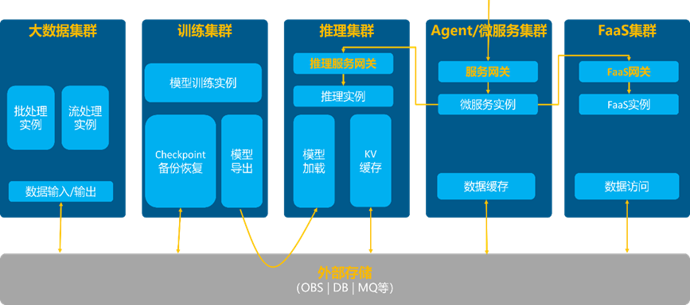
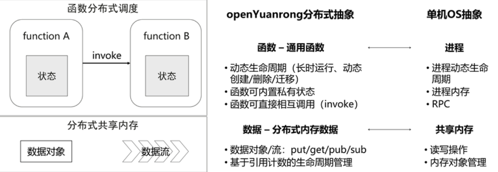

**前言**

在云原生、大数据、AI 快速发展的今天，分布式计算已成为重要基础设施技术。然而，不像单机上有操作系统内核这样的统一底层技术，分布式计算因其复杂性，长期以来并没有统一技术底座，而只是在随业务发展过程中自发形成了一些面向特定领域的不同分布式框架。比如传统大数据、微服务、AI 等领域都有各自完全不同的分布式框架，这些框架在设计之初就已明确是为特定分布式子领域设计的，尽管在各自擅长的场景确实能发挥作用，但并不能用于更加通用的其它分布式场景。

## 云原生和AI带来的挑战和机遇

以上不同领域的不同分布式框架及其相关软件栈就像多个技术“烟囱”，相互间无法互通，技术和资源也无法复用。这个问题在以往传统业务形态下可能还不那么明显，但在技术快速演进至云原生和 AI 时代的今天，则变得更加显著和难以忍受。

以下图所示 AI场景为例，大模型不仅消耗巨量计算资源，同时还牵涉到了从数据预处理、大模型预训练、SFT、强化学习后训练、大模型推理、AI Agent 应用等完全不同的形态，几乎涉及到传统大数据、AI、微服务等各个技术领域。如果仍以传统的多套技术栈割裂部署的方式，不仅消耗大量的开发运维工作，也会因为资源池相互割裂造成大量资源浪费，同时不同技术栈之间也无法满足 AI 新形态应用高效协同的诉求。

比如，在强化学习场景下，算力资源需要在不同模型的训练/推理间频繁切换，模型权重及样本数据也需要在多个模型实例间高效传递和共享，如果模型训练和推理实例都静态部署运行在不同的集群上，会带来成倍的资源消耗和显著的数据同步开销。又比如 AI Agent 场景下，一个 Agent 应用既要接收处理外部用户的在线服务请求，又要在处理过程中调用大模型推理、外部工具，甚至执行大模型生成的代码，整个过程无论是用户请求数、复杂度还是中间执行处理逻辑都是高度动态变化不确定的，并涉及多种计算负载间相互协作融合，如果仍以多套系统拼接的方式实现，会引入大量的开发/运维/资源成本和性能开销。

## 通过“分布式内核”，将集群变成大“单机”

以上困境归根到底在于分布式计算领域长期缺少类似单机 OS 内核的“分布式内核”技术，无法统一支持各类计算负载，使得各个不同业务领域不得不自建“烟囱”。

openYuanrong 正是为解决该问题而设计的通用 Serverless 分布式计算引擎，该项目已在OpenAtom openEuler（简称“openEuler”或 “开源欧拉”）社区开源。其核心理念正是构建一套能统一支持各类分布式计算场景的“分布式内核”，以 Serverless 方式将分布式计算集群变成一个大“单机”，让用户无需关注分布式实现细节，以单机体验就可以简单灵活快速地开发 AI/大数据/微服务及其它各类分布式应用。同时正如单机OS内核能支持各种单机应用在同一台机器上统一高效运行，分布式内核也应该能让多样的分布式负载在同一集群内实现最高效的运行。

综合来看，这样一套分布式内核应该具备以下几个特征：

- **高易用性：**
通过把集群变“单机”，分布式应用的开发运维可以变得像单机程序一样简单，无需关注复杂的集群软硬件环境和各种分布式实现细节。

- **高性能：**
为单机体验开发的应用提供高性能的自动分布式实现，自动匹配集群内复杂软硬件环境，合理调度和放置分布式计算实例及其产生的中间数据，支持应用在集群内高性能分布式运行。

- **高资源利用率：**
支持大规模多样分布式负载统一运行在一个大集群内，满足业务安全隔离需求的同时，按应用实际运行需要动态弹性地调度分布式实例和调整资源分配，充分利用集群内所有资源支持更多业务负载，避免任何不必要的资源闲置浪费。

- **高可用：**
分布式集群随时可能出现故障，需要支持在故障时自动恢复应用实例及其状态，降低对业务的影响。

## openYuanrong 核心概念设计

为设计这样一套分布式内核， openYuanrong 经过反复思考和归纳总结，同时参考单机OS内核设计思想，提出了如下几个简单但足够通用的核心概念抽象。

#### 函数

函数是 openYuanrong 的核心概念抽象，它起到类似单机 OS 中进程的作用，是 openYuanrong 分配资源和调度运行的基本单位。同时它和传统Serverless函数一样，是应用代码的执行入口，支持用户编程实现业务逻辑——某种程度可将其类比单机程序的 main 函数。但为了支持通用场景， openYuanrong 相比传统 Serverless FaaS 对函数概念进行了泛化使其更加通用，比如没有运行时长限制、支持内置状态、函数间支持异步互调、支持运行中动态拉起新的被调函数等等。

有了这些通用能力，openYuanrong 函数可以像单机函数一样，支持编写任意复杂的应用程序，只是这些程序在运行时会自动变成分布式，由 openYuanrong 在集群内按需动态调度运行并支持自动弹性。相比以往Serverless技术一般仅支持水平弹性，openYuanrong还支持函数的自动垂直弹性和跨节点迁移，以充分地利用集群各节点资源，支持更多业务负载。openYuanrong这种通用函数能力实际上可以表达和充当 AI、大数据、微服务等任意分布式场景下的计算逻辑和运行实例。

#### 状态

状态是指函数运行中可以访问和修改的进程内私有变量。典型的状态如进程内静态变量、面向对象编程中的成员变量等。传统 Serverless FaaS 要求无状态以便于自动水平弹性，但实际业务场景中大量分布式应用往往是有状态的。以往为适配 FaaS ，用户不得不人工将状态外置到外部存储如 DB 等，但这引入了不必要的改造成本和运维依赖，也降低了状态访问性能，由此也使得无法胜任一些高性能场景。正是看到这个问题，openYuanrong 原生支持函数有状态，无状态函数则作为有状态函数的简化情形来处理。对有状态函数，openYuanrong确保函数调用时始终能路由至正确的函数实例，以及在弹性扩缩前后保持状态的一致性。

#### 数据对象/数据流

复杂的分布式应用可能会包含不只一个运行实例。正如单机 OS 上不同进程间可以基于本地共享内存来交换数据，分布式运行实例间很多时候也需要交换和共享数据。以往用户不得不引入外部系统如 KV 缓存、消息队列等等，但这些系统往往部署于计算集群以外，频繁访问导致不必要的网络和 IO 开销，影响了应用性能。为满足极致性能场景诉求，openYuanrong 通过数据对象/数据流概念原生支持函数实例间基于分布式内存高性能共享和交换数据。其中，数据对象可用来支持 KV 语义的数据共享和交换，替代外部 KV 缓存，数据流则可在不同函数间实现非耦合的流式数据传递和共享，用于高性能的异步流式数据处理场景，替代外部消息队列。

通过以上概念抽象，openYuanrong 基本可以表达我们所知的所有分布式应用。

**未完待续：把集群变“单机”（下）——openYuanrong核心架构设计解析**

## 相关链接

- 官网地址：<http://docs.openyuanrong.org/zh-cn/latest/index.html >  

- 源码地址：<https://atomgit.com/openeuler/community/tree/master/sig/sig-YuanRong>

- 问题反馈：<https://gitcode.com/openeuler/yuanrong/issues>

欢迎添加 openYuanrong 小助手微信，由小助手拉您进我们的官方群获得最新资讯

