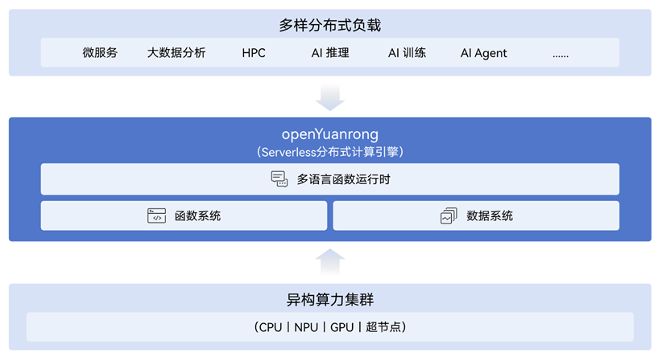
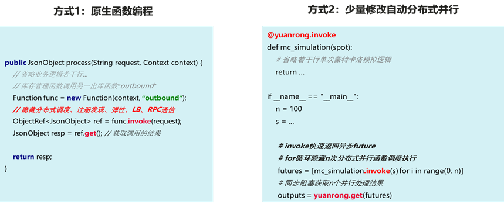
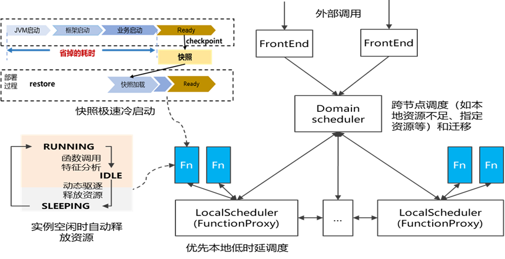
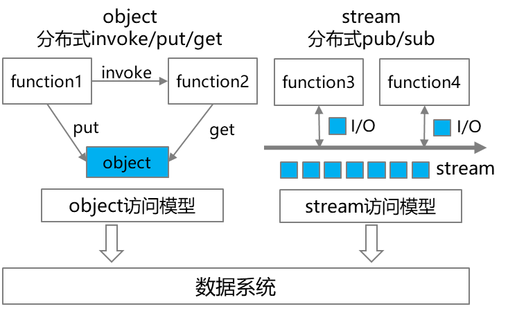
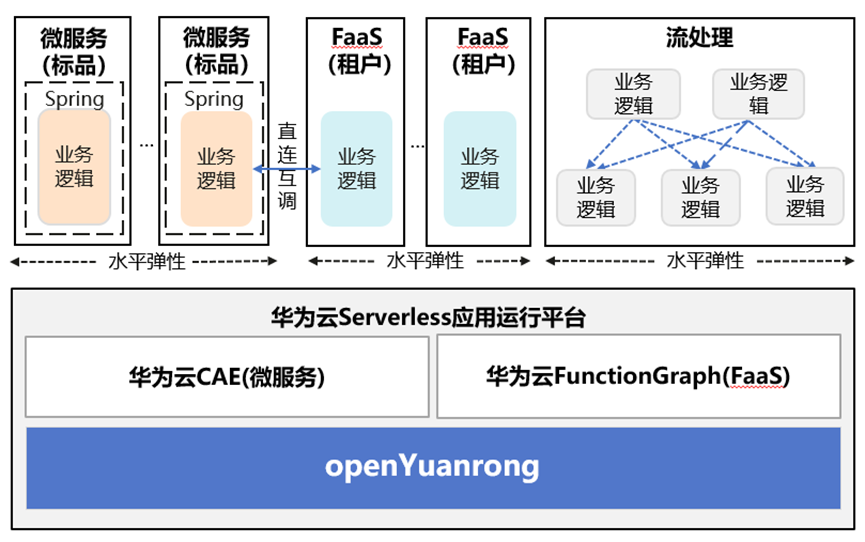
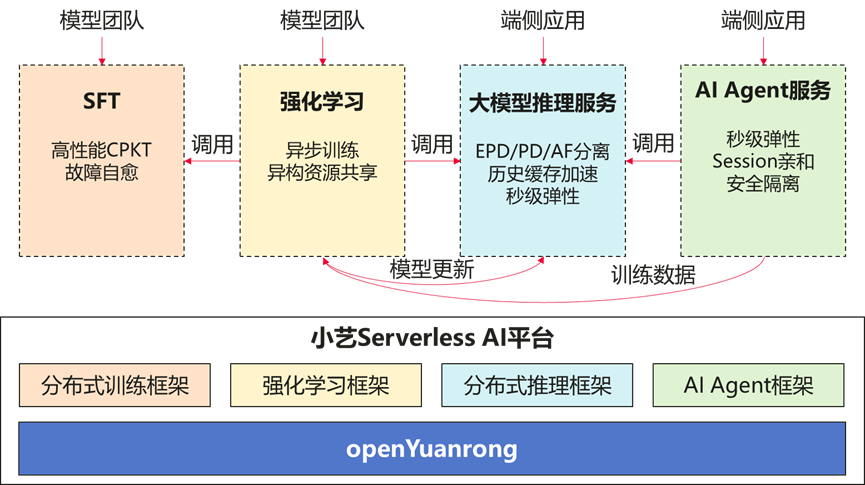

**背景**

面向云原生和AI给分布式计算带来的全新挑战和机遇，openYuanrong 提出分布式内核的技术理念，希望将集群变成一个大“单机”，让分布式应用的开发运维像单机程序一样简单，同时为应用和集群带来高性能、高资源利用率和高可用等收益。为设计实现这样的分布式内核， openYuanrong 提出函数、状态、数据对象、数据流等几个核心概念，灵活表达各类分布式应用。

关于 openYuanrong 分布式内核理念及以上几个概念抽象的详细介绍，详见上一篇文章：[把集群变“单机”（上）——openYuanrong核心技术理念解析。](https://www.openeuler.openatom.cn/zh/blog/20260128-openYuanrong/20260128-openYuanrong.html)

## openYuanrong 整体架构

基于函数、状态、数据对象、数据流等核心概念抽象，openYuanrong 定义了一套通用Serverless分布式接口DPOSIX（Distributed Portable Serverless Inerface），它在分布式内核中起到类似单机OS POSIX接口的作用。进一步围绕这套接口，我们设计实现了整个openYuanrong。上图是其整体架构，重点包括以下 3 个核心子系统。

### 多语言函数运行时和编程接口

openYuanrong基于DPOSIX定义的函数、状态、数据对象、数据流等核心概念接口，面向Python、Java、C++ 等主流编程语言提供了默认的函数运行时实现并提供用户编程接口，方便用户以单机体验快速开发各类分布式应用。除了提供原生的函数编程能力外，这层编程接口也支持普通单机程序少量修改自动变成分布式程序。同时用户也可基于 SDK 自定义函数运行时，或在存量应用中调用openYuanrong分布式计算能力。

在此基础上，针对微服务、大数据、AI等领域一些常用的分布式框架如Spring、Spark、Ray、vLLM、veRL等，openYuanrong提供了适配器，支持用户代码零修改或极少修改即可运行在openYuanrong上。

### 函数系统

函数系统负责以分布式方式实现DPOSIX定义的函数调度、调用等相关能力，支持大规模函数的Serverless分布式调度和函数间高性能直连互调，并提供分布式容错机制，确保应用运行的高性能、高资源利用率和高可用。

函数系统支持包括CPU/NPU/GPU算力在内的异构算力统一调度，并提供动态函数生命周期管理，支持函数自动休眠/唤醒、水平/垂直弹性和跨节点迁移以高效利用资源。其中函数创建环节的启动时延直接影响了何时能接收请求进行实际业务处理，因此至关重要，这在Serverless领域被称为冷启动问题。针对该问题，函数系统实现了快照冷启动、请求预测、实例预热等多项技术，将大型Java微服务、大模型推理等的启动耗时降低一个数量级。

由于函数粒度很细且生命周期是动态的，运行中随时可能有大量函数并发创建，要在一个大集群中统一调度各类负载，需要有大规模的函数动态调度能力。为此函数系统采用了分级可扩展的分布式调度设计，既能加速本地快速启动，又能避免大规模并发下的中心调度瓶颈。同时为满足应用性能/可用性等诉求，支持亲和/反亲和等多种灵活的调度策略。另外原生支持多租户，并支持通过容器/安全沙箱/MicroVM等方式实现不同级别的实例安全隔离。

函数系统还支持函数间原生通过id/name进行互调，无需感知IP/端口等底层设施，并确保无论函数是否有状态、是否经过休眠/迁移都能正确路由和调用成功。同时支持故障自动检测，以及在故障情形下重拉实例，并恢复其最近备份的状态。

### 数据系统

数据系统负责以分布式方式实现DPOSIX定义的数据对象和数据流能力，支持应用以单机方式访问分布在集群各节点的内存数据，同时提供极致的数据访问性能。

数据系统在实现时支持同节点函数直接通过本地共享内存访问数据，从而实现免拷贝高性能读写。当函数跨节点访问数据时，数据系统自动将数据同步至本节点，这样下次访问时依然可通过本地共享内存完成。

数据系统可以和函数系统形成高效配合。比如支持数据亲和调度，允许函数调度到数据所在节点上以便共享内存访问加速。同时数据系统提供的数据对象能力可以用来存放函数调用的参数和返回值，尤其是在大对象场景下通过共享内存免拷贝可提升函数调用性能。另外数据对象也可以存放函数异步调用的返回值，方便后续异步处理。

除了Host内存，数据系统也支持HBM异构数据对象，用于 AI 等场景。针对HBM对象，数据系统通过对象语义API支持D2D高性能自动数据同步，使用户无需再关注Send/Recv等繁琐的异构编程细节，同时还支持跨节点H2D/D2H的高性能互访，以及通过HBM/DDR/SSD构成多级缓存以扩大容量提高命中率。

## 应用实践

### 通用计算场景

华为 MetaERP 以 openYuanrong 为底座构建了业界首个 Serverless 的 ERP 系统。MetaERP 为华为公司整体提供 ERP 服务，包含上千个微服务、日处理百 TB 级数据，是目前国内最大的 ERP 系统之一。MetaERP 使用 openYuanrong 提供零代码修改方案将 Spring 开发的标准微服务直接 Serverless 化，和 FaaS 原生的扩展服务实现共集群部署。openYuanrong 的快照极速冷启动等方案使大型 Java 微服务启动时延从 90s 缩短至 1.4s，满足了 Serverless 自动水平弹性，以及无请求缩容到 0 的需求。同时，MetaERP 还采用了 openYuanrong 提供的 Serverless 流处理方案，实现性能优于 Flink 的大数据处理流水线。通过 openYuanrong 提供的 Serverless 技术，MetaERP 整体提升开发效率 60%，资源成本节省 30％。

### 智能计算场景

华为小艺服务采用 openYuanrong 作为其云端 AI 训-推-用的 Serverless AI 基础设施。传统方案下，SFT 训练、强化学习、大模型推理、AI Agent 分别采用不同的软件技术栈，独立集群部署（如在训推场景中使用 Ray，而 Agent 实例则运行在 K8S 管理的容器中），带来了大量的开发运维成本。小艺基于 openYuanrong 在单一资源池上构建了统一的 Serverless AI 平台，同时支持了 SFT 训练、强化学习、模型推理、AI Agent 四个领域负载的融合部署和资源灵活调度，在极大简化了分布式系统的开发运维的同时提升了资源利用率。利用 openYuanrong 的分布式内核技术，小艺的强化学习训推任务调度端到端时延减半；大模型推理实例启动速度从分钟级下降到秒级（如 Llama2-70B 水平弹性时延从 571 秒缩短至 4.55 秒）。基于 openYuanrong 的异构分布式内存数据系统，分布式 KV Cache 整体性能提升 1 倍以上，同时强化学习过程中，训推转换时实例间参数同步时延也从分钟级缩短至秒级。相较于业界类似产品（如 Ray），openYuanrong 提供了更高的性能和弹性调度能力，更成熟稳定，同时也支持通算和智算负载的融合部署，构建全流程的 Serverless AI 平台。

## 开源

openYuanrong 已在OpenAtom openEuler 社区全面开源，采用 Apache 2.0 License。

开源网址：<https://www.openeuler.org/zh/projects/yuanrong/>

另外，关于本文提及的各项关键技术，后续会再有文章进行详细介绍，同时读者也可参考openYuanrong的开源代码。

## 总结

openYuanrong Serverless 分布式计算引擎致力于通过分布式内核技术理念，将大规模分布式集群变成一个大“单机”，提供单机体验编程简化分布式应用开发，通过大规模动态弹性调度和分布式内存数据共享支持各类分布式负载在一个大集群内统一高效运行。基于openYuanrong，AI、大数据、微服务等各类不同分布式场景应用既可以简化开发运维，也可通过统一的分布式技术底座实现高效协作以及资源的充分共享和复用。

## 相关链接

- 官网地址：<http://docs.openyuanrong.org/zh-cn/latest/index.html >  

- 源码地址：<https://atomgit.com/openeuler/community/tree/master/sig/sig-YuanRong>

- 问题反馈：<https://gitcode.com/openeuler/yuanrong/issues>

欢迎添加 openYuanrong 小助手微信，由小助手拉您进我们的官方群获得最新资讯

