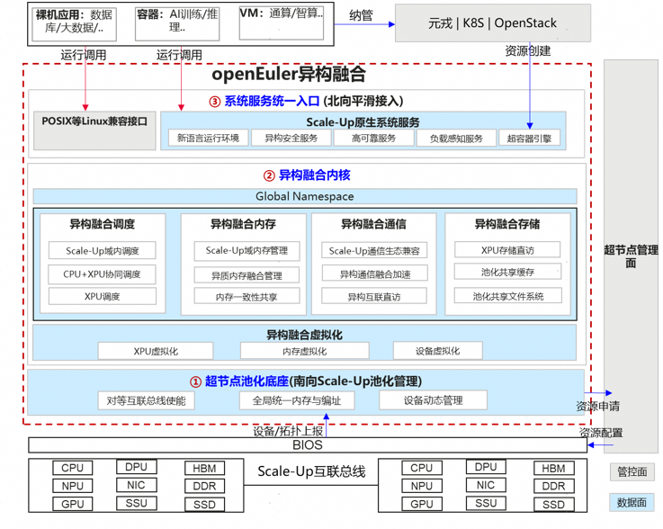

## 前言

OpenAtom openEuler （简称“openEuler”或 “开源欧拉”） 作为全场景的统一操作系统，是连接底层硬件和上层应用的桥梁。在计算领域，面对异构硬件（CPU+XPU）、高速互联总线（UB、CXL 等）以及通智算融合负载（大数据，生成式推荐，AI 推理等）的演进和挑战，其核心任务是在资源与负载之间，扮演关键的总调度和总指挥角色，实现硬件资源和软件负载的精准匹配和按需供给，融合异构算力，构建异构融合计算基础设施框架。

## 什么是异构融合

异构融合包括异构硬件（算力/互联/存储）融合，以及通智负载融合。

异构硬件，随着大模型、生成式 AI、科学计算等智算场景的爆发，摩尔定律的逐渐失效，为了满足应用对算力的逐年增长需求，硬件向异构方向发展，从 CPU 为中心的计算架构，逐步演进以数据为中心，通过高速互联总线，实现 CPU+XPU 异构对等架构。

**1.算力上，** CPU/GPU/NPU/DPU 算力单元适合不同的负载，但传统服务器上只提供固定配比的算力组合，这使得服务器在面对负载变化时非常不灵活。需要基于负载的计算需求，按需组合不同算力，并且在运行过程中动态的将任务调度到最适合的算力上运行。

**2.互联上，** 高速互联总线（UALink、NVLink、Unified Bus、CXL 等）带来了超低时延、超大带宽、高可靠性、内存语义等关键特征，但高速互联总线还需要结合操作系统，实现系统性的设计、控制、协同，才能让高速互联总线发挥技术优势。

**3.存储上，** 传统以 CPU 为中心的架构中，GPU、NPU 这些算力发起对内存和存储的数据访问的路径极为复杂，涉及到多次数据的搬移，很容易出现带宽和算力的瓶颈，需要通过 GPU/NPU 直通存储，以及全局共享，降低数据搬移和通信的开销。

4.**业务应用上，** 当前应用负载从传统通算向智算负载以及通智融合负载方向演进。传统数据中心以处理通用计算任务（Web 服务、数据库）为主，随着大模型的训练、推理、生成式推荐、Agentic AI 等 AI 新负载应用兴起，这些新应用逐渐成为了数据中心的新主角。以推理为例，整体任务的完成，需要 CPU 侧下发算子，到 GPU/NPU 侧，计算完成后再回到 CPU 侧，CPU 侧的算子下发和 NPU 的算子执行，需要协同实现充分 pipeline 并行，是一个典型的通智融合负载。

## 异构融合为什么需要操作系统的参与

硬件异构融合后，仍存在如下问题难以解决：

- 过度配置：业务潮汐特征，需要提前预留资源，低负载情况下资源浪费，无法根据负载进行灵活配比，即使通过云原生方式进行按需弹性，其弹性效率也存在瓶颈。

- 孤岛式架构：集群内资源彼此不共享，各个节点资源存在碎片，集群内无法有效进行资源碎片整合。

- 高性能 SLA 要求：多任务运行由于部分业务苛刻性能 SLA 要求无法进行混合部署。

通过把集群变“单机”，分布式应用的开发运维可以变得像单机程序一样简单，无需关注复杂的集群软硬件环境和各种分布式实现细节。
为单机体验开发的应用提供高性能的自动分布式实现，自动匹配集群内复杂软硬件环境，合理调度和放置分布式计算实例及其产生的中间数据，支持应用在集群内高性能分布式运行。

因此，操作系统亟需打破传统资源边界，对资源进行池化，根据负载变化进行资源灵活按需配比，极致提升资源利用率。

对于业务应用，AI 推理，生成式推荐，Agentic AI 等负载对硬件算力和内存资源提出更高的要求，而且由于硬件算力不足和内存容量的瓶颈、存在缺少高效的协同机制、资源利用不充分的问题。

1.存储管理上，以大模型生成式推荐训练为例，其 Embedding 表最大可到 100TB+，KVCache 达到 PB 级, 而 HBM/DDR 容量有限，GPU/NPU 需要从外置或远端存储中获取数据，使其大部分时间处于饥饿等待状态，严重影响训练效率。

2.算力协同上，Agentic AI 以及推理的 CPU+XPU 协同，当前通算和智算的资源调度和管理方式都是独立的“烟囱”，由于缺少统一的协同机制，使得推理、通信负载不协调，造成了显著的长尾，频繁出现资源空闲（Bubble）问题，最终导致系统整体吞吐量变低。

可以看出，硬件和负载之间缺少高效、统一的协同和管理机制，低效算力和资源孤岛问题凸显，通过简单堆积硬件无法满足 AI 时代新负载的爆发式性能诉求，操作系统作为硬件和应用的桥梁，需要提供一个高效、统一的协同和管理机制。

## 异构融合对操作系统的挑战和诉求

在异构融合新趋势下，当前计算系统也面临一些关键挑战和对操作系统的诉求：

**1.性能挑战：** 计算架构的多样性，从 CPU->CPU+XPU，从片间异构->片内异构->核间异构，操作系统需要高效组合异构算力，提升任务处理速度。缩短数据供给速度与 XPU 计算速度的差距，提升计算效率。

**2.资源利用率挑战：** 资源使用的时空不均，导致资源利用率低。时间上，如错误恢复时计算资源闲置；空间上，GPU 和显存不够 CPU 和 DRAM 浪费。需要池化和算力弹性，打破服务器盒子边界，实现大范围不同设备的池化和资源动态分配，提升闲置资源利用率。

**3.可靠性挑战：** 链路拥塞、时延抖动、闪断丢包等异常都会导致系统性能规格急剧劣化、甚至不可用，需要结合操作系统进行精确感知、有效地故障处理及高效的故障恢复，避免故障扩散。

**4.易运维挑战：** 面向大规模的多样化异构算力集群，全局资源管控、软件部署、故障定位定界等问题都变得更加复杂，操作系统需要考虑如何实现对不同算力的高效统一管理、软件高效部署，以及故障问题的高效定位定界。

**5.生态兼容和应用平滑迁移挑战：** 计算系统都是伴随相应的计算范式同步发展，计算范式衔接芯片、硬件、系统软件和应用架构，形成持续正向循环发展的良性生态。操作系统对底层计算、网络、存储、通信资源进行合理的封装，建立正确的应用规则，避免应用软件滥用。面向新的 Scale-Up 池化异构系统，操作系统如何兼容现有 POSIX 接口，享受新硬件和互联总线带来的性能提升，同时提供新的系统服务接口，客户应用便捷开发可高效利用异构融合算力，性能进一步提升。

## openEuler sig-Long 异构融合应对之道

应对上述提到的产业痛点、硬件技术演进以及新负载趋势对操作系统带来的诉求，openEuler 异构融合技术，南向支持多样化的处理器种类、架构及高速互联总线，北向满足指数级增长的大模型计算及 Agentic AI 时代智能体应用需求，旨在定义一种异构融合计算系统上新的计算范式。它具备可分可合的软件定义服务器、“数据”为中心的网算存智能协同、承接超节点和通智融合的软件新生态三大关键特征。

#### 可分可合的软件定义服务器

支持异构资源统一视图管理，实现 Scale-Up 域内超大规模资源聚合、根据负载自适应灵活组合。资源访问确定性时延、高可靠，保证资源有序高效利用，实现异构硬件资源和负载的精准匹配和按需供给。池内故障的有效隔离，控制问题辐射影响半径。

#### “数据”为中心的算存网智能协同
操作系统针对异构硬件提供的统一抽象实体，实现分层协同对等调度，异质内存全域统一语义，跨节点内存一致性共享，对等互联直访通信，多链路并行通信加速，层级存储特征感知，软件定义虚拟节点等能力。最终实现系统资源高效利用，发挥高速总线的技术优势。

#### 承接超节点和通智融合的软件新生态
操作系统构建应用开发的新接口规范，合理封装计算实例呈现统一入口，一方面通智算融合的应用可以低成本接入进新架构，满足动态、多样性负载的不同性能规格要求；另一方面传统单机业务和云原生业务可以以少量修改适配，充分发挥超节点等新硬件上可应用的弹性、可靠安全等能力。

通过对三大关键特征的展开，openEuler 异构融合的参考实现架如下：

异构融合核心架构包括超节点池化底座、异构融合内核和系统服务统一入口三层，南向实现池化硬件资源抽象、北向对接业务和融合负载感知，中间层融合内核实现硬件资源和负载的精确匹配，包括：

#### 超节点池化底座
面向 Scale-Up 总线互联的超节点架构，与超节点管理面配合，实现算力/内存/设备等资源实现动态申请和释放、动态发现、拓扑解析，动态管理池化设备的物理实体组合，并进行对等互联总线下的全局地址管理，对上呈现异构资源的抽象与解耦抽象解耦层，实现资源灵活组合。

#### 异构融合内核
调度、内存、存储、网络、虚拟化等操作系统核心子系统，资源高效协同，实现异构融合高效并行，算力最优发挥：

**1.异构融合调度，** 按照算力协同范围，分层构建 XPU 调度、CPU-XPU 协同调度，Scale-Up 域内调度三层关键技术，实现吞吐最优，发挥极致算力效率。

**2.异构融合内存，** 纵向按照 HBM/DDR/SSD 异质内存融合管理，横向按照 Scale-Up 域内内存一致性共享，实现最佳数据效率。

**3.异构融合通信，** 按照多路径融合并行通信，释放高性能通信能力，使能 Scale-Up 域内数据面通信加速。

**4.异构融合存储，** 通过池化共享存储能力，实现 Scale-Up 域内数据共享，提供存储直访功能，减少 CPU 开销，实现极简高效存储提升性能。

**5.异构融合虚拟化，** 基于算力、内存、设备虚拟化，提供细粒度虚拟资源管理能力，实现虚拟运行时内 Scale-Up 域内资源高效利用。

#### 系统服务统一入口
**1.超容器引擎：** 兼容传统云原生应用，在不改变容器镜像内业务的情况下，在异构融合环境下可同时提供垂直弹性伸缩和水平弹性伸缩的能力，达成极致资源利用率。

**2.负载感知服务：** 构建多层次负载亲和与资源拓扑感知机制，实现超节点域内算力的最优调配与能效平衡，提升资源利用率与任务性能。

**3.高可靠服务：** 面向通智融合应用，在兼容现有 POSIX 接口基础上，通过新增系统级快照，任务状态迁移，跨节点恢复，故障主动预测和处理等接口，应用可以通过调用或配合高可靠服务减少计划内和计划外停机次数，缩短停机时间，整体提升系统的可靠性。

**4.异构安全服务：** 在去中心化对等算力的异构融合场景下，传统以 CPU 为中心的单机安全信任边界被打破，计算系统的机密性、完整性和可用性都面临新的安全威胁。操作系统的安全服务需要提供分布式访问控制，异构完整性保护，异构机密计算等能力，解决身份仿冒，完整性破坏，数据窃取，攻击扩散四类威胁。

## 总结
随着硬件和负载的变化，异构融合对操作系统有了新的诉求，操作系统作为底层硬件和上层应用的连接器，需要在架构上有新的突破，实现业务性能、资源利用提升以及高可靠运行。

openEuler 异构融合技术，提出三层参考架构，实现业务的北向平滑接入，资源有效供给业务，以及南向硬件的高效管理。后续 openEuler SIG-Long[1]会针对调度、内存、虚拟化以及存储等关键子方向，推送一系列文章讲述 openEuler 在异构融合上的技术进展和场景应用。如果您对相关技术感兴趣，可以添加小助手微信，加入 SIG-Long 微信群进一步交流。

[1] : https://www.openeuler.openatom.cn/zh/sig/sig-Long