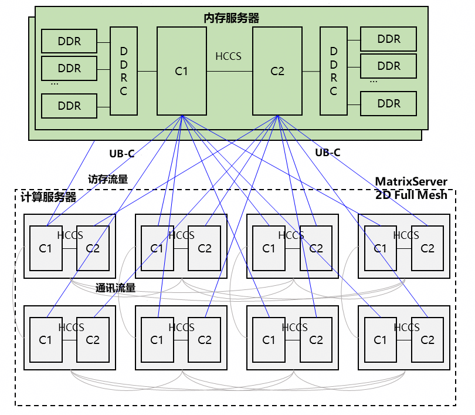
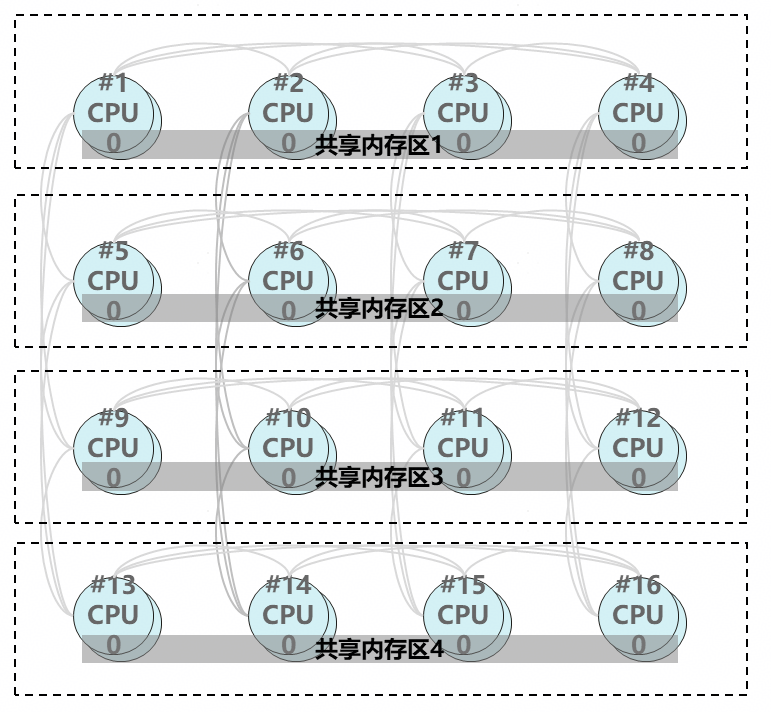
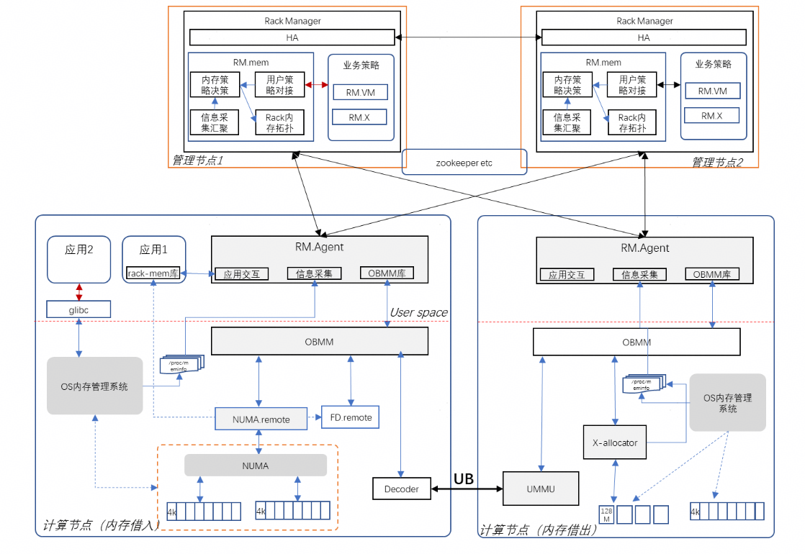
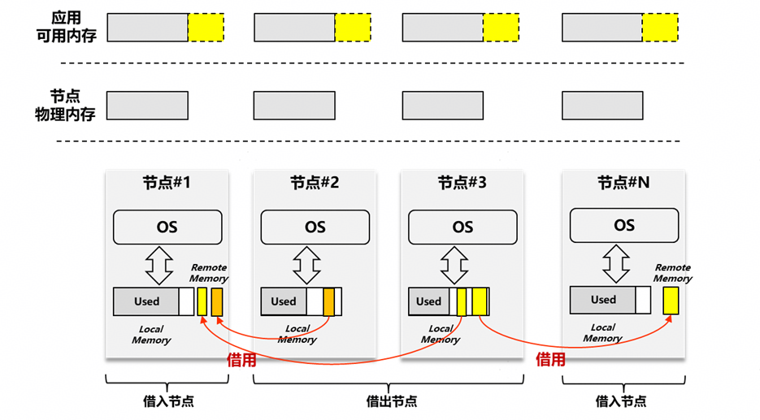
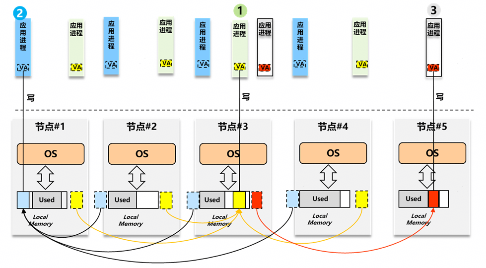
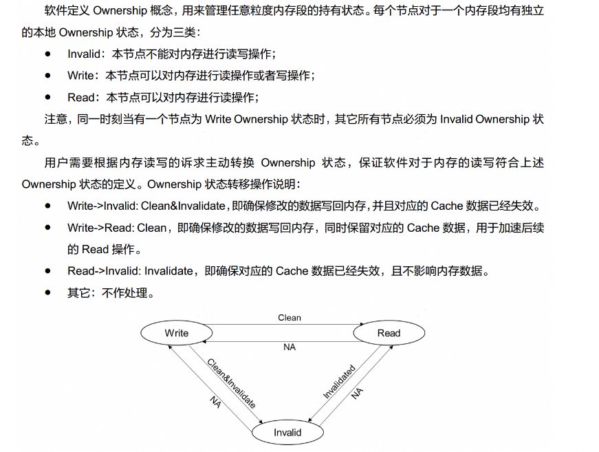

## 背景

在之前的文章中介绍了“异构融合”的整体技术背景。具体背景和总体架构参考如下链接。

<https://mp.weixin.qq.com/s/Y9VZn-SzNCGSD33BcrulLg>

本文介绍异构融合软件“池化底座”中内存池化借用技术和基于灵衢（Unified-BUS）的参考实现。

在 ScaleUP 域内，通过高速互联总线连接多个“基础（计算）节点”形成“超节点”。基于高速 ScaleUP 互联能力提供的内存直访语义，在超节点管理面的支持下，我们可实现“一个基础节点**借用**其他基础节点的内存资源”这个特色能力。

> 注：基础（计算）节点的范围为一个常规的 OS 域。包含可支持运行一个 Linux 系统并被 Linux 系统所纳管的硬件资源。

特别地考虑到当前内存价格持续上升且预计在未来相当长的时间都会价格高企（相比较于计算单元的价格）的时代背景，在通过 ScaleUP 互联的基础（计算）节点之间通过内存借用来提升物理内存的资源利用率将是一个缓解燃眉之急的有力备选项。

## 内存池化&借用共享架构

在内存池化的实现中，有如下两种主要的参考池化架构：

1. 集中池化架构 -- 中心池化

  

    - **技术特征**：共享内存来源于同构的内存服务器。
    - **成本&TCO**：需要新增单独内存池硬件，影响成本和TCO；当计算节点内存不够时，扩展更灵活。
    - **可靠性**：计算节点与内存节点分离，计算节点故障不影响内存数据；内存节点通过内存mirror、亚健康检查、故障时内存迁移等手段保证高可靠。

2. 对等池化架构 -- 逻辑池化

   

    •**技术特征**：共享内存来源于各节点的空闲内存。
    •**成本&TCO**：无需新增独立内存池硬件，只基于 ScaleUP 互联即可，内存利用率高，TCO 低。
    •**可靠性**：亚健康检查、故障时内存迁移。

    > 上述连接拓扑以板上互联 HCCS 和灵衢（UB）为示例。替换为其他 ScaleUP 连接时不失一般性。

考虑同时支持上述两种架构时不难发现，逻辑池化可以包含中心池化；异构融合基础软件同时支持上述两种架构，下文**基于逻辑池化**进行描述即可。

### 超节点链路及资源管控

在超节点层面，在基础（计算）节点之上，是超节点内存管理；这个超节点内存管理者，需要负责如下功能：

 ● 打通基础（计算）节点之间的总线路由；

 ● 统筹管理内存借用/共享的关系。

负责上述功能的组件称为超节点管控面；这个逻辑组件我们不妨将其称之为 Fabric Manager，简记为：FM。

在如下图所示的参考设计中，最上方的 “Rack Manager” 即是一种 Fabric Manager 的具体实现：



上图中的 “Rack Manger” 及 “RM.Agent” 是一种实现了 Fabric Manager 逻辑功能的组件实现。

在内存池化借用层面，FM 提供的服务接口需包含如下功能：

1. 内存互联拓扑与互联拓扑感知
2. 池化内存分布及全局内存借用关系管理
3. 内存资源隔离与内存链路路由设置

具体的超节点管控面设计与实现不在此处赘述。

> 1. 可参考后续灵衢管控面介绍系列文章；
> 2. 上图中的 OBMM 和 NUMA.remote 为内存池化借用的主要软件组件。

### 内存借用 vs 内存共享

站在内存使用者的角度，至少可以将所使用的内存区分为“本地（近端）内存”和 “池化（远端）内存”。使用远端内存时，进一步细分为“借用”和“共享”两种用法；其重点的差异在于：借用时，是单对单的关系，支持借用者二次管理分配；共享时，是多对多的关系，**通常不进行**二次管理分配；借用是共享的一种极致简化。

> 在绝大多数的内存共享场景，均基于共享内存做数据共享，不基于共享内存做二次分配管理。

#### 内存借用



#### 内存共享



### 缓存/数据一致性

在计算-内存的层次化体系架构设计中，基于数据的时空局部性原理，通过 Cache 获取数据面上的收益。在考虑内存时，现代通用计算体系架构**通常**基于 Cacheable 的内存属性，使用 hardware cache 器件进行访存加速；当一个基础（计算）节点使用池化（远端）内存时，基础立足点可以是使用 Non-Cacheable 的属性使用池化（远端）内存，此时对池化（远端）内存的访问性能（延迟、带宽）将远远不及本地近端内存；但同时我们更希望能使用 Cacheable 的内存属性从而可以基于 Cache 器件获取访问性能收益。基于 Cacheable 属性使用远端内存时，上文所述的 ‘内存借用’ vs  ‘内存共享’ 的差异凸显出来。在内存借用这个简化的场景中，使能 Cacheable 属性将变得简单，不再需要依赖 ScaleUP 互联的 CC 设计；但我们仍然需要重点考虑共享，毕竟大家都爱共享内存（作为传统上 IPC 机制中最高效简单的共享数据乃至沟通交流的途径）。

当考虑共享场景，我们不对 ScaleUP 互联所能提供的 Cacheable 能力以及 Cache Conherence 能力&范围做任何强假设（实际上在大规模 ScaleUP 互联系统中也无法做任何强假设）；因此我们抽象“数据所有权”：




> 引用自灵衢基础协议 8.2.6 小节：<https://www.unifiedbus.com/zh?callback=download&fileType=docs&fileName=UB-Base-Specification-2.0-zh.pdf>

以及基于数据所有权的操作来在多个使用者之间进行数据一致性维护。

共享内存的使用者基于共享数据进行业务协同操作的本质包含两个：

 ● 维护数据的一致性，其中包含数据 cache flush & 维护 cache 状态。

 ● 使用者之间的通知。

我们将上述“数据一致性维护”抽象为 **set_ownership** 接口。OBMM 对于 set_ownership 提供了参考实现，细节参考下文 OBMM 的 set_ownership 小节。

将 set_ownership 定义为：

```cpp
__weak int set_ownership(...) { return 0; }
```

当 ScaleUP 互联具有 Cache Coherence 能力时，可直接在相应的运行环境中不额外实现 set_ownership 接口。

另一个‘使用者之间的通知’话题，本文不做展开。

### 内存导入与导出

在内存借用和共享时，我们定义‘内存导出’和‘内存导入’两个逻辑操作。

#### 导出： export

在内存的物理资源管控方，进行内存导出；这是一个“准备好内存资源给使用方用”的逻辑操作；可类似理解为“从一个物理机器上热拔一块儿内存”。

这是一个需要物理资源提供方实现的操作，其需要完成的功能包含：

 (a) 准备物理内存资源；

 (b) 将物理内存资源从导出方隔离；

 (c) 操作访存管理单元设置‘被导出内存’的访存上下文；

我们不妨将这个操作接口命名为：**_mp_export**；

> OBMM 提供的基于灵衢的参考实现 obmm_export 见下文。

#### 导入： import

在内存的使用（借用）方，进行内存导入；这是一个“将新的可用的内存准备好提供给业务”的逻辑操作；可类似理解为“给一个物理机器上热插一块儿内存”。

这是一个需要内存资源使用方实现的操作，其需要完成的功能包含：

 (d) 将物理内存资源导入 OS 内存管理；

 (e) 提供使用接口给应用（内核态&用户态）；

 (f) 设置打通从使用方到提供方的互联访问链路；

我们不妨将这个操作接口命名为：**_mp_import**；

> OBMM 提供的基于灵衢的参考实现 obmm_import 接口见下文。

此处所述 #f 一般由上文所述的超节点链路管理组件 FM实现；此处 import 操作调用 FM 的功能即可。

> 注：上文所述‘热插’&‘热拔’仅为帮助理解所用的表达，与 memory-hot-remove 以及 memory-hot-add 并不等同。

## OBMM

OBMM（Ownership Based Memory Management）是一个基于灵衢互联总线实现池化内存借用和共享的参考实现；上文中提及的 OBMM 相关文档可见如下仓库：<https://gitee.com/openEuler/obmm>

OBMM 首先实现了内存描述符，基于内存描述符实现上文架构定义的 export 和 import 操作。OBMM 的 export & import 实现在下文‘借出内存’和‘借入内存’小节有接口与示例。

> 此处可参考灵衢基础协议中内存管理章节的内存描述符定义。

### 内存描述符

OBMM 的核心数据结构：内存描述符 -- 描述一段可以跨 host 访问的远端内存，libobmm 定义了通用数据结构 `struct obmm_mem_desc`：

```auto
struct obmm_mem_desc {
    uint64_t addr;
    uint64_t length;
    /* 128bit eid, ordered by little-endian */
    uint8_t seid[16];
    uint8_t deid[16];
    uint32_t tokenid;
    uint32_t scna;
    uint32_t dcna;
    uint16_t priv_len;
    uint8_t  priv[];
}
```

该数据结构是组网范围内的一段支持跨计算节点访问的内存的通用描述。

在提供方，该数据结构主要作为出参，用于获取**导出内存**的地址参数，少部分域段也用作配置入参。

> 引用自： <https://gitee.com/openeuler/obmm/blob/master/doc/libobmm.md>

### set_ownership

OBMM 基于灵衢实现了 set_ownership 接口，用来在内存借用和共享时维护数据的一致性操作。具体实现包括：

 ● 缓存回刷到 persistent point

 ● 阻止预取

具体内容可参考：<https://gitee.com/openeuler/obmm/blob/master/doc/obmm_set_ownership.md>

相关实现为内核态实现，可参考内核代码仓库：<https://gitee.com/openeuler/kernel>

### 内存借用 - 接口 & 用例

OBMM 实现的 obmm_export 和 obmm_improt 提供了 libobmm 库封装，代码链接：<https://gitee.com/openeuler/obmm/tree/master/src/libobmm>

内核态 OBMM 和 NUMA.remote 代码见内核代码仓库：<https://gitee.com/openeuler/kernel>

#### 借出内存

如上文中参考实现实例图中所示，超节点内存管理 Agent 可如下例代码所示，完成内存借出方“导出内存”的动作：

```auto
#include <stdio.h>
#include <stdbool.h>
#include <libobmm.h>

#define SZ_2M	(1UL << 21)

int export_interface_demo(void)
{
    unsigned int device_deid = 0x101;
    int ret;
    mem_id id;
    /* Export 2M memory from node 0 and no memory from other nodes. */
    size_t length[OBMM_MAX_LOCAL_NUMA_NODES] = { SZ_2M };
    /* Allocate memory only from OBMM buffer and create a mappable memory device. */
    unsigned long flags = OBMM_EXPORT_FLAG_FAST | OBMM_EXPORT_FLAG_ALLOW_MMAP;
    /* Specify that this memory device has no private data. */
    struct obmm_mem_desc desc = {
        .priv_len = 0
    };
    memcpy(desc.deid, &device_deid, 4);
    /* Export memory from OBMM. */
    id = obmm_export(length, flags, &desc);
    if (id == OBMM_INVALID_MEMID) {
        /* Export failed. */
        perror("obmm_export() failed.\n");
        return -1;
    }
    /* Export succeeded. Key parameters written to @desc. */

    /* Do your work here... */

    /* Unexport memory. */
    flags = 0;
    ret = obmm_unexport(id, flags);
    if (ret) {
        perror("obmm_unexport() failed.\n");
        return -1;
    }

    return 0;
}

int export_useraddr_interface_demo(void)
{
    unsigned int device_deid = 0x101;
    int ret;
    mem_id id;
    /* Export 2M memory from node 0 and no memory from other nodes. */
    size_t length[OBMM_MAX_LOCAL_NUMA_NODES] = { SZ_2M };
    /* Allocate memory only from OBMM buffer and create a mappable memory device. */
    unsigned long flags = OBMM_EXPORT_FLAG_FAST | OBMM_EXPORT_FLAG_ALLOW_MMAP;
    /* Specify that this memory device has no private data. */
    struct obmm_mem_desc desc = {
        .priv_len = 0
    };
    memcpy(desc.deid, &device_deid, 4);
    /* Export memory from OBMM. */
    id = obmm_export_useraddr(length, flags, &desc);
    if (id == OBMM_INVALID_MEMID) {
        /* Export failed. */
        perror("obmm_export() failed.\n");
        return -1;
    }
    /* Export succeeded. Key parameters written to @desc. */

    /* Do your work here... */

    /* Unexport memory. */
    flags = 0;
    ret = obmm_unexport(id, flags);
    if (ret) {
        perror("obmm_unexport() failed.\n");
        return -1;
    }

    return 0;
}
```

> 引用自：<https://gitee.com/openeuler/obmm/blob/master/doc/obmm_export.md>

#### 借入内存

相应地，超节点内存管理 Agent 可如下例代码所示，完成内存借用方“导入内存”的动作：

```auto
#include <stdio.h>
#include <stdlib.h>
#include <libobmm.h>

int import_demo_decoder(unsigned long pa, size_t size, unsigned int scna, uint8_t *seid)
{
    int ret;
    mem_id id;
    /* Import the remote memory in such a way that we can open and mmap its char device. */
    unsigned long flags = OBMM_IMPORT_FLAG_ALLOW_MMAP;
    /* Specify that this memory device has no private data. */
    struct obmm_mem_desc desc = {
        .addr = pa,
        .length = size,
        .scna = scna,
    };
    memcpy(desc.seid, seid, 16);
    id = obmm_import(&desc, flags, 0, NULL);
    if (id == OBMM_INVALID_MEMID) {
        perror("obmm_import() failed.\n");
        exit(EXIT_FAILURE);
    }
    /* Import succeeded. */

    /* Do your work here... */

    /* Unimport memory. */
    ret = obmm_unimport(id, 0);
    if (ret) {
        perror("obmm_unimport() failed.\n");
        exit(EXIT_FAILURE);
    }

    return 0;
}
```

> 引用自：<https://gitee.com/openeuler/obmm/blob/master/doc/obmm_import.md>

导入的内存将呈现为一个特殊的 CPU-less 的 NUMA，即 NUMA.remote；应用基于 libnuma，madvise 等 POSIX 接口使用 NUMA.remote 即可。

## 应用场景&效果

### **场景：节点内存扩展**

在单节点环境中扩展可用内存容量，突破本地物理内存限制。

**具体应用实例**：

 ● **大内存数据库**: 数据库服务器需要处理超过本地物理内存容量的数据集，通过 OBMM 导入远程内存作为 NUMA 节点，透明扩展内存容量

 ● **内存密集型计算**: 科学计算、机器学习训练等场景需要大量内存，通过 OBMM 动态扩展内存资源

 ● **内存层次优化**: 将冷数据迁移到远程内存，热数据保留在本地内存，实现智能的内存分层管理

 ● **容器内存扩展**: 为容器提供额外的内存资源，突破单机内存配额限制

### **场景：节点间共享内存**

在多节点环境中实现高效的内存数据共享和协作。

**具体应用实例**：

 ● **分布式缓存**: 多个应用节点共享同一份缓存数据，避免重复存储，提高缓存命中率

 ● **实时数据共享**: 金融交易系统中，多个交易节点共享实时行情数据，确保数据一致性

 ● **协同处理流水线**: 多个处理节点共享输入数据和中间结果，减少数据传输开销

 ● **高可用性集群**: 主备节点共享状态数据，实现快速故障切换和状态同步

> 引用自：<https://gitee.com/openeuler/obmm/blob/master/README.md>

### 有益效果

 ● 通过内存的快借快还，实现物理（计算）节点的内存伸缩，提升约 20% 内存利用率：业务不变内存减配 20% vs 同等内存业务部署密度提升 20%

 ● 通过内存借用构建大规模内存池，消减数据库大数据等业务在内存和 I/O 之间的交换，提升业务吞吐量约15%

 ● 基于内存共享实现跨节点约 500 ns 级时延单边通知

## 其他

基于 ScaleUP 域的内存池化借用和共享对于可靠性提出了新的挑战。在内存借用和共享时，我们不能假设岁月静好永远无事。内存本身会故障，访存链路会故障，提供内存节点的软件也可能故障；在上文所述基于提供内存借用、共享功能抽象和实现之外，针对可靠性也做了相应的机制，比如：

 ● 远端内存故障围栏

 ● 内存提供端托管

 ● pre-panic 故障内存迁移

等等机制。

具体详见本系列文章中 《池化可靠性》 等内容。

## 结尾但未结束

本文中提及但并未详述的是基础（计算）节点之间的内存共享；本文描述的基础机制已经包含了用于支持共享的全部功能和机制，实际用法参考文中 OBMM 的相关文档即可。此外，基于内存语义的通知，池化资源管理除了内存之外的算力池化，设备池化等内容，系列文章更新中~