## 背景

为了解决云原生和AI给分布式计算带来的全新挑战，openYuanrong 提出分布式内核的技术理念。它包含函数、状态、数据对象、数据流等几个核心概念，由多语言函数运行时、函数系统、数据系统几个子系统协同构建。其中函数系统负责以分布式方式实现函数调度、调用和弹性伸缩等相关能力，解决大规模并发调度、高性能互调、快速冷启动、高资源利用和分布式容错等关键问题。

关于 openYuanrong 的整体架构和设计理念，详见上一篇文章：[把集群变“单机”（下）——openYuanrong核心架构设计解析](https://mp.weixin.qq.com/s/a-B7waZG6LvjEiFnEHUniw)

## 函数系统整体架构

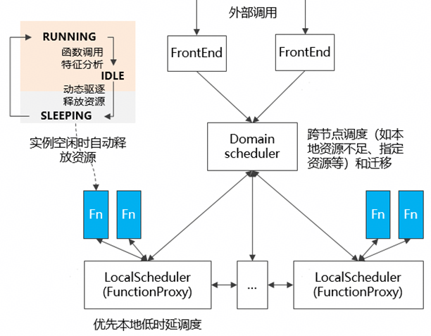

函数系统的架构如上图所示，包括以下几个关键能力：

- **分布式分级调度：** 分级可扩展，避免中心单点调度瓶颈，支持大规模分布式集群细粒度函数调度。

- **动态生命周期管理：** 支持运行中动态创建/删除实例，支持自动休眠、唤醒、迁移。

- **高效资源利用：** 基于快照的极速冷启动，自动水平/垂直弹性和跨节点迁移充分利用各节点资源。

- **实例间支持原生互调：** 根据实例 ID 互调，地址无关（不暴露 IP），迁移友好，原生支持分布式异步调用。

- **分布式容错：** 支持故障自动检测，以及在故障情形下重拉实例，并恢复其最近备份的状态，同时支持函数调用过程中的分布式异常处理。编程示例

### 编程示例

openYuanrong 提供如下单机体验编程简化分布式应用开发，函数系统需要支持这些单机体验开发的程序自动分布式运行。

原生函数编程例子：

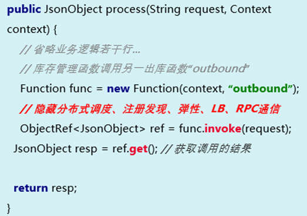

通过少量修改自动分布式并行有两种典型的场景：无状态和有状态。

- 无状态编程的例子：

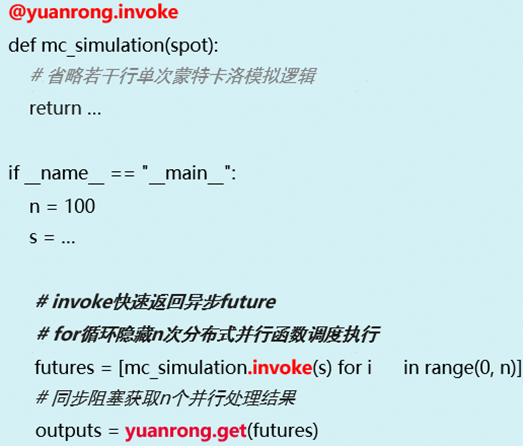

- 有状态编程的例子：

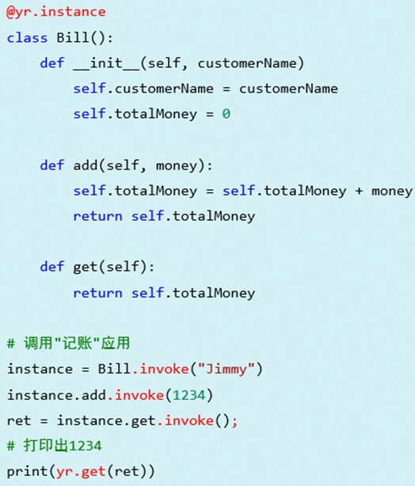

### 分布式分级调度

常规的集中式调度将所有控制放在中心节点，一旦中心出故障或负载过高，整个系统都可能瘫痪或变慢，且它难以扩展，不适应大规模分布式场景。因此函数系统采用了 Domain-local 分层的调度设计，函数优先在本节点内的 Local Scheduler 调度，这样即减少了调度开销，同时也减少了函数间的数据跨节点传递。仅当本节点资源不足时，才将函数提交给上层 Domain Scheduler，实现全局的资源负载均衡。当集群规模比较大时，Domain Scheduler 本身也可以通过父子级联的方式来管理集群，每个 Domain Scheduler 管理 500~1000 节点，实现分而治之的效果。

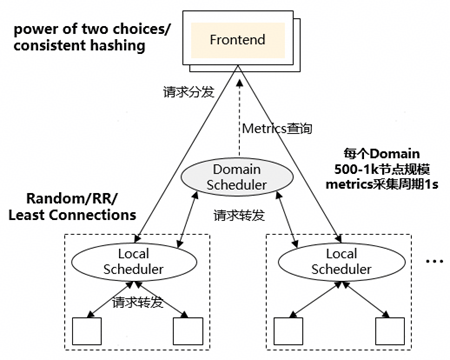

- **Local Scheduler:** 负责单个节点的资源管理和函数调度，同时管理节点上函数实例的生命周期。

- **Domain Scheduler：** 负责单个调度域内的资源管理和函数调度，相比 Local Scheduler，它还会负责比较复杂的需要全局资源视图的调度策略，比如亲和调度、拓扑感知的调度。

- **Frontend：** 根据策略（power of two choices/consistent hashing）将调度请求发送至Domain Scheduler。

### 水平弹性

传统云原生方的弹性方案一般是基于负载（如 CPU、内存使用率）进行弹性决策，但负载无法准确反映业务压力，易引发误伸缩，导致 SLA 违规。因此函数系统采用了依据请求流量进行弹性决策的方法，Function Scheduler 根据函数调用请求队列的长度，估算队列中请求的等待时延，加上函数历史执行的平均时延则可预计出请求处理完成的时延。如果处理时延预计增长超过一定阈值，则进行扩容， 每隔一段时间，评估函数实例的请求处理情况，如果请求处理时延没有增加则考虑缩容。

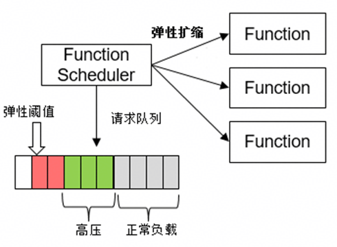

为进一步提升响应速度与稳定性，Function Scheduler 可集成预测算法。通过分析历史调用规律（如过去一周的数据），预测未来数小时至一天的具体请求量与实例需求，实现预先的资源调配与快速扩缩。 同时考虑到兼容传统微服务，Function Scheduler 也支持通过插件的方式，扩展支持传统的弹性策略，比如基于负载（如 CPU、内存使用率）进行弹性决策。

### 垂直弹性

传统容器类微服务部署时，用户通常按峰值流量预留固定资源（如4核8G）。当实际流量较低时，大量资源被闲置浪费。垂直弹性通过动态调整单个实例的资源配额，把闲置资源让给其它有需要的函数，从而进一步提升集群资源利用率。

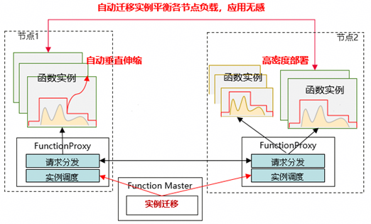

- **按需垂直伸缩：** 根据服务请求处理时延实时调整实例资源配额（资源配额和请求时延成负相关，请求延时和目标延时比较，按步长调整资源配额）。

- **按需实例迁移：** 自动迁移实例避免节点负载过高或过低，导致影响服务SLA或造成资源浪费

### 快速冷启

水平弹性主要解决函数何时扩缩的问题，而快速冷启解决函数能多快响应业务请求的问题。函数系统的冷启动方案基于 CRIU（Checkpoint/Restore In Userspace），将函数的状态保存为镜像文件，启动时从镜像文件快速恢复。

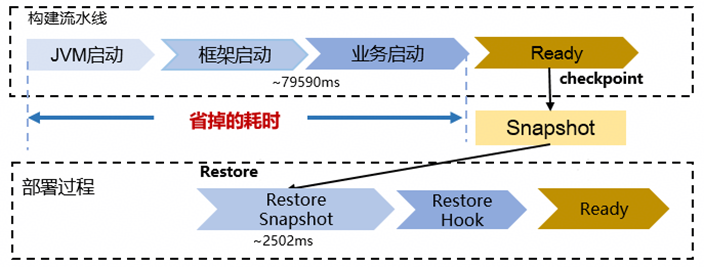

如上图所示 Java 微服务启动由多个环节组成，CRIU 可以省掉启动这段耗时，但镜像文件从磁盘加载仍然需要秒级左右的耗时，因此函数系统通过将镜像文件存在 openYuanrong 自带的数据系统中（近计算分布式缓存系统）来优化加载速度。

### 实例间原生互调

函数系统支持函数间原生通过函数名或函数实例 ID 进行互调，无需感知 IP/端口等底层设施,同时支持函数间直连，加速函数的互调性能。

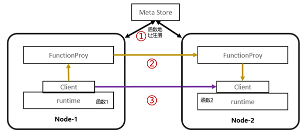

首先，将函数实例的元信息统一注册到 Meta Store。当一个函数调用另一个函数时，会通过 Meta Store 进行服务发现，并在两者之间建立一条经由 Function Proxy 转发的“黄色线条标识的链路”，通过它交换函数调用双方的地址信息。

其次，系统会利用调用双方的地址信息建立一条“紫色线条标识的链路”，即函数间点对点直连通道，用于函数间正常的通信，大幅降低了端到端调用时延。

最后，为确保直连通信的安全性，系统也提供了认证鉴权机制，后续会有相应的文章专门介绍，这里就不赘述。

### 分布式异常处理

在分布式系统中，要捕获类似于单机程序那样完整且时序准确的全局调用栈信息，非常具有挑战性。函数系统提供分布式融合调用栈来解决此问题，为应用开发者提供单机调测体验。

举一个简单的例子，Function A -> Function B -> Function C，具体如下：

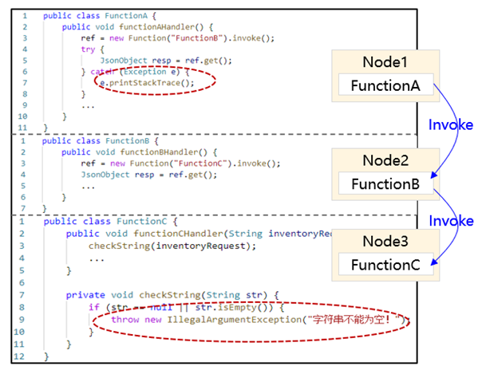

Function C异常，在Function A中通过Try{}Catch{}即可捕获如下异常：

     Caused by: java.lang.IllegalArgumentException:字符串不能为空！
     at functionC.checkString(functionC.java:9)
     at functionC.functionCHandler(functionC.java:3)
     at functionB.functionBHandler(functionB.java:4)

**实现的原理如下：**

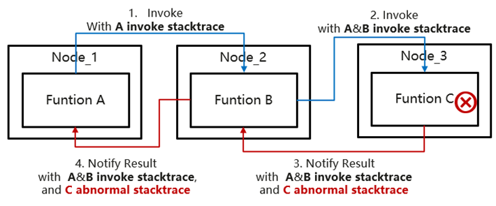

- **全链路调用栈自动拼装：** 利用函数互调链路，异步拼装函数调用关系和函数异常调用栈。

- **函数异常时机精准捕获：** 函数异常通过 get()/wait() 函数（与 future 语义保持一致）使用原生语言的捕获语义进行捕获，减少开发者学习成本。

## 实践案例

### 案例一

在HPC领域选取了一款EDA xxx工具使用 openYuanrong 做分布式改造，该工具的任务间相互依赖，使用NAS存储数据同步低效，难以分布式并行加速。

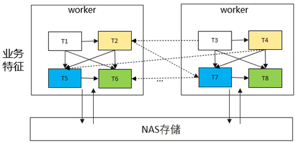

利用 openYuanrong 的编程接口，实现单机编程体验，快速支撑该工具万核并行，实现7倍加速。

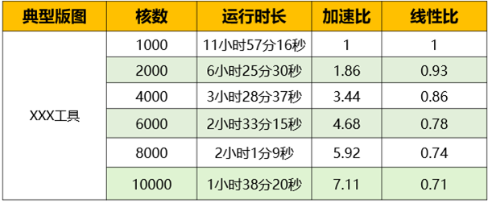

### 案例二

选取一个微服务场景，100个虚拟机（16C-32G）规模的集群，基于生产环境流量和业务负载回放测试，openYuanrong 的垂直弹性加动态调度可提升集群利用率至60.5% ，函数请求响应P95延时劣化<10%，仍满足用户SLO。

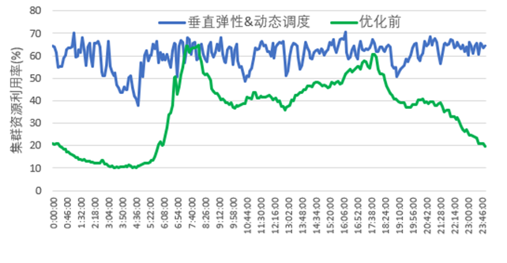

### 案例三

选取了六种 Java 微服务进行了测试，微服务的代码包大小在 128MB~200MB 之间，基于快照极速冷启动的方案，冷启动速度提升10倍。详情见下表：

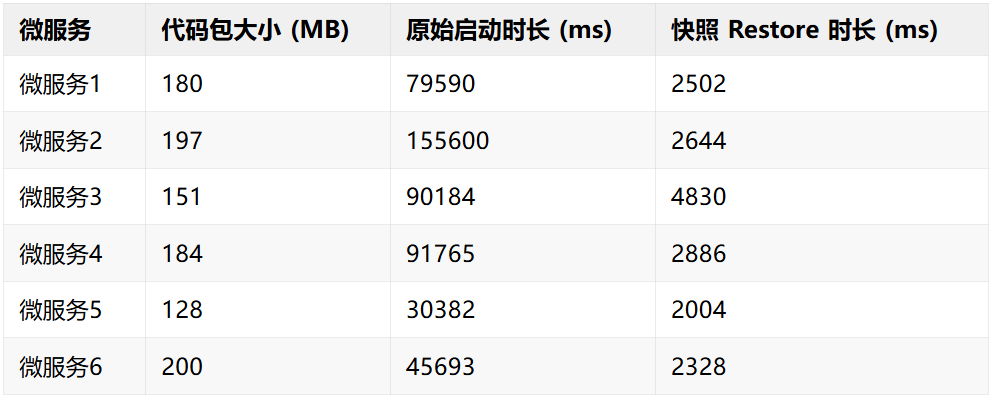

## 总结

函数系统作为 openYuanrong 的核心子系统，旨在实现高性能、高可用的分布式计算引擎。它通过分级调度提供大规模细粒度动态调度，使用水平弹性、垂直弹性和快速冷启提升集群资源利用率，内置了分布式容错与异常处理，保障业务长时间稳定运行。

openYuanrong 已在OpenAtom openEuler 社区全面开源，采用 Apache 2.0 License。

- 官网地址：<http://docs.openyuanrong.org/ >  

- 源码地址：<https://atomgit.com/openeuler/yuanrong>

- 问题反馈：<https://atomgit.com/openeuler/yuanrong/issues>

欢迎添加 openYuanrong 小助手微信，由小助手拉您进我们的官方群获得最新资讯

