## 背景

为了应对云原生与AI时代对分布式计算提出的高性能与易用性挑战，openYuanrong 提出了以函数、状态、数据对象、数据流为核心抽象的分布式内核理念，并通过多语言函数运行时、函数系统与数据系统三大子系统协同实现。数据系统是以内存为中心、近计算的分布式异构多级缓存，为AI训推、Agent、大数据、微服务等分布式应用提供高性能的数据对象（KV）与数据流访问、HBM/DRAM/SSD 多级缓存以及实例间零拷贝数据共享能力。当数据系统与函数系统紧密配合时，可实现数据亲和调度、异步函数执行、自动分布式GC等系统级能力。

关于 openYuanrong 的整体架构和设计理念，详见上一篇文章：[把集群变“单机”（下）——openYuanrong核心架构设计解析](https://mp.weixin.qq.com/s/a-B7waZG6LvjEiFnEHUniw)

## 数据系统整体架构

openYuanrong 数据系统采用近计算部署与共享内存机制，实现函数实例间免拷贝高速数据交换，同时基于分布式 Object Directory，自动管理数据副本和生命周期，使开发者无需关注底层复杂机制。

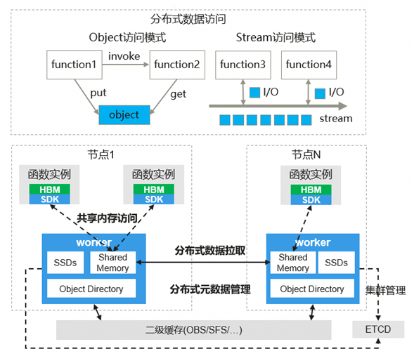

数据系统为开发者提供以下四个核心能力：

- **分布式内存共享：** 数据优先通过计算所在节点共享内存实现高性能读写，跨节点访问自动将远端数据缓存至本地共享内存。

- **分布式对象引用：** 支持对象引用替代传值，同时支持Future语义以便于异步处理，数据系统自动实现分布式引用计数和全局数据对象生命周期管理。

- **分布式异构对象：** 面向大模型训推等场景，支持异构数据对象和HBM/DRAM/SSD多级缓存，提供高性能分布式KV Cache访问。

- **分布式元数据管理：** 采用分布式元数据架构消除单点瓶颈，同时支持就近访问与快速寻址，确保高并发下的系统稳定与可扩展性。

## 编程示例

openYuanrong 数据系统提供两类分布式数据编程抽象：数据对象与数据流。

**数据对象：** 支持引用传递与键值访问。

分布式对象引用（ObjRef）： 开发者可通过函数调用（invoke）或直接写入（put）产生一个对象引用，该引用可在任务间灵活传递，实现数据的按需、异步获取。

典型使用方式包括：

- 作为顶层参数传递：在函数间直接传递引用，无需等待数据就绪。

- 作为嵌套参数传递：将引用嵌入复杂数据结构中，进一步减少不必要的数据复制。

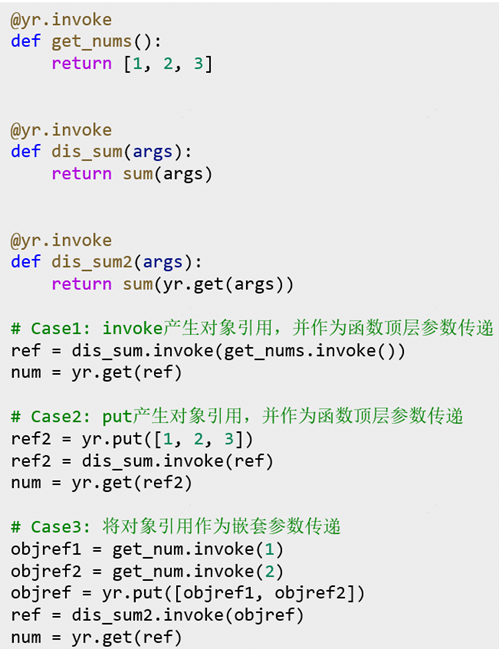

键值（Key-Value）接口： 开发者可通过指定Key来读写、删除具有唯一标识的命名对象，适用于需要显式命名的场景。

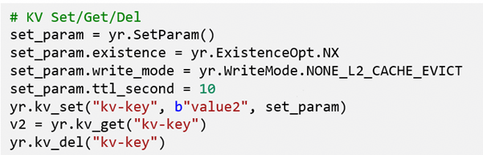

**数据流：** 支持基于名称的生产消费模型。 支持函数实例间基于约定的流名称建立生产-消费关系并实现数据收发解耦，具体接口和实现机制将在后续专题文章中详细介绍。

## 关键技术实现

### 分布式内存共享

为了实现高性能的分布式数据读写，数据系统围绕近计算部署、共享内存访问、副本管理与可变对象支持等核心设计，构建了以下机制：

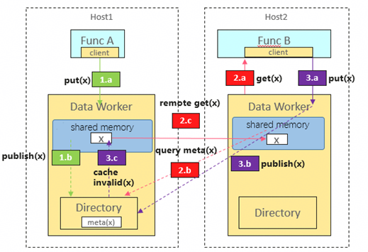

#### 近计算亲和访问

- **数据局部性保障：** 数据对象默认按本地写入策略进行分布，避免跨节点散列，确保访问尽量就近完成。

- **共享内存低时延访问：** 函数实例通过进程间共享内存直接读写由Data Worker管理的对象，实现免拷贝的高性能数据访问。

#### 热点数据副本管理

- **自动本地缓存：** 访问远端数据时，数据系统自动将其缓存至本地共享内存，供多个函数实例免拷贝复用，避免重复网络传输。

- **负载均衡拉取：** Object Directory在数据拉取时采用随机策略选择副本节点，分散热点访问压力，提升系统整体吞吐。

- **缓存按需淘汰：** 本地副本在内存受限时按LRU策略进行淘汰，在保证数据可访问性的同时优化内存使用效率。

#### 可变对象支持

- **对象可变性支持：** 数据系统支持可变数据对象，允许对同一对象进行多次覆盖写入，并确保分布式环境下的数据一致性（支持不同的一致性等级）。

### 分布式对象引用 (Future)

在分布式并行编程中，编写高效、正确的程序面临两大固有挑战：

**挑战一：依赖管理复杂**

开发者必须手动编排任务顺序，等待上游数据就绪后再传递给下游任务。这种“拉取式”依赖协调将调度与数据流紧耦合，导致复杂逻辑难以表达和维护。

**挑战二：数据位置与生命周期管理负担重**

在分布式环境中，开发者需关注数据存储在何处、何时可用、何时可安全删除。这不仅容易引发内存泄漏或访问已释放数据错误，也分散了开发者对核心业务逻辑的关注。

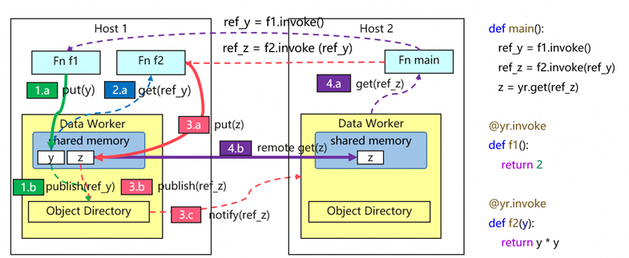

为解决上述问题，数据系统支持分布式对象引用（分布式Future）核心抽象，通过以下机制实现依赖与资源管理的自动化：

**机制一：发布/订阅，实现依赖自动协调**

数据系统通过分布式的 Object Directory 管理数据位置与订阅关系。当任务B依赖任务A的结果时，只需订阅对应引用；任务A完成后，数据被写入共享内存，Object Directory 记录其位置并自动通知所有订阅者。开发者只需声明依赖关系，无需关心数据如何传递。

**机制二：引用计数，实现生命周期自动化**

每个对象的引用计数由 Object Directory 维护。引用传递时计数增加，离开作用域时计数减少；计数归零时，系统自动回收内存。开发者无需手动管理数据生存周期，彻底免除了内存管理的负担。

### 分布式异构对象多级缓存

在大模型推理分布式KV Cache等高吞吐场景中，开发者通常面临以下关键瓶颈：

- **内存容量受限：** 单节点内存难以支撑大规模KV Cache等缓存数据的存储需求；

- **数据传输效率不足：** 设备间、主机与设备间的小数据搬运成为整体性能瓶颈；

- **跨节点访问延迟高：** 依赖主机中转的传统访存路径无法满足低延迟要求；

- **多级内存管理复杂：** HBM、DRAM、SSD等异构内存需人工介入管理，显著增加开发负担。

为系统性地解决上述问题，数据系统扩展支持了异构数据对象，并构建了由HBM、DRAM、SSD 组成的分级缓存体系，通过以下关键技术实现高性能、大容量、易用的分布式数据访问：

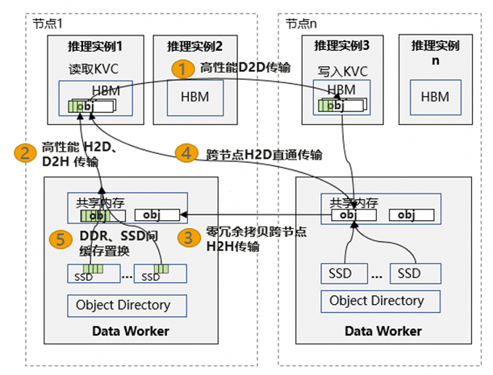

- **D2D高速传输：** 支持卡间HBM数据直接通信，自动管理动态链路建立、P2P通信算子调度与负载均衡，降低跨设备传输延迟，简化多卡编程；

- **H2D/D2H高效传输：** 采用内存大页聚合与批量SDMA/RDMA操作，显著提升KB级小数据的传输效率，实现单卡高达20GB/s的传输吞吐；

- **H2H零拷贝传输：** 通过共享内存与通信内存的复用机制，实现进程间数据零冗余拷贝，充分发挥UB互联总线带宽，实测传输速率可达48GB/s；

- **跨节点H2D直通访问：** 基于NPU NIC支持主机内存到设备内存的直接访问，避免数据经由HBM中转，有效降低KV Cache等场景的跨机访问延迟；

- **SSD容量扩展与分级管理：** 将数据自动溢出至SSD，突破内存容量限制，并智能调度数据在DRAM与SSD间的迁移与淘汰，实现存储容量与访问性能的平衡。

### 分布式元数据管理

为突破单点元数据管理在可扩展性、性能与可靠性上的根本瓶颈，数据系统设计了分布式元数据目录架构，通过将元数据管理完全分布化，并基于局部性确定目录位置，在系统层面实现了故障域隔离与访问性能优化的双重目标。

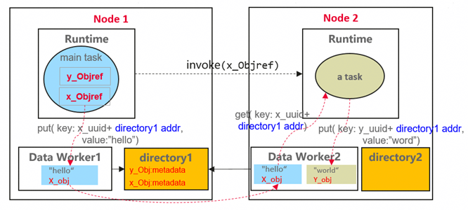

**分布式元数据目录：**

- 每个节点部署独立的元数据目录，负责其管辖对象的元数据读写与协调，彻底消除中心化单点瓶颈。

- 目录仅管理本节点关联任务的元数据，单一节点故障的影响被严格限制在其管理的数据子集内，系统整体可用性显著提升。

**基于局部性的目录位置指派：**

- 本地写入亲和：对象通过 yr.put 首次写入时，其所在节点的目录即成为其 Home Directory。

- 调用者亲和：函数调用者所在节点的目录，自动成为其返回值对象的 Home Directory。

- 编码直接寻址：Home Directory 地址被编码至对象引用的 Key 中，支持运行时直接解码定位，无需中心查询。

通过上述亲和性规则，对象的创建者与主要使用者通常位于相同或相邻节点，其元数据操作（查询、更新）绝大多数在本地或邻近目录完成。该设计大幅减少了跨节点、跨机架的元数据远程访问，在实现管理分布化的同时，也达成了低延迟、高吞吐的访问性能。

## 实践案例

### 分布式KVC多级缓存

数据系统作为分布式 KV Cache 后端对接到 vllm-ascend 框架，通过扩展缓存池容量提升性能。基于 Qwen3-32B 模型、8 并发负载的测试表明，在 50% 缓存命中率条件下，随着输入序列长度从 1K 增加至 8K，性能提升幅度逐步增大：

- **吞吐提升：** 8K 序列下，吞吐 提升 **169.4%。**

- **TTFT降低：** 在同等条件下，TTFT 降低 **66.5%.**

**性能提升的根本原因在于，数据系统通过将缓存池从 HBM 扩展至分布式内存，显著提高了缓存命中率，并且 KV Cache 数据 H2D 加载耗时在 TTFT 总耗时中的占比低于 5%。**

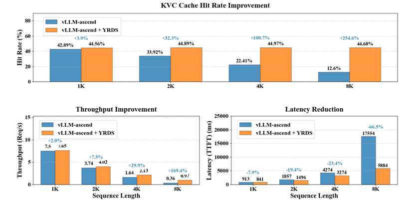

### LLM实例快速弹性

数据系统支持大模型推理实例快速弹性，利用模型参数的只读性，从已有服务实例的NPU快速复制模型参数到新实例。

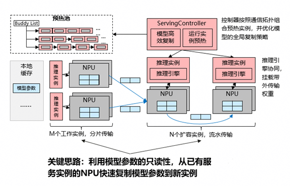

经过实验验证：

单推理实例推理服务实例弹性能力提升20~100x至5秒内。

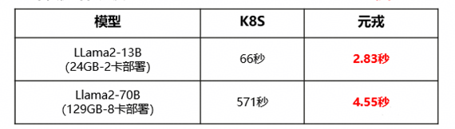

借助数据系统P2P数据负载均衡优化，多实例批量弹性速度接近单实例，D2D数据流转不存在单点瓶颈。

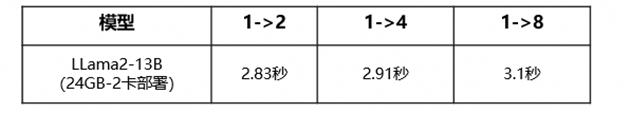

并且，通过消融实验验证，在弹性扩容过程中，数据系统对推理性能干扰较小，工作实例的吞吐下降 < 5%，持续时间2秒。  

注：k8s为内部实验室环境验证数据。

## 总结

数据系统作为 OpenYuanrong 分布式内核的核心组件，秉承“内存为中心、近计算部署”的设计理念，以数据对象和数据流为核心编程抽象，通过分布式内存共享、分布式对象引用、异构对象多级缓存与分布式元数据管理等一系列技术，构建了统一的高性能数据访问基础设施，有效支持微服务、大数据与AI等场景下对分布式数据的高效访问需求。

openYuanrong 已在OpenAtom openEuler 社区全面开源，采用 Apache 2.0 License。

- 官网地址：<http://docs.openyuanrong.org/ >  

- 源码地址：<https://atomgit.com/openeuler/yuanrong>

- 问题反馈：<https://atomgit.com/openeuler/yuanrong/issues>

欢迎添加 openYuanrong 小助手微信，由小助手拉您进我们的官方群获得最新资讯

