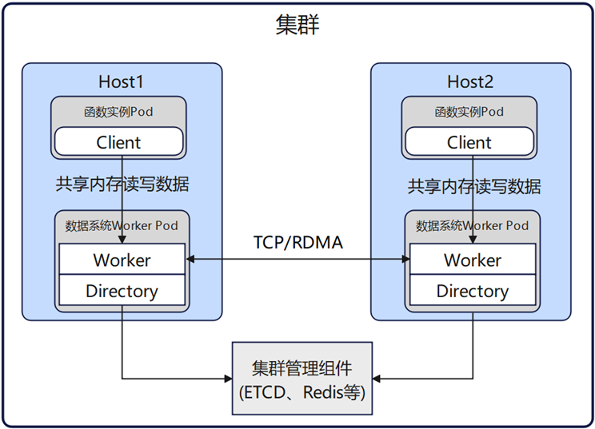
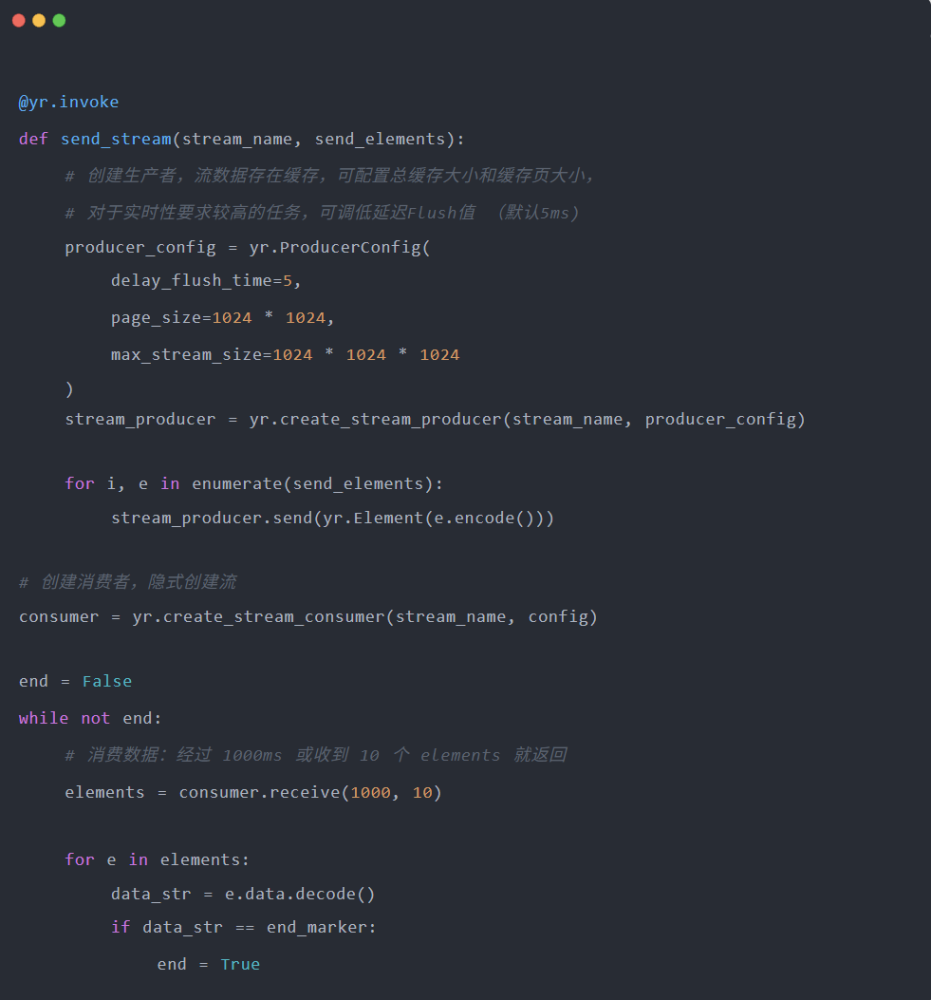
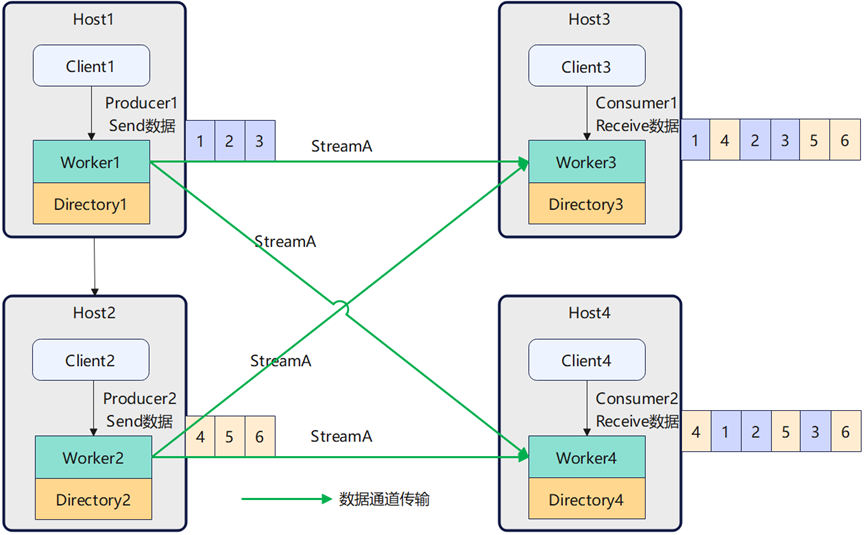
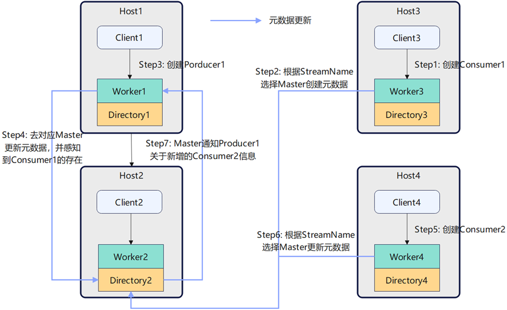
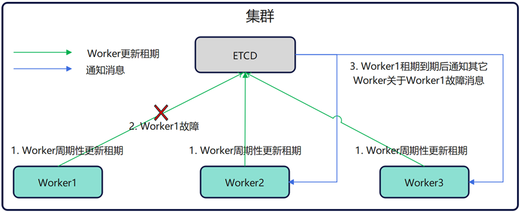
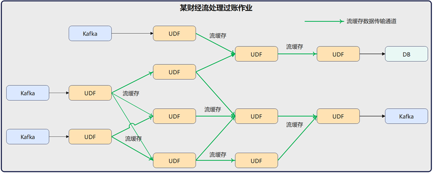
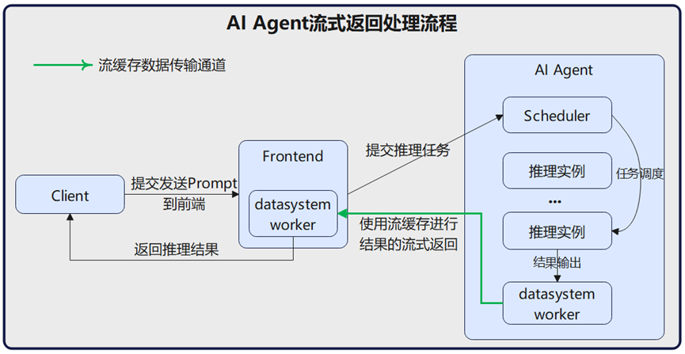

## 引言

在当今数字化时代，数据已成为驱动技术创新与业务增长的核心要素。然而，数据的生产者与数据的消费者往往存在物理或者逻辑上的隔离。典型场景包括：微服务架构中组件间的业务协同，大数据处理中不同 UDF（用户定义函数）流水线之间的数据传递，物联网海量设备数据汇聚上报分析和 AI Agent 完成推理后的流式返回。这些场景共同揭示了一个共同的需求：构建一种高吞吐、低延迟且资源高效的数据流转功能，以支撑不同场景中复杂多样的通信范式。

## 问题与挑战

当前 Kafka、Rabbit 等主流的消息队列或数据管道普遍采用中心化的 Broker 架构——即数据需由生产者发送至 Broker 节点进行持久化、缓存与分发，而非就近存储于数据源或计算节点本地。尽管该模式具备良好的解耦性与可靠性，但在高并发、低延迟、资源敏感的场景面临诸多痛点：

- **内存开销大：** 数据的生产者和消费者需要额外维护发送/接受数据缓冲区。另外即使生产者和消费者在同一节点，同一份流式数据也会被多次复制，造成内存数据冗余与资源浪费。

- **高时延：** 数据生产消费都需要经过 Broker，因此数据从生产者流向消费者涉及数据多次的拷贝和传输，导致端到端的数据流转时延较高。

- **网络带宽利用率低：** 所有数据生产消费都需经由 Broker 中转，无法利用本地亲和性（如同节点、同机架部署）实现直连传输，导致网络带宽被非必要流量挤占，系统扩展性受限。

## openYuanrong 数据流

### openYuanrong 简介

openYuanrong 是一个 Serverless 分布式计算引擎，致力于以一套统一 Serverless 架构支持 AI、大数据、微服务等各类分布式应用。它提供多语言函数编程接口，以单机编程体验简化分布式应用开发；提供分布式动态调度和数据共享等能力，实现分布式应用的高性能运行和集群的高效资源利用。 关于 openYuanrong 的整体架构和设计理念，详见上一篇文章：[《把集群变“单机”（下）——openYuanrong核心架构设计解析》](https://mp.weixin.qq.com/s/cZ1yJk1abhJJt9ODYiyijQ)。

数据系统是 openYuanrong 的一个核心子系统，提供分布式内存缓存能力，利用计算集群的 HBM/DRAM/SSD 资源构建近计算多级缓存，提升模型训练及推理、大数据、微服务等场景数据访问性能。关于 openYuanrong 数据系统的整体架构和设计理念，详见上一篇文章：[《openYuanrong 数据系统：近计算高性能分布式内存缓存》](https://mp.weixin.qq.com/s/ia_EY4nPTsdhuIIYM-Lm6w)。

### openYuanrong 数据流总体架构

openYuanrong 数据流是 openYuanrong 数据系统提供的一个基于共享内存 Page 的流语义，旨在消除传统消息中间件中的冗余拷贝与中转开销。 数据系统中包含三个组件：

- **Client：** 提供数据流、KV、Object 和异构语义，供用户调用。

- **Worker：** 缓存数据流、KV、Object 的数据，并对数据进行节点间的推拉。

- **Directory：** 元数据管理组件，数据系统中使用分布式的 Directory 架构。

- 数据流支持多语言版本的 SDK，涵盖主流语言 C++/Java/Python。

- 用户持有 Stream Client，Client 连接本节点的 Worker，Client 对集群中其它的 Worker 和 Directory 不感知。

- Client 基于 StreamName 创建 Producer 和 Consumer，数据发送方和接受方只需持有 Producer 和 Consumer 即可发送和接受数据。

- 系统中的 Stream Client 提供数据流的 SDK，Worker 作为数据流转的执行组件，Directory 保存 Stream 的元数据信息。

- 数据传输无 Broker 中转，Worker 之间推拉数据的时候直接点对点进行传输。

- Producer 和 Consumer 直接读写 Worker 的共享内存，减少数据传输时内存的多次拷贝。

### 核心能力解析

#### openYuanrong 数据流 API

openYuanrong 数据流支持主流编程语言，提供 C++/Java/Python 的 SDK 接口，下面以 Python 为例：

#### openYuanrong 数据流的优势

openYuanrong 数据流是近计算的流语义，其基于共享内存进行数据的读写。由此带来的优势如下：

- 降低内存占用：Producer 将数据直接写入同节点 Worker 的共享内存上，后续数据流转由 Worker 进行。因此 Client 不需要额外申请内存用于数据传输，降低用户进程的资源消耗。

- 低时延/降低网络消耗：数据读写亲和，如果 Consumer 与 Producer 位于同节点，则不需要进行进程或者网络间的数据传输，Consumer 直接从 Worker 的共享内存中读取即可。

#### openYuanrong 数据流数据传输流程

openYuanrong 数据流支持 Producer 与 Consumer 一对一、一对多、多对一和多对多的关系进行数据流转。

- Producer 发送的数据由本节点 Worker 推送到 Consumer 节点所在 Worker 上，随后 Consumer 可从对应 Worker 接收数据。

- Worker 间拉取数据时直接为点到点收发，无 Broker 组件的中转消耗。

- 在 Producer 和 Consumer 多对一或者多对多的使用场景下，Consumer 接收的数据对于每个 Producer 发送的数据是保序的，而 Prodcuer 之间数据接收顺序是不保证的。

#### openYuanrong 数据流元数据管理

openYuanrong 数据流采用分布式的 Directory 架构对 Worker 和元数据进行管理，Directory 和 Worker 采用共进程的方式进行部署，用户不需要感知 Directory 的存在。而正是因为Directory的存在，才使 Worker 之间可以不依赖 Broker 直接进行点对点的数据传输，下图展示了 Client 创建 Producer 和 Consumer 时内部的处理流程：

- 新增 Producer：新增 Producer 时，在管理对应 Stream 的 Directory 中添加 Producer 信息，并根据 Directory 获取到对应 Stream 的所有 Consumer 信息，后续 Producer 生产的数据会推送给原有的 Consumer。

- 新增 Consumer：新增 Consumer 时，在管理对应 Stream 的 Directory 中添加 Consumer 信息，同时 Directory 会通知对应 Stream 的所有 Producer 关于新 Consumer 的信息，后续 Producer 生产的数据会推送给新增的 Consumer。

#### openYuanrong 数据流故障处理

openYuanrong 数据流作为分布式的数据流转通道，集群内的 Worker 状态依赖 ETCD 进行节点管理。当某个节点故障后，ETCD 会推送故障节点信息到集群内其它的所有 Worker。

- Producer 节点故障：当 Producer 节点 Worker 或者主机故障后，并不影响这条流的其它 Producer 和 Consumer 的数据收发。

- Consumer 节点故障：当 Consumer 节点 Worker 或者主机故障后， Producer 节点可继续向其它 Consumer 发送部分数据。

- Directory 节点故障：Producer 和 Consumer 的数据流转不依赖与 Directory 节点，因此原有的 Producer 和 Consumer 可进行正常的数据收发。如果 Directory 故障后立即恢复，对应的元数据可正常恢复，如果 Directory 故障超过死亡时间，对应流的元数据会迁移到其它节点。Directory 恢复或者缩容后，对应流的 Producer 和 Consumer 可以创建成功。

## 应用案例

### 财经交易核算引擎

某财经业务采用流处理框架对交易数据进行分录、凭证和过账处理，其内部 UDF（用户定义函数）算子之间采用 openYuanrong 数据流进行数据的流转传输，利用节点共享内存实现近计算的数据流传输。

### AI Agent 推理流式返回

在某 AI Agent 的业务场景中，客户端向 AI Agent 推理引擎发起请求后，推理引擎完成计算并返回结果。相较于让客户端长时间等待、最终一次性获取全部推理结果，采用流式响应方式可实时、持续地将最新推理数据逐步返回给客户端，显著提升用户体验与交互流畅性。

## 总结

openYuanrong 数据流提供了面向通用场景的近计算流缓存能力，利用共享内存缓冲和主动数据推送方式，解决了传统 Broker 架构高延迟、多次拷贝、高带宽消耗的问题，显著提升了数据流转效率，为 AI、大数据、微服务和 Serverless 等场景提供了轻量、高效的数据实时流转通道。

openYuanrong 已在OpenAtom openEuler 社区全面开源，采用 Apache 2.0 License。

- 官网地址：<http://docs.openyuanrong.org/ >  

- 源码地址：<https://atomgit.com/openeuler/yuanrong>

- 问题反馈：<https://atomgit.com/openeuler/yuanrong/issues>

欢迎添加 openYuanrong 小助手微信，由小助手拉您进我们的官方群获得最新资讯

