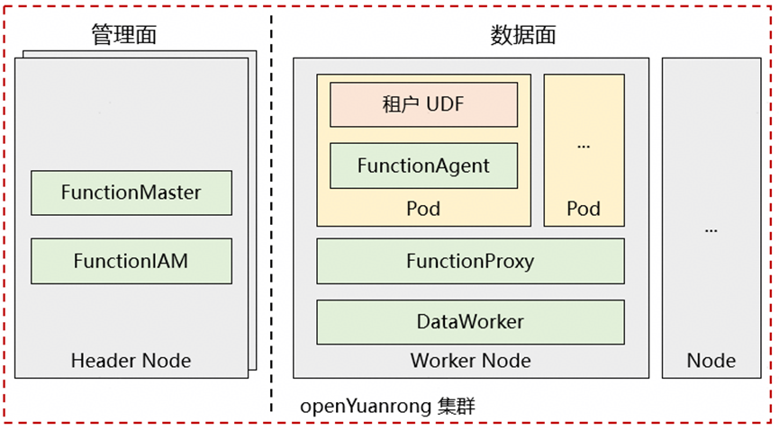
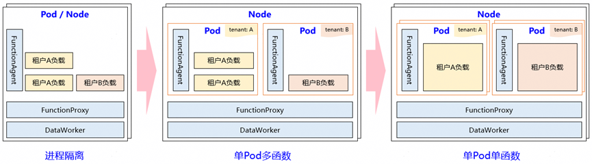
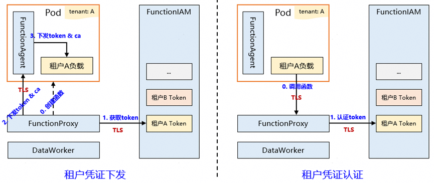
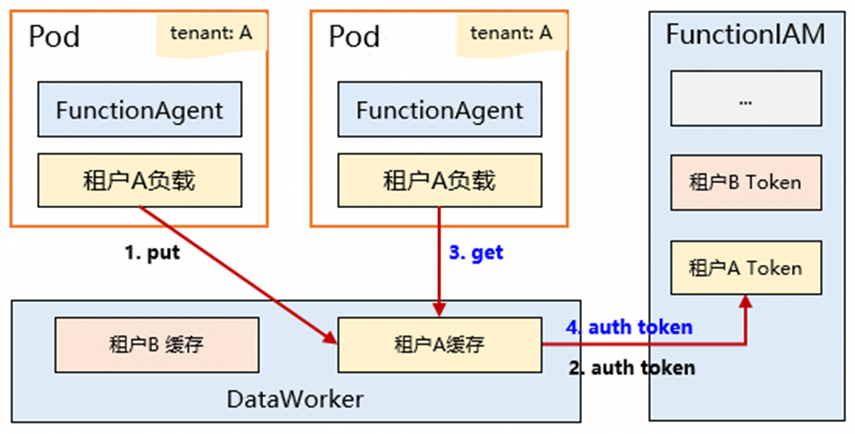
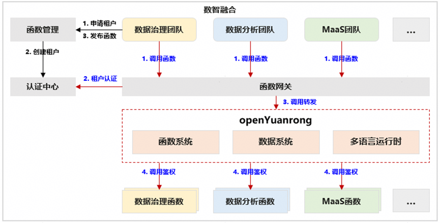
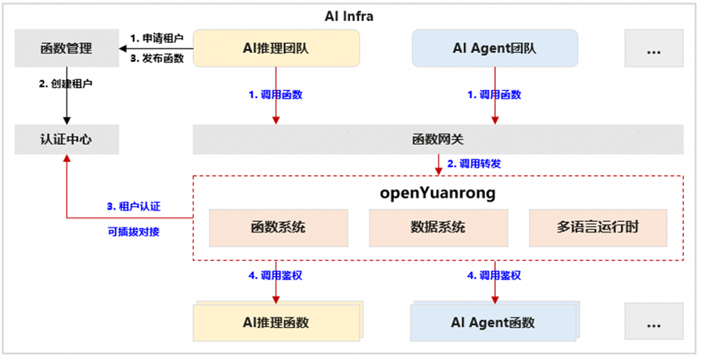

## 问题与挑战

分布式计算框架要在企业级环境下使用，必然面临多租隔离的挑战。以开源框架 Ray 为例，其 Task、Actor 和 Object 不支持隔离和多租，存在以下可能的风险：

- **安全隔离：** AI Agent 和强化学习等场景的AI生成代码以及某些场景下的 UDF 代码是不受信任的，直接运行存在安全隐患，需要容器甚至安全沙箱级别隔离，Ray 当前不具备 Task/Actor 级的安全隔离能力。

- **资源争抢：** Ray 可能将不同租户的 Task/Actor 计算任务运行在同一节点上，容易出现资源相互争抢，导致不同租户间应用互相干扰。

- **数据泄露：** Plasma Object Store 基于共享内存统一存放各应用生成的数据，但缺乏租户认证隔离机制，存在跨租户数据访问的风险。

- **非法调用：** Ray Actor/Task 间调用缺乏租户认证隔离机制，存在跨租户越权访问风险和资源滥用风险。

针对 Ray 的多租隔离缺陷，业界普遍采用 KubeRay 进行“物理硬隔离”，即为每个任务/租户动态创建独立的 Ray 集群，这种“单租户单集群”模式也引入了新的问题：

- **资源碎片化：** 每个 KubeRay cluster 独立分配资源，之间无法进行资源共享，导致 cluster 之间无法共享资源，影响利用率。

- **启动时延高：** 应用执行需要先启动一个 Ray 集群，包含完整的 K8s Pod 调度与Ray集群初始化流程，带来了显著的冷启动延迟。

- **集群运维困难：** 用户在运维应用时不得不同时运维一个完整的 Ray 集群，增加了运维复杂性与成本。

## openYuanrong 多租和隔离

openYuanrong 作为一个通用的 Serverless 分布式计算引擎，在构建之初就充分考虑了多租隔离。支持多租户共享同一套集群，同时，通过 DaemonSet 形式部署 FunctionProxy 和 DataWorker 组件，实现节点级别资源共享，有效加速租户工作负载的冷启动效率。

通过调度策略和原生IAM机制确保函数运行、调用与数据访问时的安全隔离，有效解决同一集群内不同租户的隔离问题，核心特性包括：

- **租户运行隔离：** 支持按需配置不同的隔离模式，追求极致的资源利用率且隔离要求不高时，可采用“进程隔离”模式；需确保业务绝对稳定、避免干扰时，可选择“单 Pod 单函数”模式；希望保证租户间隔离的同时控制资源开销，可选择“单 Pod 多函数”。

- **租户调用隔离：** 每个租户分配唯一的身份凭证 Token 及 CA 根证书，经由基于证书认证的 TLS 安全通道下发至租户函数运行时。在通信过程中，FunctionProxy 验证函数实例的 Token，函数实例验证 FunctionProxy 的证书，从而实现双向认证与 TLS 加密传输。该机制支持按需配置启用或关闭，采用可插拔架构，便于与外部认证鉴权系统对接。

- **租户数据隔离：** 数据系统对租户数据进行了物理隔离，函数在访问数据系统共享内存时，可基于租户 Token 与 DataWorker 进行认证鉴权。该机制支持按需配置，启用后能够确保各租户仅可访问和操作本租户数据，从而实现租户间的数据强隔离，灵活适应不同业务场景对安全与性能的要求。

## 应用案例

### 数智融合场景不同业务隔离

某数智融合平台包含数据治理、数据处理、MaaS 等属于不同团队的业务，单租户集群部署时存在资源浪费，通过 openYuanrong 实现共享集群部署。网关侧通过平台认证中心实现用户认证，数据面基于 openYuanrong 原生租户隔离机制实现资源和调用隔离。

### AI场景不同业务隔离

某 AI Infra 平台为 AI 推理、AI Agent 等业务提供统一AI运行时负载，支持业务共享集群以提升资源利用率，基于 openYuanrong 租户隔离机制，确保业务间的安全隔离。同时，通过对接原有租户认证服务，实现认证机制的可插拔集成，兼顾统一安全与架构灵活。

## 总结与展望

openYuanrong 提供灵活、可配置的租户隔离机制，解决了不同业务在共享集群上的隔离运行，同时有效提升了资源利用率。未来，openYuanrong 将进一步实现应用级动态可配置隔离，以精准响应不同应用的差异化隔离需求；同时，将进一步引入和增强对安全沙箱与 MicroVM 的技术支持，推动隔离体系从“逻辑隔离”向“安全硬隔离”升级，以满足 UDF 和大模型生成代码的安全运行。

openYuanrong 已在OpenAtom openEuler 社区全面开源，采用 Apache 2.0 License。

- 官网地址：<http://docs.openyuanrong.org/ >  

- 源码地址：<https://atomgit.com/openeuler/yuanrong>

- 问题反馈：<https://atomgit.com/openeuler/yuanrong/issues>

欢迎添加 openYuanrong 小助手微信，由小助手拉您进我们的官方群获得最新资讯

