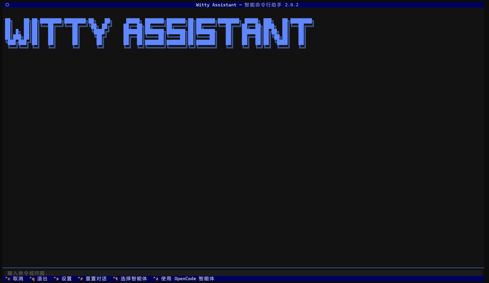
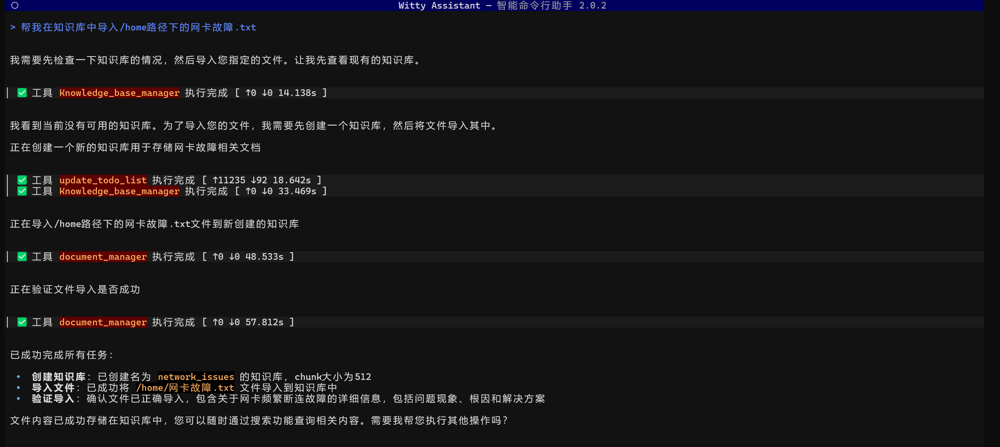
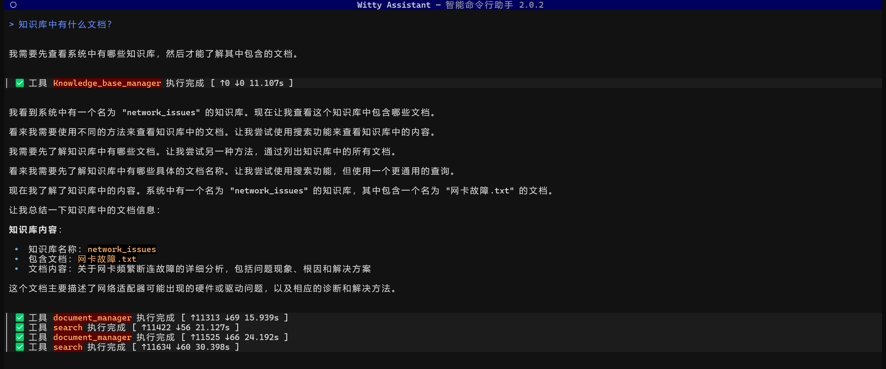
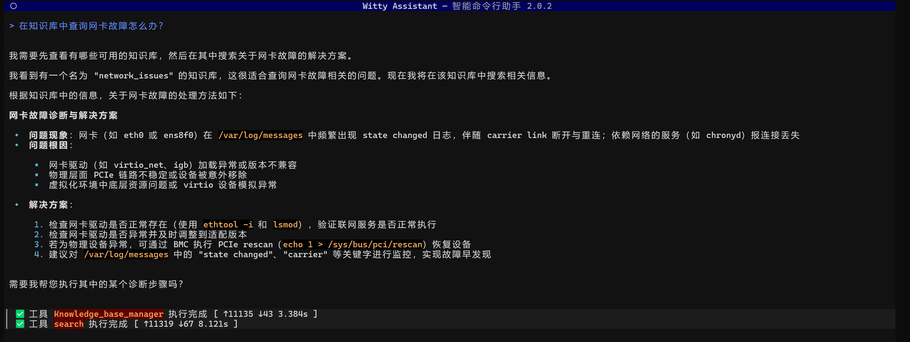
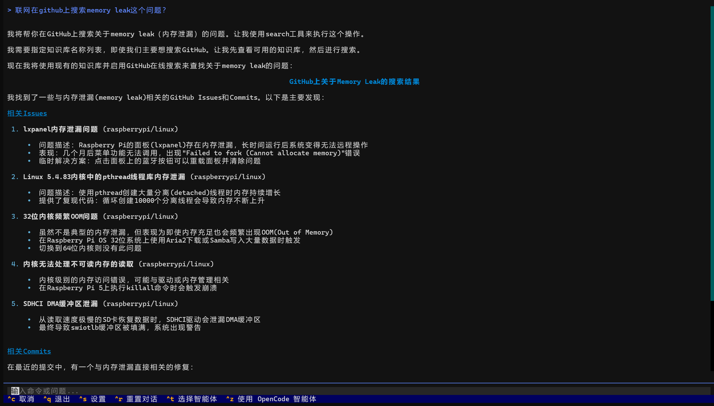

## 一、背景：让历史故障经验“活”起来

在企业级运维中，一个令人无奈的现实是：大量故障并非首次发生。无论是配置错误、版本兼容问题，还是硬件异常，许多“新”告警背后，往往藏着早已被解决过的“老问题”。然而，这些宝贵的经验通常散落在工单系统、内部 Wiki、PDF 手册或工程师的个人笔记中，难以在关键时刻被快速召回。

为此，OpenAtom openEuler（简称“openEuler”或“开源欧拉”）团队将于 2026 年 3 月正式推出**已知问题分析 Agent** —— 一款专注于故障复用与加速诊断的智能体。该 Agent 能自动解析用户输入的故障现象或整篇日志，识别潜在根因，并主动查询历史已知问题库，匹配相似案例，从而生成包含“典型表现、解决方案、验证步骤”的结构化分析报告，大幅缩短平均修复时间。

而这一切高效复用能力的背后，离不开一个关键基础设施：轻量级知识库 MCP 服务。它不依赖外部向量数据库，基于 SQLite 实现文档存储、异步向量化与混合检索，支持 PDF、DOCX、MD 等多格式故障案例模板的导入与管理。运维团队可提前将历史故障的标准化处置方案存入知识库，为即将上线的Agent提供精准、安全、低延迟的本地化“记忆”。

## 二、轻量级知识库 MCP：全生命周期管理，线上本地混合检索

作为 openEuler 智能运维体系中首个内嵌式知识管理模块，**轻量级知识库 MCP** 并非一个独立应用，而是以 **MCP（Model-Context-Protocol）服务** 的形式深度集成于智能运维平台（以下简称 “Witty”）中，提供从知识沉淀到智能召回的完整闭环，具备三大核心特性：

### **1. 零外部依赖，轻量嵌入 openEuler 系统**
- 基于 **SQLite 单文件数据库** 实现存储，无需部署 Milvus、Pinecone 等重型向量引擎；
- 利用 **FTS5 全文检索** 处理关键词匹配，结合 **sqlite-vec 向量扩展** 支持语义相似度计算；
- 所有数据本地存储，满足企业对 **数据主权与安全合规** 的严苛要求；

> 对比传统 RAG 方案动辄 GB 级内存占用，本 MCP 服务在典型故障文档库（<1000 文档）下内存开销 <200MB，真正实现“轻量级智能”。

###  **2. 全生命周期管理，支持多格式故障案例模板**
运维团队可将各种所需文档（如 PDF 报告、MD 复盘文档、DOCX 操作手册）一键导入知识库：

- **支持格式广泛**：TXT、PDF、DOCX、DOC、MD、HTML、PPTX、XLSX、YAML、JSON，甚至图片中的文字（通过 OCR 处理）；

- **智能切分与异步向量化**：文档按 token 自动切块（chunk），并通过后台任务批量生成向量，避免阻塞主交互流程；

- **精细化管理**：支持按知识库组织文档，提供创建、列表、删除（软删除）、查看 chunks 等完整 CRUD 接口。

###  **3. 混合检索 + 线上检索，兼顾精度与鲁棒性**
面对用户自然语言提问（如“系统启动卡在 dracut”），MCP 采用 **本地混合检索 + 可选线上增强** 的双重策略

- **本地混合检索**：同时执行 FTS5 关键词匹配与 sqlite-vec 向量搜索，通过加权融合并结合 Jaccard 相似度去重重排序，确保高相关性结果优先返回；

- **线上检索增强（可选）**：当本地知识覆盖不足时，可启用 `online=True` 参数，自动调用 GitHub API 检索相关 Issues 或 Commits，补充社区最新解决方案；


## 三、前置环境配置-零门槛启动指南

### 3.1 从环境准备到服务启动，五步搞定

openEuler智能助手 **Witty** 的部署支持外网在线部署和内网离线部署，以下为标准外网部署流程（详细部署文档可参考[官方部署手册](https://atomgit.com/openeuler/euler-copilot-framework/blob/master/docs/zh/witty_assistant/witty_shell/deploy_guide/deployment.md)）：

#### 3.1.1 环境准备

需满足基础环境要求

| 需求类型       | 具体要求                                                                 |
|----------------|--------------------------------------------------------------------------|
| 系统版本       | openEuler 24.03 LTS SP3 及以上版本                                       |
| 硬件资源       | 内存≥8GB（本地部署大模型需≥32GB），可用磁盘空间≥20GB                     |
| 权限要求       | 具备sudo权限                                                             |
| 大模型准备     | 支持工具调用的大模型（如线上的DeepSeek、本地的ollama）及对应API端点       |

---

#### 3.1.2 安装基础包

打开终端执行以下命令，更新系统并安装openEuler智能助手核心包：

```bash
# 更新系统软件包
sudo dnf update -y
# 安装openEuler智能助手及部署工具
sudo dnf install -y witty-assistant
```

#### 3.1.3 初始化配置

执行初始化命令启动部署助手，按提示选择“部署新服务”，并完成LLM配置（API端点、密钥、模型名称），embedding配置（API端点、密钥、模型名称）：

```bash
sudo witty init
```

注意：LLM配置和embedding配置需确保“支持工具调用”，配置完成后系统会自动验证，验证通过方可继续。

#### 3.1.4 启动部署

确认配置无误后点击“开始部署”，系统会自动完成环境检查、MongoDB安装、sysagent服务部署、智能体初始化等操作，全程约10-20分钟。

#### 3.1.5 部署验证

终端输入`witty`启动工具，若能正常显示交互界面，输入“你好”并成功返回结果，说明部署完成。

## 四、使用方法与案例

- **启动与退出**：`witty`启动，`Ctrl+Q`退出，`Ctrl+C`中断当前任务；



- **文档导入**：在对话框中直接输入：帮我在知识库中导入/home路径下的网卡故障.txt；



- **文档查看**：在对话框中输入：知识库中有什么文档？



- **本地知识库查询**：直接输入需求：在知识库中查询网卡故障怎么办？



- **在线Github查询**：输入问题：联网在github上搜索memory leak这个问题？



- **命令行工具**：除了使用自然语言，也支持使用rag-server的命令行工具去调用各种工具。


## 五、总结

轻量级知识库 MCP 的推出，标志着 openEuler 智能运维从“工具自动化”迈向“知识智能化”的关键一步。它不仅是技术组件，更是企业运维知识沉淀与复用的基础设施。

作为 **3 月即将发布的“已知问题分析 Agent”** 的核心记忆引擎，该 MCP 服务以三大优势赋能故障诊断新范式：

- **对运维团队**：无需搭建复杂 RAG 架构，只需将历史故障案例（PDF、MD、DOCX 等）导入本地知识库，即可实现“一次录入、多次复用”，让宝贵经验不再沉睡在归档文件夹中；

- **对智能 Agent**：提供低延迟、高精度的混合检索能力，使 Agent 能在秒级内匹配相似已知问题，生成包含典型现象、根因分析、解决步骤的结构化报告，显著缩短 MTTR；

- **对企业安全**：全链路本地化运行，数据不出内网，无外部 API 依赖，满足金融、电信、政务等高合规场景需求。

从日常的配置问题排查，到复杂的内核级故障复现，轻量级知识库 MCP 正在将 Witty 打造成一个 **会学习、能记忆、可进化** 的智能体。

>  **立即体验**  
> 该功能已随最新 `Witty` 发布，欢迎通过以下资源快速上手：
> - [Witty部署与配置指南](https://atomgit.com/openeuler/euler-copilot-framework/blob/master/docs/zh/witty_assistant/witty_shell/deploy_guide/deployment.md)  
> - [知识库使用手册](https://atomgit.com/openeuler/euler-copilot-framework/blob/release-2.0.0/mcp_center/servers/rag/README.md)  

欢迎加入 sig-intelligence 交流社区分享使用心得、反馈问题或贡献代码，与生态伙伴共同探索 openEuler 与 AI 的更多创新可能！

🔹 开发小组：sig-intelligence

🔹 交流社区：<https://www.openeuler.openatom.cn/zh/sig/sig-intelligence#>

