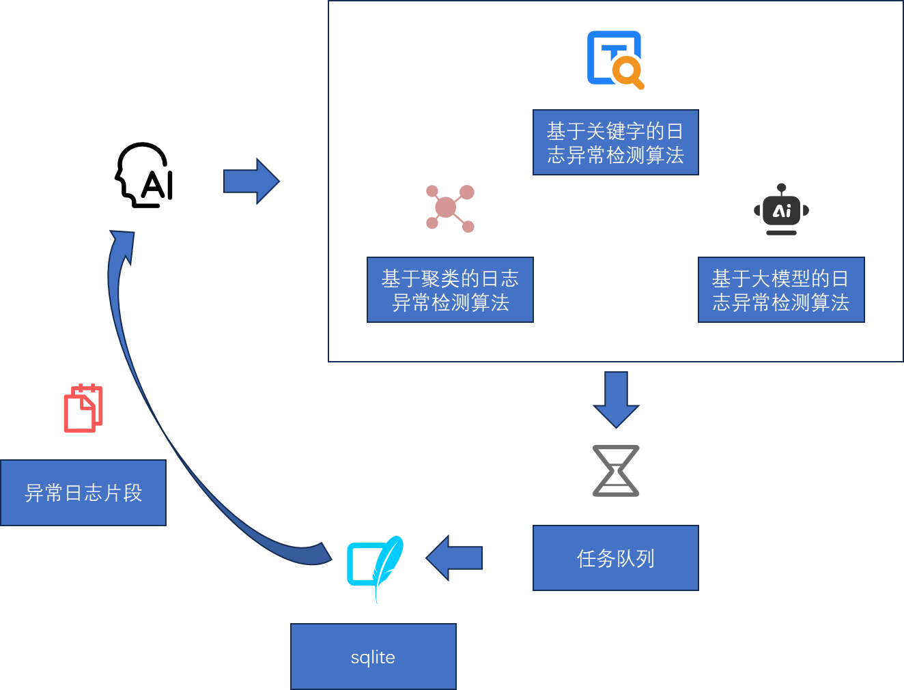
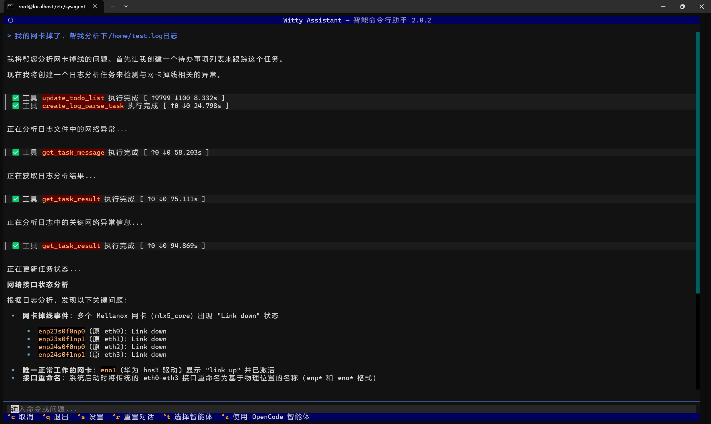

在企业级运维场景中，系统日志普遍存在**类型繁多、体量庞大、维度复杂**的问题，单文件容量轻松突破GB级。传统单一算法处理效率低下，即便依托大模型，也常受限于**上下文窗口不足、注意力分散**等瓶颈，导致异常识别准确率低、分析成本居高不下。

为此，OpenAtom openEuler（简称“openEuler”或“开源欧拉”）团队**计划于2026年3月正式发布已知问题分析Agent——聚焦故障复用、智能诊断、问题快速定位，助力企业运维效率升级。** 而支撑其核心能力的关键组件——日志异常检测 MCP，已于3月13日正式上线。

以下将为大家具体介绍日志异常检测 MCP 的部署流程、使用流程及核心价值。

## 一、日志异常检测 MCP：企业级日志智能分析引擎



日志异常检测 MCP 是集**日志提取、分割、模板化与多算法融合**于一体的异常检测引擎，可将海量日志精准浓缩为核心异常片段，**显著降低大模型 Token 消耗，全面提升分析效率**。

平台支持三大异常检测策略，覆盖不同场景需求：

1. **基于关键字的异常检测**
融合通用关键字与场景化关键字进行日志评分，智能筛选 Top-K 高价值异常片段。

2. **基于聚类的异常检测**
通过日志向量化结合DBSCAN/K-Means算法，精准识别离群异常日志。

3. **基于大模型的异常检测**
大模型逐段深度分析，输出**异常原因、异常分数、置信度**，实现异常精准定位。

> 技术亮点
> 针对日志分析耗时问题，MCP采用**SQLite实现IPC通信与结果持久化**，支持分页查询，保障系统稳定高效运行。

## 二、零门槛部署：3步快速上手，极简接入

### 1.环境要求
- 系统：openEuler 24.03 LTS SP3
- 内存：≥8GB
- 磁盘：≥20GB
- 权限：sudo权限
- 推荐模型：qwen-max、bge-m3

### 2.安装与启动
```bash
sudo dnf update -y
sudo dnf install -y witty-assistant
```

```bash
sudo witty init
```

配置大模型API/Key即可自动部署，网络正常情况下**10～20分钟**完成全流程部署。

### 3.部署验证
终端执行：
```
witty
```
若可正常交互并回复“你好”，即代表部署成功。

## 三、极简使用流程：一键分析，自动生成专业报告



1. 用户指定日志目录，Agent自动创建检测任务
2. 后台完成日志解析、异常检测、结果持久化
3. 任务完成后，从数据库读取核心异常日志片段
4. 联动运维知识库，关联历史同类故障案例
5. 自动生成专业**根因分析报告**

真正实现**上传日志 → 等待完成 → 查看结论**的全自动化体验。

## 四、核心价值：赋能运维全场景，安全高效双升级

### 对运维团队
告别人工翻阅海量日志，实现AI全自动分析，**大幅缩短故障定位时长**。

### 对智能Agent
强化日志预处理核心能力，仅向大模型输入高价值日志，提升模型分析效能。

### 对企业安全
全链路**本地化部署运行**，敏感数据无需出网，保障数据安全可控。

## 五、立即体验
📖 witty 部署指南
<https://docs.openeuler.openatom.cn/zh/docs/24.03_LTS_SP3/tools/ai/euler-copilot-framework/witty_assistant/witty_shell/deploy_guide/deployment.html>

📖 日志异常检测MCP 使用指南
<https://atomgit.com/openeuler/euler-copilot-rag/blob/dev/witty_log_detection/README.md>

欢迎你加入 sig-intelligence 交流社区分享使用心得、反馈问题或贡献代码，与生态伙伴共同探索 openEuler与AI 的更多创新可能！

🔹 开发小组：sig-intelligence

🔹 交流社区：<https://www.openeuler.openatom.cn/zh/sig/sig-intelligence# >


