想让 AI Agent 常驻服务器全天待命，替你盯着代码仓库、跑定时任务、随时处理突发任务，却卡在以下这两道坎：

- 环境难装：
Node.js 版本、依赖冲突、系统兼容性，折腾半天跑不起来。

- 用起来不顺手：Agent 部署在远端服务器，缺乏便捷的通讯渠道，想发条指令还要先开 SSH，谈不上"随时随地"。

OpenAtom openEuler（简称"openEuler"或“开源欧拉”）结合OpenClaw 针对以上两个痛点给出了完整解法：

- 部署侧：提供基于 openEuler 24.03-LTS-SP3 的容器镜像（版本 2026.3.2），一条 docker pull 拉起即用，容器在服务器上 24 小时持续运行，不依赖本机环境，重启自动恢复。

- 使用侧：官方飞书插件已正式上线，配置完成后飞书即成为你与服务器 Agent 之间的实时通道——无论通勤途中还是会议间隙，发一条消息，Agent 即时收到、立即执行，结果直接回到对话框，全程无需登录服务器。


跑通之后，你将可以得到一个 24 小时在线、随时随地可控、能力按需扩展的个人 AI Agent。本教程将带你在 openEuler 服务器上完成从容器部署到飞书接入的完整配置，全程不超过 30 分钟。具体操作教程如下：

## 一、使用 Docker 容器部署 OpenClaw

### 1. 环境准备

本教程所有步骤均依赖 Docker，请根据操作系统完成安装：

| 操作系统 | 安装方式 |
|----------|----------|
| openEuler / Linux | `sudo yum install docker` 或参考发行版文档安装 Docker Engine |
| macOS | 下载安装 [Docker Desktop for Mac](https://www.docker.com/products/docker-desktop/) |
| Windows | 下载安装 [Docker Desktop for Windows](https://www.docker.com/products/docker-desktop/)，需开启 WSL2 后端 |

**macOS 注意事项**

Docker Desktop for Mac 安装完成后，每次使用前需先**启动 Docker Desktop 应用**，等待菜单栏鲸鱼图标状态变为 "Running" 后，再在 Terminal 中执行后续命令。

**Windows 注意事项**

同样需要先启动 Docker Desktop，等待系统托盘图标状态变为 "Running"。

> **TODO**：WSL 部署方式稍后补充。

安装完成后验证 Docker 是否就绪：

```bash
docker version
```

### 2. 拉取镜像

```bash
docker pull openeuler/openclaw:2026.3.2-oe2403sp3
```

### 3. 运行 Onboarding 向导

```bash
docker run -it --name my-openclaw openeuler/openclaw:2026.3.2-oe2403ltssp3 onboard --install-daemon
```

向导启动后，按提示完成以下配置：

#### 3.1 配置模式

选择 **QuickStart**（推荐），向导将引导完成核心配置，细节可在完成后通过以下命令随时调整：

```bash
docker exec -it my-openclaw openclaw configure
```


#### 3.2 配置模型

OpenClaw 支持各大 LLM 公司的模型，也支持本地模型。以 **Qwen（OAuth）** 为例进行配置。

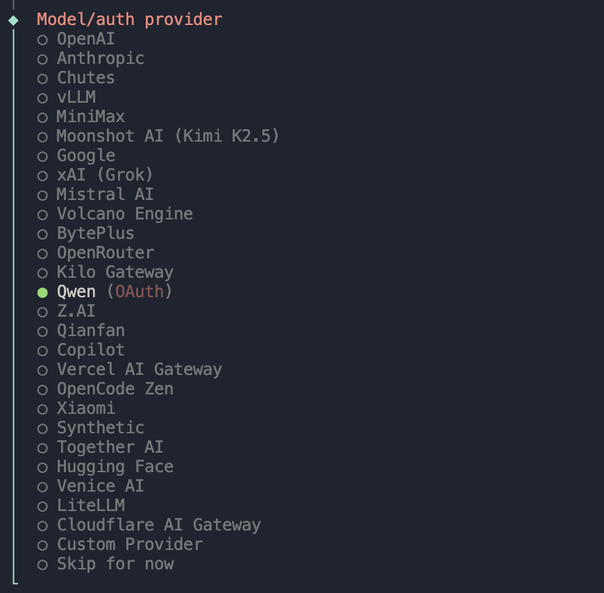

#### 3.3 频道配置

频道选项中海外平台居多，国内用户推荐选择 **Feishu/Lark（飞书）**，或直接跳过，飞书完整配置流程见[第二章](#二配置飞书频道)。

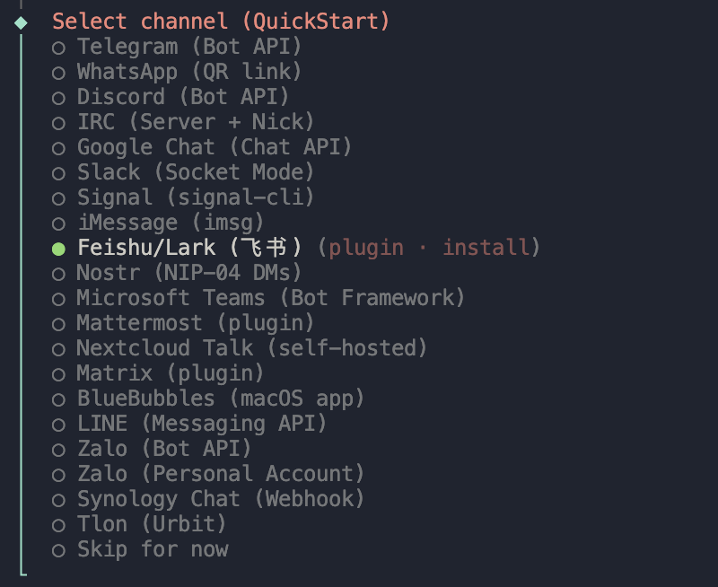

#### 3.4 Skills 配置

向导会逐一询问各 Skill 所需的 API Key，不需要的直接选 **No** 跳过，后续对话中也可随时通过 `/install` 补充安装。


#### 3.5 Hooks 配置

官方推荐的 4 条 hooks 建议全部启用：

- **boot-md**：启动时自动加载指定 Markdown 文本作为默认引导内容，常用于把规则、偏好、项目背景等在每次启动时注入。
- **bootstrap-extra-files**：通过 glob/path 模式注入额外的工作区引导文件。
- **command-logger**：把在 OpenClaw 里执行过的命令和关键操作记一份日志，方便排查问题和复盘。
- **session-memory**：在执行 `/new` 或 `/reset` 命令时保存会话上下文，让下次启动能延续上下文，体验更连贯。

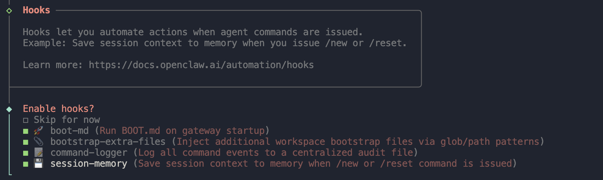

### 4. 启动容器

Onboarding 完成后，启动容器：

```bash
docker start my-openclaw
```

### 5. 运行 Gateway（终端 1）

Gateway 是 OpenClaw 的核心服务进程，负责连接模型、频道和 Skills，必须保持运行。

```bash
docker exec -it my-openclaw openclaw gateway run
```

### 6. 启动 TUI 客户端（终端 2）

打开新终端，进入 TUI 交互界面：

```bash
docker exec -it my-openclaw openclaw tui
```

TUI 启动后即可开始与 OpenClaw 对话：

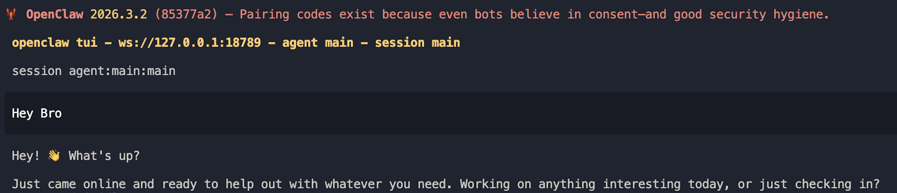

至此，OpenClaw 已在容器中完整运行。后续如需调整模型和频道配置，可在容器内执行：

```bash
docker exec -it my-openclaw openclaw configure
```

---

## 二、配置飞书频道

OpenClaw 支持通过飞书官方插件与飞书机器人打通，国内用户推荐使用此方式。以下步骤需要在 OpenClaw 容器已运行的前提下完成。

### 第一步：创建飞书企业自建应用

登录[飞书开放平台](https://open.feishu.cn/)，点击"**创建企业自建应用**"。


在弹窗中填写应用名称、描述和图标，点击"**创建**"按钮。

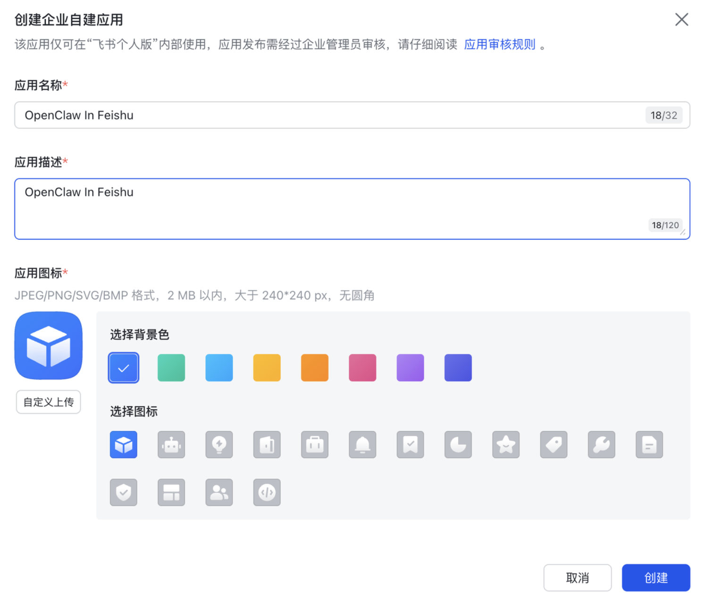

在左侧目录树选择"**应用能力 > 添加应用能力**"，选择"按能力添加"页签，点击"**机器人**"能力卡片的"添加"按钮。

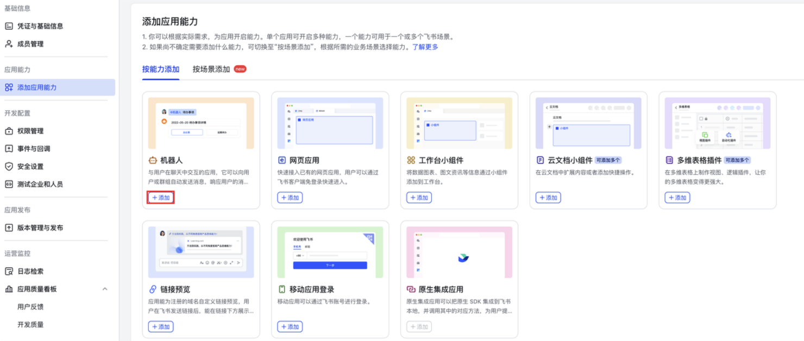

### 第二步：配置权限

在左侧目录树选择"**开发配置 > 权限管理**"，点击"**批量导入/导出权限**"按钮，在"导入"页签中将以下 JSON 替换原有示例，点击"**下一步，确认新增权限**"。

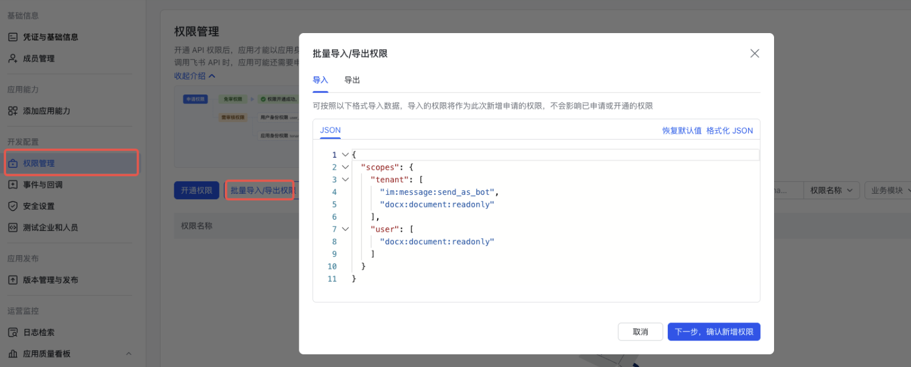

```json
{
  "scopes": {
    "tenant": [
      "contact:contact.base:readonly",
      "docx:document:readonly",
      "im:chat:read",
      "im:chat:update",
      "im:message.group_at_msg:readonly",
      "im:message.p2p_msg:readonly",
      "im:message.pins:read",
      "im:message.pins:write_only",
      "im:message.reactions:read",
      "im:message.reactions:write_only",
      "im:message:readonly",
      "im:message:recall",
      "im:message:send_as_bot",
      "im:message:send_multi_users",
      "im:message:send_sys_msg",
      "im:message:update",
      "im:resource",
      "application:application:self_manage",
      "cardkit:card:write",
      "cardkit:card:read"
    ],
    "user": [
      "contact:user.employee_id:readonly",
      "offline_access",
      "base:app:copy",
      "base:field:create",
      "base:field:delete",
      "base:field:read",
      "base:field:update",
      "base:record:create",
      "base:record:delete",
      "base:record:retrieve",
      "base:record:update",
      "base:table:create",
      "base:table:delete",
      "base:table:read",
      "base:table:update",
      "base:view:read",
      "base:view:write_only",
      "base:app:create",
      "base:app:update",
      "base:app:read",
      "board:whiteboard:node:create",
      "board:whiteboard:node:read",
      "calendar:calendar:read",
      "calendar:calendar.event:create",
      "calendar:calendar.event:delete",
      "calendar:calendar.event:read",
      "calendar:calendar.event:reply",
      "calendar:calendar.event:update",
      "calendar:calendar.free_busy:read",
      "contact:contact.base:readonly",
      "contact:user.base:readonly",
      "contact:user:search",
      "docs:document.comment:create",
      "docs:document.comment:read",
      "docs:document.comment:update",
      "docs:document.media:download",
      "docs:document:copy",
      "docx:document:create",
      "docx:document:readonly",
      "docx:document:write_only",
      "drive:drive.metadata:readonly",
      "drive:file:download",
      "drive:file:upload",
      "im:chat.members:read",
      "im:chat:read",
      "im:message",
      "im:message.group_msg:get_as_user",
      "im:message.p2p_msg:get_as_user",
      "im:message.send_as_user",
      "im:message:readonly",
      "search:docs:read",
      "search:message",
      "space:document:delete",
      "space:document:move",
      "space:document:retrieve",
      "task:comment:read",
      "task:comment:write",
      "task:task:read",
      "task:task:write",
      "task:task:writeonly",
      "task:tasklist:read",
      "task:tasklist:write",
      "wiki:node:copy",
      "wiki:node:create",
      "wiki:node:move",
      "wiki:node:read",
      "wiki:node:retrieve",
      "wiki:space:read",
      "wiki:space:retrieve",
      "wiki:space:write_only"
    ]
  }
}
```

确认权限列表无误后，点击"**申请开通**"按钮。

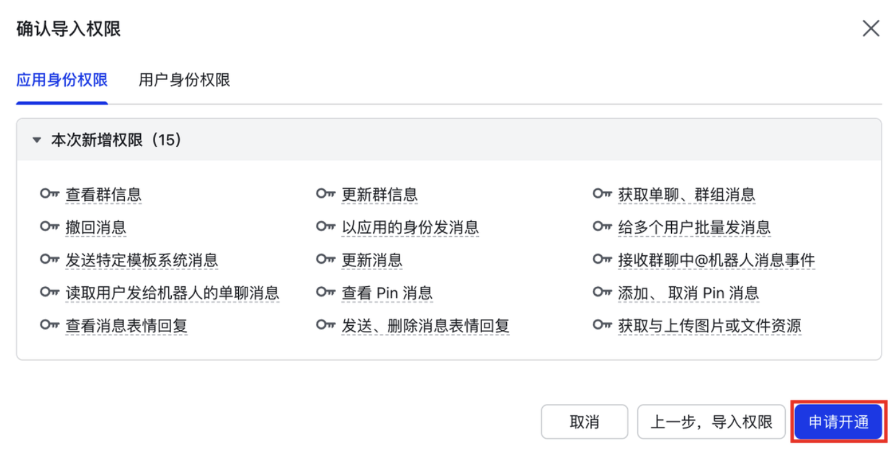

### 第三步：发布应用版本

权限申请完成后，应用处于"待上线"状态，点击顶部"**创建版本**"按钮。


填写应用版本号和更新说明，点击"**保存**"。

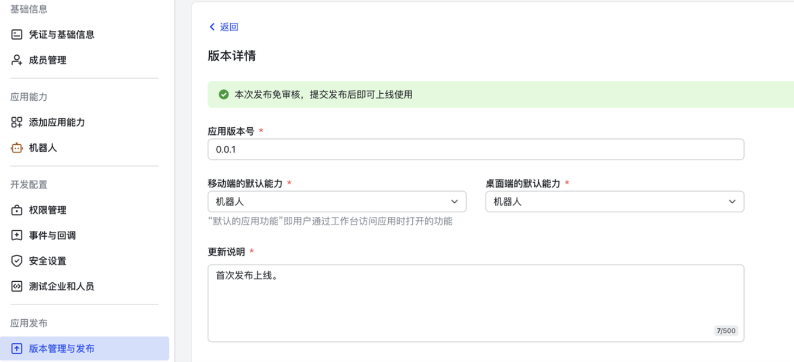

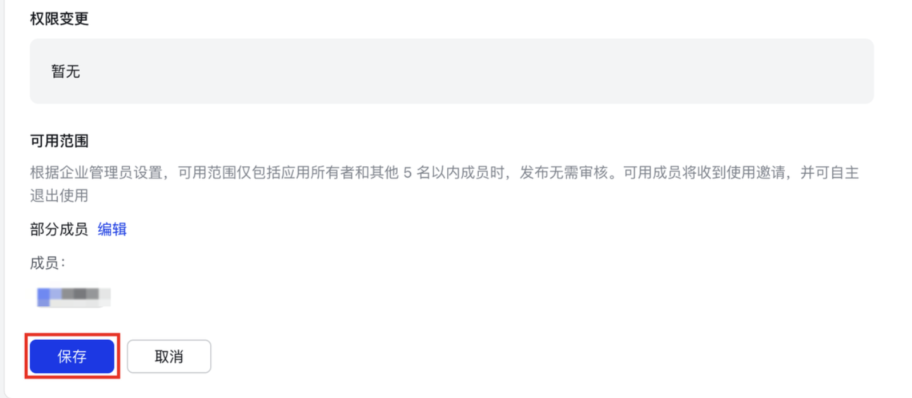

保存完成后，点击页面右上角"**确认发布**"按钮完成应用发布。

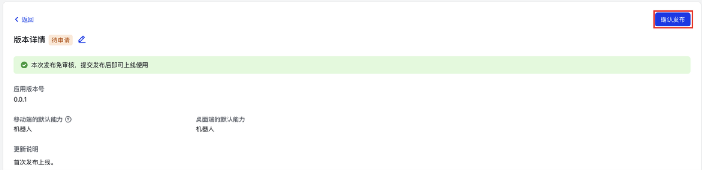

### 第四步：获取配置信息

在左侧目录树选择"**基础信息 > 凭证与基础信息**"，记录 **App ID** 和 **App Secret**，后续步骤中需要用到。

### 第五步：安装飞书插件并完成关联

确保 Gateway 已在容器中运行（见[第一章第 4 步](#4-运行-gateway终端-1)），打开新终端执行：

```bash
docker exec -it my-openclaw feishu-plugin-onboard install
```

按提示输入第四步获取的 **App ID** 和 **App Secret** 完成关联。

### 第六步：订阅机器人事件

回到飞书开放平台，进入"**开发配置 > 事件与回调**"，配置**长链接**事件订阅方式，添加"**接收消息**"事件，并发布新版本使配置生效。

### 第七步：完成机器人配对

在飞书中向机器人发送任意消息，机器人会返回配对码：

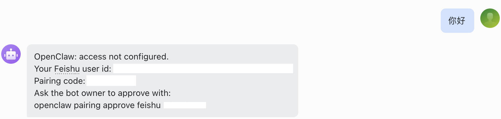

在容器内执行以下命令完成配对（将 `<配对码>` 替换为实际收到的配对码）：

```bash
docker exec -it my-openclaw openclaw pairing approve feishu <配对码> --notify
```


按提示完成授权后，即可正常使用。

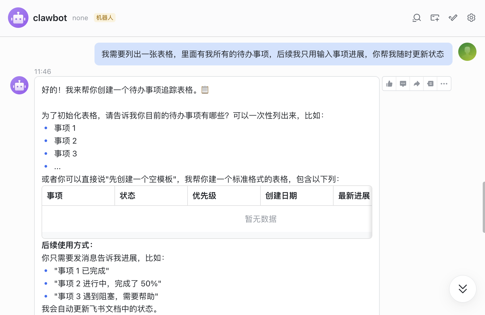
---

