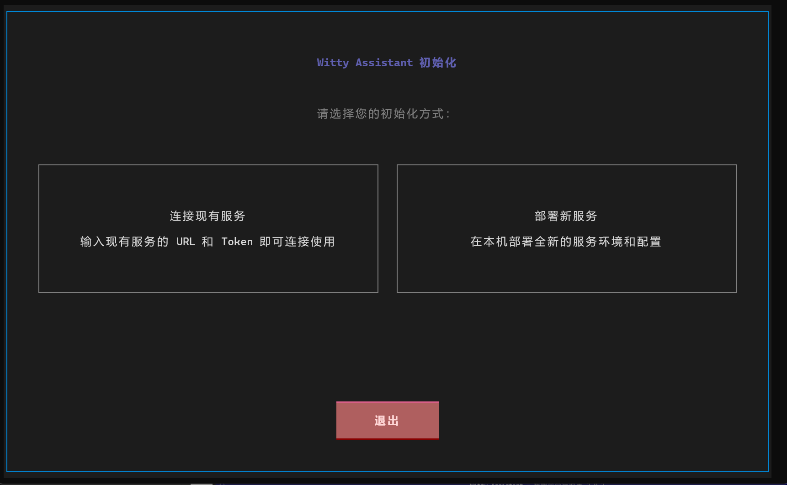
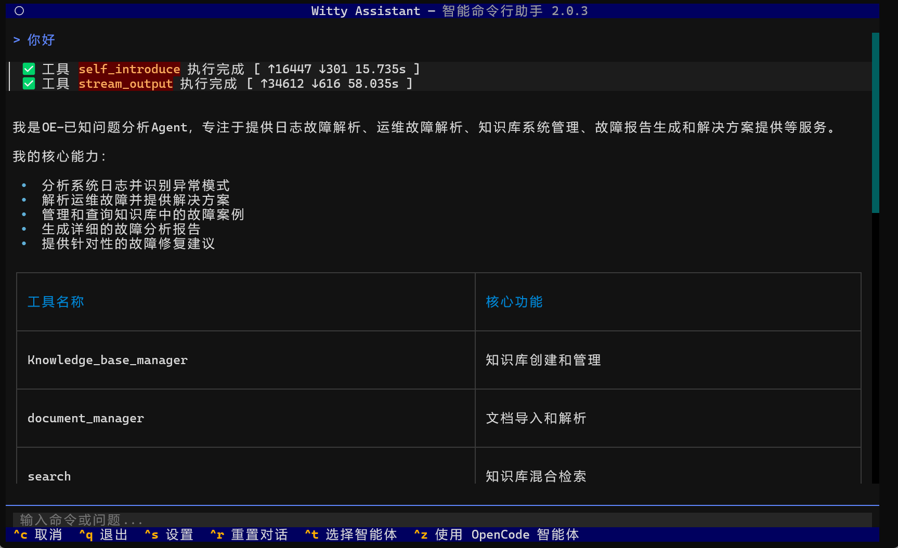
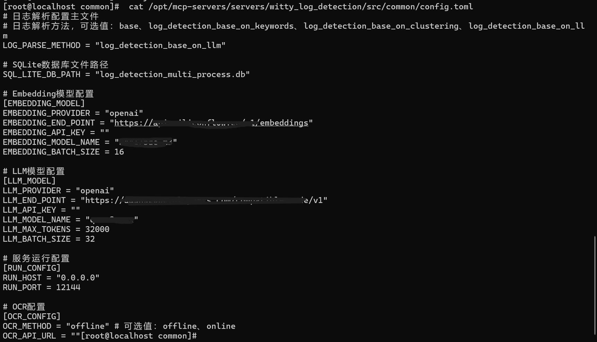
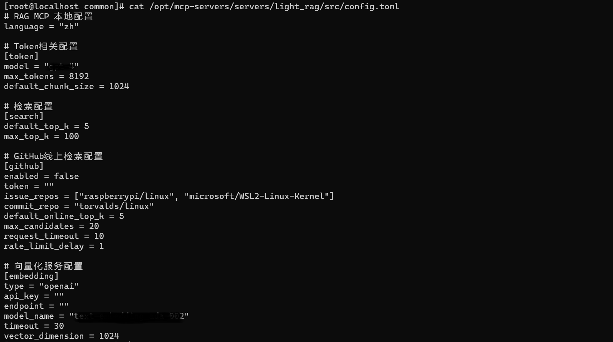
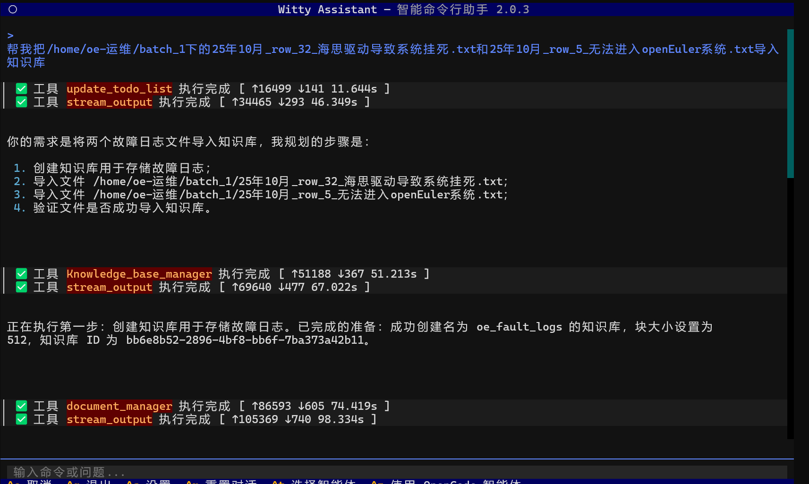
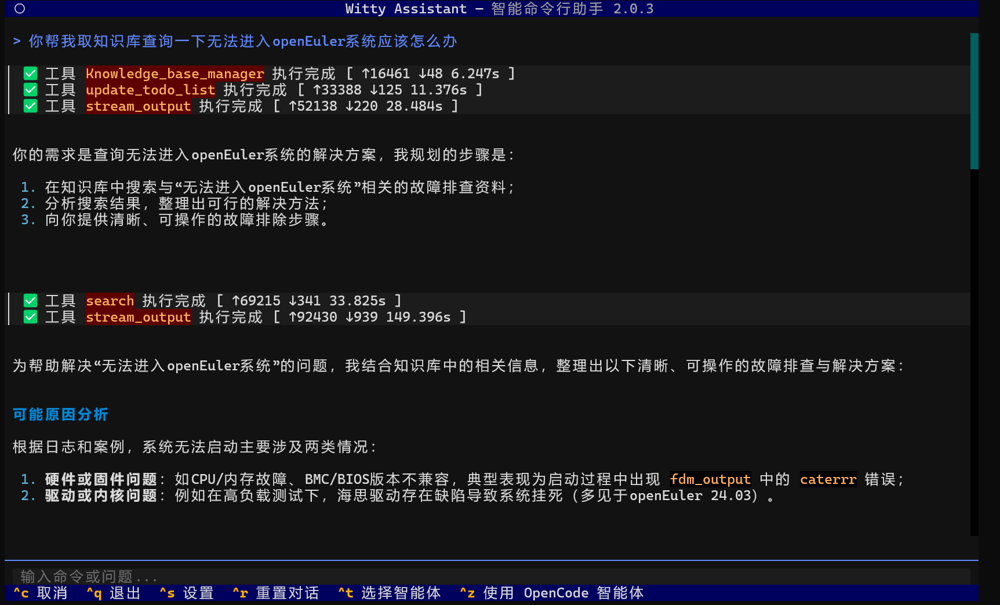
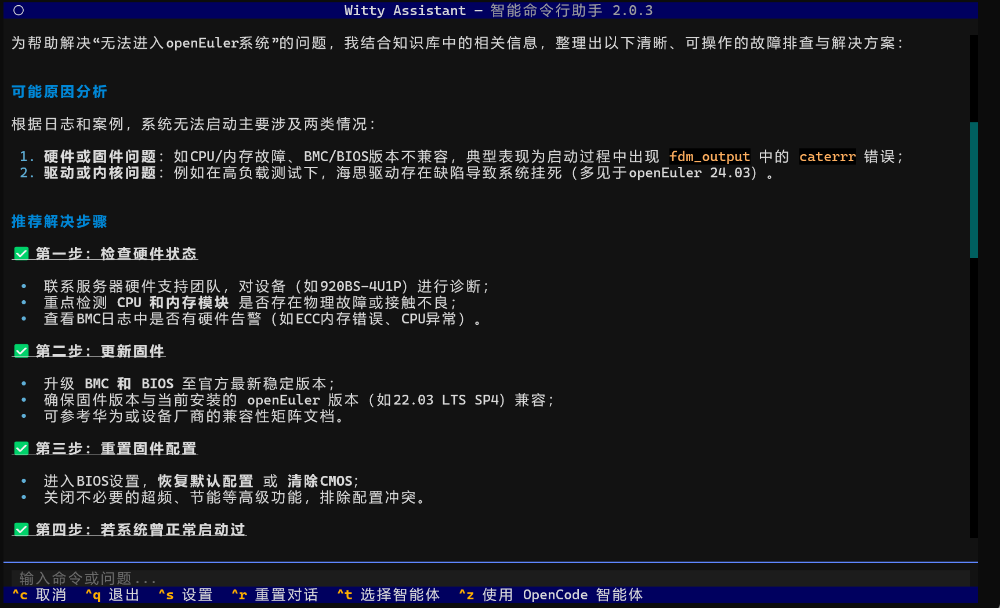

你是否还在为重复出现的系统故障焦头烂额？是否还在海量日志、工单、手册中翻找历史解决方案？是否明明是“老问题”，却要花费数小时重新排查、反复试错？

好消息！**OpenAtom openEuler（简称“openEuler”或“开源欧拉”）24.03-LTS-SP3版本正式推出Witty Assistant，更重磅打造“已知问题分析Agent”**，以AI赋能运维，让“老问题”不再重复消耗精力，让故障诊断效率实现质的飞跃，解锁openEuler智能运维新体验 。

## 先搞懂：什么是Witty Assistant「已知问题分析Agent」？

作为openEuler-24.03-LTS-SP3版本Witty Assistant的核心组件，"已知问题分析Agent"是一款专注于故障复用与加速诊断的智能体，依托轻量级知识库MCP服务和日志异常检测MCP引擎，打破传统运维中“经验分散、排查低效”的痛点，为运维人员提供全流程自动化的问题分析能力。

简单来说，它就像一个“运维经验大师”——能自动记住所有已解决的系统问题，当你遇到新故障时，它会快速匹配历史案例，一键生成完整的分析报告和解决方案，无需手动翻查、无需重复试错，让故障修复时间大幅缩短。

## 核心亮点：为什么一定要用这个Agent？

针对openEuler-24.03-LTS-SP3版本的系统特性，"已知问题分析Agent"做了深度优化，四大核心优势，直击运维痛点：

- **全自动化分析，告别手动排查**：无需输入复杂命令，只需上传故障日志或描述故障现象，Agent会自动完成日志解析、异常检测、根因定位，全程无需人工干预，哪怕是新手也能快速上手。

- **历史经验复用，效率翻倍**：依托轻量级知识库MCP服务，可导入PDF、DOCX、MD等多格式历史故障案例，Agent会自动检索相似问题，直接复用成熟解决方案，避免重复踩坑。

- **轻量本地部署，安全可控**：基于SQLite实现本地存储，无需依赖外部重型向量数据库，内存开销低（典型文档库下<200MB），敏感运维数据无需出网，完全符合企业数据安全合规要求。

- **深度适配openEuler，精准度拉满**：我们提供openEuler线上开源[运维案例库](https://atomgit.com/openeuler/witty-ops-cases)，可直接导入使用，丰富的专属案例的加持，能进一步提升Agent故障匹配的精准度与效率，让解决方案更贴合openEuler运维实际场景。

## 重点教程：3步上手，一键调用Agent

无需复杂配置，开箱即用，跟着步骤走，轻松搞定系统故障，全程10分钟内完成部署+使用：

### 第一步：前置准备（必看！）

|需求类型|具体要求|
|---|---|
|系统版本|openEuler-24.03-LTS-SP3|
|权限|具备sudo权限|
|CPU|≥4核|
|内存|≥8GB|
|存储|≥20GB|
|大模型|支持主流大模型（如Qwen、DeepSeek等）|

### 第二步：部署Witty Assistant（含Agent默认集成）

openEuler-24.03-LTS-SP3版本中，"已知问题分析Agent"已默认集成于Witty Assistant，无需额外安装，只需4步完成部署：

2.1. 更新系统并安装核心包：打开终端，执行以下命令

```bash
sudo dnf update -y
            
sudo dnf install -y witty-assistant
```

2.2. 初始化配置：执行初始化命令，启动部署助手

```bash
sudo witty init
```



按照提示选择“部署新服务”，完成LLM配置（API端点、密钥、模型名称）和embedding配置，系统会自动验证配置有效性。

2.3.启动部署：确认配置无误后，点击“开始部署”，系统会自动完成环境检查、服务部署和Agent初始化，全程约10-20分钟，部署完成后会显示已知问题分析Agent已可用。

2.4.部署验证：终端输入“witty”，若能正常显示交互界面，输入“你好”可成功返回响应，即代表部署完成。

 

### 第三步：快速使用已知问题分析Agent（3步直达，高效上手）

部署完成后，无需复杂操作，按以下流程快速启用Agent，完成案例导入与故障查询，全程简单易懂：

#### 步骤3.1：配置模型（可选，系统环境变量无模型时必做）

若系统环境变量中未配置模型，需分别在两个MCP相关配置文件中手动配置，确保Agent正常调用知识库检索能力：

1. 在以下两个MCP相关配置文件中：

    日志检测MCP引擎配置文件：`/opt/mcp-servers/servers/witty_log_detection/src/common/config.toml`

  

    轻量级知识库MCP服务配置文件：`/opt/mcp-servers/servers/light_rag/src/config.toml`

   

    分别找到embedding相关配置项，填写相同的模型信息（API端点、密钥、模型名称）并保存即可完成配置

#### 步骤3.2：打开Witty并选择已知问题分析Agent

1. 终端输入`witty`，启动Witty Assistant交互界面（可通过`Ctrl+Q`退出、`Ctrl+C`中断当前任务）。

2. 在交互界面中，按Ctrl+T选择智能体，选择“已知问题分析Agent”，完成Agent切换，此时Agent已自动对接MCP服务。

#### 步骤3.3：导入案例库并查询运维问题

1. 导入运维案例库：在交互对话框中，用自然语言输入导入指令，示例：

    ```
    帮我把/home/oe-运维/batch_1下的25年10月_row_32_海思驱动导致系统挂死.txt和25年10月_row_5_无法进入openEuler系统.txt导入知识库
    ```

   

2. 等待导入完成（系统会提示导入成功），即可直接用自然语言询问当前碰到的运维问题，示例：

    ```
    你帮我去知识库查询一下无法进入openEuler系统应该怎么办
    ```

   

3. Agent会快速检索MCP知识库中的案例，生成包含故障根因、解决步骤、验证方法的结构化回复，直接按提示操作即可解决问题。

    


## 智能运维，从Witty Assistant开始

openEuler-24.03-LTS-SP3推出的Witty Assistant及已知问题分析Agent，以轻量、高效、安全的优势，打破传统运维瓶颈，让运维经验可复用、故障排查更高效。

不管是日常运维还是紧急故障排查，已知问题分析Agent都能派上大用场，尤其适合这些场景：

- 系统启动异常（如卡在dracut）、磁盘空间不足、网络连接故障等常见问题

- 重复出现的配置错误、版本兼容问题，无需反复排查历史工单

- 海量日志分析（GB级日志可快速浓缩为核心异常片段），避免人工逐行翻阅。

- 新运维人员上手，快速复用老员工的故障处理经验，降低入门门槛。

简单部署、一键调用，即可减少重复劳动，提升运维效率。现在就下载openEuler[运维案例库](https://atomgit.com/openeuler/witty-ops-cases)，导入知识库，开启智能运维新征程！

欢迎加入 sig-intelligence 交流社区分享使用心得、反馈问题或贡献代码，与生态伙伴共同探索 “openEuler+AI” 的更多创新可能！

🔹 开发小组：sig-intelligence

🔹 交流社区：<https://www.openeuler.openatom.cn/zh/sig/sig-intelligence>
