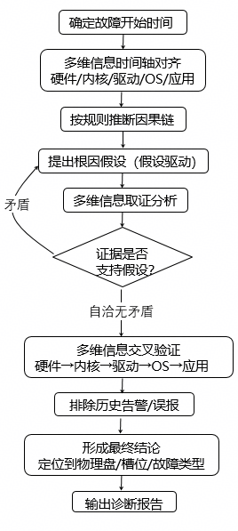
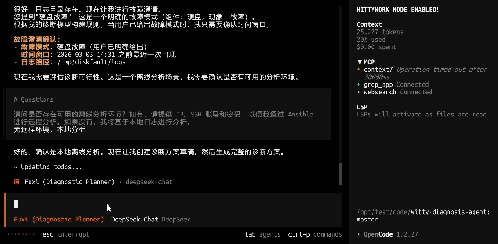

## 背景：海量遥测数据下的“分析困境”

硬盘物理损坏是运维与存储场景中最具破坏性的故障之一，直接威胁数据安全、导致服务不可用。在现代运维体系中，虽然监控工具能采集到丰富的硬盘遥测数据（如 SMART信息、内核日志、I/O 监控），但数据的获取并不等于问题的解决。当故障预警触发后，运维人员往往面对海量的离线日志和复杂的硬件指标束手无策。传统排查方式高度依赖人工对离线数据的解读能力，需要从分散的文件中拼凑线索，过程繁琐且滞后。尤其在故障发生后，如何基于已有的遥测数据快速还原现场、锁定根因，成为避免数据丢失和业务停摆的关键瓶颈。

为此，OpenAtom openEuler（简称 “openEuler” 或 “开源欧拉”）团队计划于 2026年3月底正式发布​**智能诊断 Agent**​，通过 AI 赋能故障高效、精准定位，助力企业运维效率升级。

## 问题与挑战：硬盘物理损坏排查的三大核心困境

1. **故障边界模糊，易与逻辑故障混淆**

   硬盘物理损坏与逻辑故障（如文件系统损坏、病毒攻击）的外在表现高度重合，均可能出现读写报错、硬盘无法识别、系统蓝屏、文件丢失等现象。传统排查方式缺乏精准的区分手段，往往需要先投入大量时间排查逻辑故障，排除后才能聚焦物理损坏，大幅延长排查周期，错过最佳的数据恢复与故障修复时机。

2. **排查工具碎片化，协同成本高**

   传统排查硬盘物理损坏需搭配多种工具，如SMART参数检测工具、硬件检测软件、异响诊断设备等，不同工具的操作逻辑、数据格式不互通，需要运维人员熟练掌握各类工具的使用方法，逐一采集数据、交叉分析。工具的碎片化不仅增加了操作难度，更导致数据整合效率低，易出现数据遗漏，影响根因定位的准确性。

3. **人工分析效率低，故障恢复周期长**

   传统硬盘排查依赖人工下载日志、逐行检索关键词、对照手册解读SMART属性。即使数据已采集完毕，人工分析动辄数小时。在分秒必争的故障恢复阶段，漫长的分析过程意味着业务中断时间的延长，增加了数据彻底丢失的风险。

4. **专业门槛极高，专家资源稀缺**

   解读硬盘底层遥测数据要求人员精通存储协议、硬件架构及内核机制。大多数运维团队缺乏此类深度专家，面对复杂的离线诊断数据包，往往只能等待厂商支持，导致故障处理流程被动且缓慢。

# 智能诊断Agent：破解硬盘物理损坏排查难题的核心方案

面对硬盘物理损坏排查的诸多痛点，智能诊断Agent依全程基于用户提供的遥测数据（含硬盘SMART参数、运行日志、状态快照等）开展诊断，无需在线连接硬盘，规避排查风险的同时，精准锁定根因：

* ​**故障模式智能区分**​：基于用户提供的遥测数据，自动提取硬盘运行特征与故障信息，精准区分物理损坏与逻辑故障，跳过无效排查环节，直接聚焦物理损坏核心，无需在线操作，大幅缩短排查周期。

* **多维度数据整合**​：自动整合用户提供的遥测数据（SMART参数、系统日志、硬件状态等），无需搭配多种碎片化工具，无需人工交叉分析，智能提取关键故障信息，降低操作难度，实现高效数据解析。

* **根因精准定位**：将隐性的专家业务经验（分析流程、运维规范等）转化为显性的、可执行、可复用的数字资产，直接复用资深专家的诊断逻辑，自动关联多维度整合后的数据，精准锁定物理坏道、接口链路异常等底层根因，确保诊断过程的专业度与准确性。

* ​**故障链路清晰呈现**​：自动生成清晰的故障传播链路，直观呈现从“报错现象”到“根本诱因”的完整逻辑链，无需人工梳理线索，让运维人员快速掌握故障来龙去脉，排查过程一目了然，大幅提升根因定位效率。

  


## 使用流程

- 启动**OpenCode**。
- 在终端执行命令：
  
  ```shell
  auto-diag 故障问题描述
  ```
  
  **说明**：当前支持离线分析，需在故障描述中指定**遥测数据 / 日志存储路径**。
  
  示例：
  
  ```shell
  auto-diag "请诊断2026-03-05 14:31前最近一次硬盘故障，日志路径：/tmp/diskfault/logs"
  ```
- 系统将自动执行**智能诊断**流程。
- 诊断完成后，根据终端输出的报告路径，查看完整的诊断分析报告。



## 总结

硬盘物理损坏的真正可怕之处，不在于硬件本身的价值，而在于拥有数据却无法快速转化为决策依据。依赖人工、依赖经验、依赖猜测的传统离线分析模式，早已无法应对现代大规模存储系统的稳定性要求。

智能诊断 Agent，让硬盘故障排查从**人工解读** 转向 ​**智能分析**​：离线导入、精准定位、安全合规、快速决策。它不仅是一个诊断工具，更是运维团队的“虚拟硬件专家”，让每一份遥测数据都能被快速看透、彻底利用，为数据安全与业务连续性保驾护航。

## 加入我们

欢迎加入 sig-intelligence 交流社区分享使用心得、反馈问题或贡献代码，与生态伙伴共同探索 openEuler与AI的更多创新可能！

* 代码仓：
  <https://atomgit.com/openeuler/witty-diagnosis-agent>
* 开发小组：
  sig-intelligence
* 交流社区：
 <https://www.openeuler.openatom.cn/zh/sig/sig-intelligence> 


