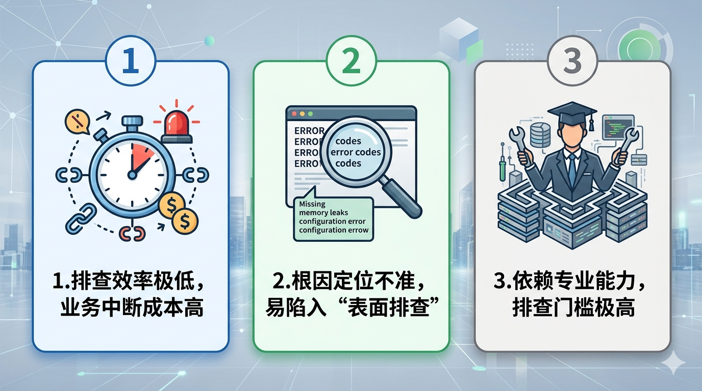
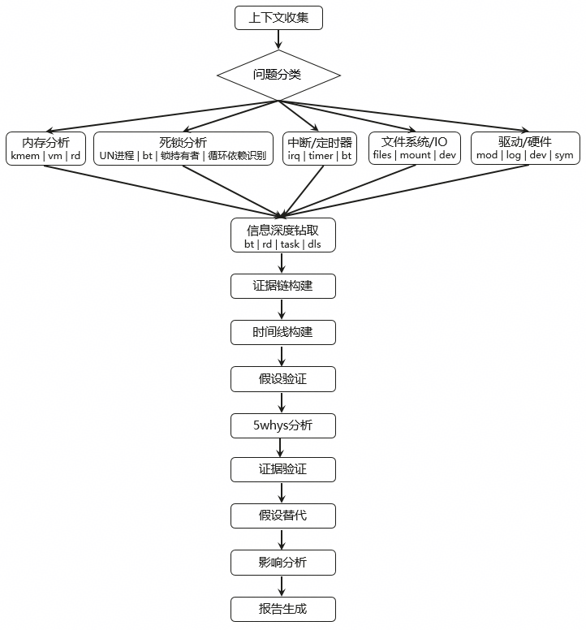

## 背景：系统Crash已成生产环境的“致命痛点”

系统Crash（崩溃）是运维场景中最严重的故障之一，直接导致服务中断、业务停摆。传统排查方式高度依赖运维人员的个人经验，需要从海量日志和复杂堆栈中逐行检索，过程耗时且技术门槛高。尤其在复杂的分布式系统中，Crash的诱因往往非常隐蔽（如底层依赖异常、代码隐性Bug、资源瞬时耗尽），常导致“复现难、定位偏”的困境。一旦Crash从偶发转变为频发，排查不及时极易引发连锁反应，造成巨大的业务损失。

为此，OpenAtom openEuler（简称 “openEuler” 或 “开源欧拉”）团队发布​**智能诊断 Agent**​，通过 AI 赋能故障高效、精准定位，助力企业运维效率升级。

## 问题与挑战：系统Crash排查的三大核心困境



1. **排查效率极低，业务中断成本高**
   传统Crash排查依赖人工逐行分析日志、拆解堆栈、复现现场。简单故障动辄数小时，复杂内核级、并发类Crash甚至需要数天定位。故障持续期间，业务持续不可用，时间成本与经济损失巨大。
2. **根因定位不准，易陷入 “表面排查”**
   多数Crash只呈现最终报错信息，而真正根因（内存泄漏、死锁、竞争条件、配置错误、底层组件异常等）被掩盖。只解决表面现象会导致故障反复出现，陷入 “修复 — 复发 — 再修复” 的恶性循环。
3. **依赖专业能力，排查门槛极高**
   系统Crash排查要求人员精通系统原理、内核机制、日志格式、异常特征等专业知识。大量中小团队、普通运维人员不具备这类能力，遇到复杂崩溃只能束手无策，严重影响系统稳定性。

## 智能诊断Agent：破解系统Crash类问题的核心诊断能力

面对上述挑战，Witty智能诊断Agent提供了全新的解决方案：

 - ​**遥测数据智能解析**​：自动分析Crash时的全量上下文（日志、VMCORE、堆栈等），智能提取关键报错信息，替代低效的人工筛选。

- ​**根因精准定位**​：基于内置的故障知识库与算法模型，关联Crash发生的具体场景（如高并发、启动阶段），直接定位到代码Bug、资源瓶颈或依赖异常等底层根因。

- ​**​代码级精准溯源​**​：结合内核源码符号与 VMCORE 中的堆栈信息，生成源码级函数调用栈，可精准定位到引发 Crash 的具体函数、代码行号，实现从故障现象到问题代码行的直接溯源。

- ​**全场景覆盖**​：通过内存、死锁、中断/定时器、文件系统/IO 及驱动硬件分析，全面支持 OOM、Hung Task、Hard Lockup、Kernel Panic等多种内核崩溃与系统挂起场景。



## 使用流程

- 启动 **OpenCode** 。
- 在终端执行命令：
  
  ```shell
  auto-diag 故障问题描述
  ```
  
  **说明**：当前支持离线分析，需在故障描述中指定**遥测数据 / 日志存储路径**。
  
  示例：
  
  ```shell
  auto-diag "我有个系统发生了 crash，请分析下原因。我将 vmcore 相关文件和命令部署到远程调试机，远程调试机登录方式：ssh root@1.1.1.1。记住：你所有的操作都要在此远程调试机执行，以下描述的所有目录也是远程调试机的目录。core 文件在/home/crash目录下（命令参考：crash ./vmlinux vmcore），同时 /home/crash/src 里面包含源码文件，分析具体的源码问题。"
  ```
- 系统将自动执行**智能诊断**流程。
- 诊断完成后，根据终端输出的报告路径，查看完整的诊断分析报告。


## 总结

系统Crash的真正可怕之处，不在于故障本身，而在于​**盲目排查带来的时间内耗与业务损失**​。依赖人工、依赖经验、依赖猜测的传统模式，早已无法应对现代复杂系统的稳定性要求。

智能诊断Agent，让系统Crash排查从**经验驱动** 转向 **数据驱动**​：自动解析、精准定位、快速止损、闭环优化。它不仅是一个故障工具，更是系统稳定性的 “智能守护者”，让每一次崩溃都能被快速看透、彻底解决。

## 加入我们

欢迎加入 sig-intelligence 交流社区分享使用心得、反馈问题或贡献代码，与生态伙伴共同探索 openEuler与AI的更多创新可能！

* 代码仓：
  <https://atomgit.com/openeuler/witty-diagnosis-agent>
* 开发小组：
  sig-intelligence
* 交流社区：
  <https://www.openeuler.openatom.cn/zh/sig/sig-intelligence>
