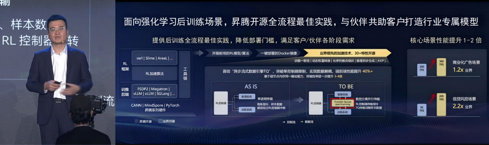
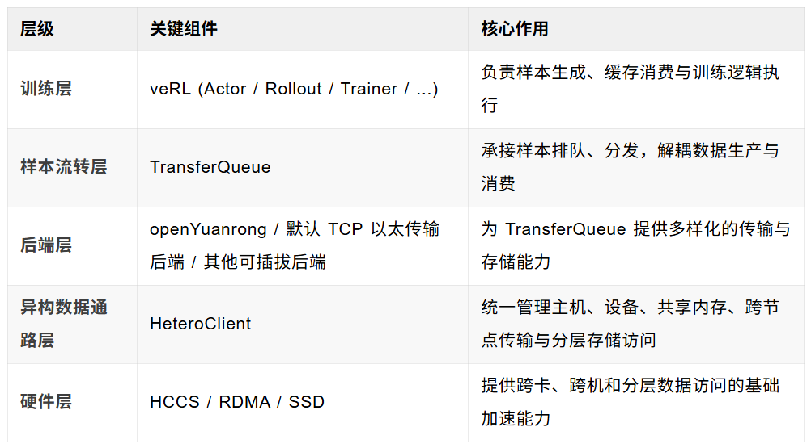
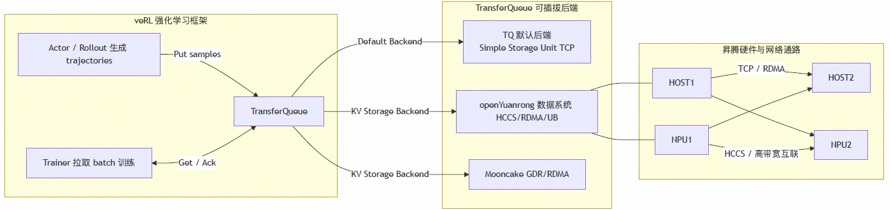
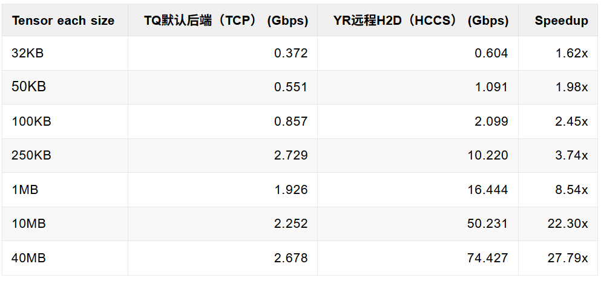
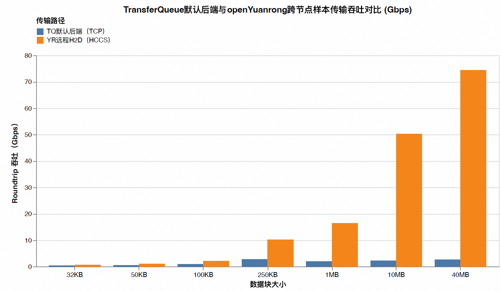
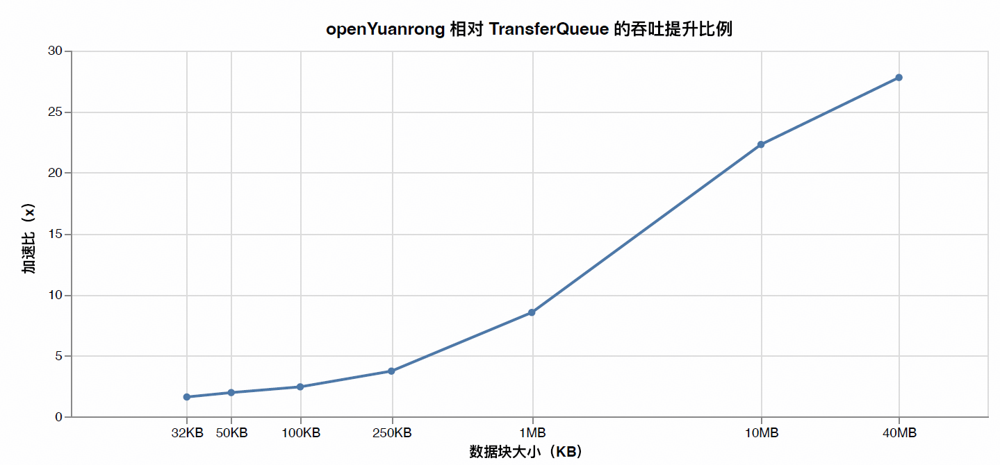

在大规模强化学习（RL）训练中，真正限制系统效率的，往往不是算力本身，而是样本传输效率。随着 Actor / Rollout 持续生成数据、Trainer 高频拉取 batch，样本在进程、节点和异构设备之间频繁流转，CPU 拷贝、协议栈开销和跨节点时延都会逐渐放大，最终让训练从“算得快”变成“等数据”。

2026 年 3 月 20 日，在 2026 年华为伙伴大会上，华为昇腾计算总裁张迪煊在介绍强化学习时，重点提到异步流式数据引擎 TransferQueue，并介绍了其基于 openYuanrong 在超节点上的实现：数据传输效率进一步提升 3～4 倍，RL 端到端性能提升 40%。这也说明，openYuanrong 正在成为强化学习高效样本流转的重要底座。

目前，openYuanrong 已在OpenAtom openEuler（简称“openEuler”或 “开源欧拉”）社区开源。本文将详细展开 openYuanrong 如何作为 TransferQueue 的 KV 后端，依托面向昇腾平台的分布式异构对象多级缓存能力，加速 veRL 的样本传输链路。

## 1. veRL样本传输的隐形瓶颈：为何高性能算力也会“饥饿”？

veRL 强化学习的典型数据链路清晰明了：Actor/Rollout 生成轨迹（通常包含复杂的 tensor 和 metadata），这些样本随后进入缓冲与调度层进行排队、批处理和分发，最终由 Trainer 高频拉取 batch 进行训练。然而，在规模化场景下，这条看似线性的链路却常常因两大痛点而步履维艰：

### 1.1 样本“既小又碎”：高频访问的固定开销陷阱

强化学习的单个样本并非总是连续的大块数据。它往往由多个字段组成，既有大型张量，也包含大量小型的非张量元数据（如索引、奖励、掩码、状态描述等）。在高并发环境下，这些小而碎的消息会频繁触发通信调用和调度事件，导致传输的有效带宽显著下降。每一次调用的固定开销被放大，使得系统性能更容易受限于软件栈的效率，而非物理链路的带宽。

### 1.2 跨节点传输与CPU中转：异构系统中的“性能鸿沟”

默认的基于 TCP 协议的传输后端，即便在应用层使用了如 pickle-5 等免拷贝机制，数据依然需要经过 CPU 侧的协议栈用户态-内核态缓冲区拷贝处理。在跨节点 remote get 场景中，这种额外的 CPU 中转开销和网络往返时延会被直接放大。最终的结果是，远端的 Trainer NPU 常常处于“等待数据”的饥饿状态，无法充分发挥其算力。昇腾超节点提供了 HCCS 等高带宽互联能力，以及专为异构计算设计的数据通路。**因此，优化的核心在于：如何让样本数据能够更“直接”地抵达 NPU，并最大程度地聚合碎片化请求，减少不必要的中间环节。**

## 2. openYuanrong 数据系统：昇腾亲和的统一异构传输层

openYuanrong 数据系统扩展支持了异构数据对象，并构建了由HBM、DRAM、SSD 组成的分级缓存体系，实现了高性能、大容量、易用的分布式数据访问。与 TransferQueue 配合，可以视为 veRL 训练场景下统一的异构数据传输层。它旨在智能地连接主机内存、设备内存（HBM）、跨进程共享内存、跨节点网络通路以及 SSD 分层存储，并根据数据的规模、访问距离和延迟敏感度，自主选择最优的数据路径与传输机制，从而显著降低训练链路中的数据搬运开销。

### 2.1 卡间HBM直连传输：告别主机中转，拥抱设备P2P高速互联

在多卡训练与推理场景中，设备间的数据交换效率是决定端到端时延的关键因素。openYuanrong 支持卡间 HBM 数据的直接通信（P2P），并能自动管理动态链路的建立、P2P 通信算子的调度与负载均衡，从而减少数据在 Host 侧不必要的中间拷贝和链路切换。

对于 veRL 中需要频繁进行张量分发、聚合或状态同步的任务，Transferqueue + openYuanrong 这种卡间直连能力能够显著降低跨卡访问延迟，并简化多卡编程的复杂性。

### 2.2 H2D / D2H 小数据高效传输：聚合碎片，释放小包吞吐

强化学习训练链路中充斥着大量从 KB 级到 MB 级不等的小块数据传输，如样本片段、状态块、索引信息、局部中间结果等。这些传输的特点是调用频率高、单次数据量小，且对固定开销极为敏感。若仍沿用传统模式，吞吐很容易被频繁的调用和调度开销所限制。

为此，openYuanrong 数据系统在主机与设备之间引入了内存大页聚合与批量 SDMA / RDMA 操作等机制，将零散的小请求聚合成更大的传输单元，从而减少频繁调用带来的吞吐损耗。这使得 KB 级数据在高频访问场景下依然能够保持较高的有效带宽。

### 2.3 H2H 零拷贝共享传输：消除进程间数据冗余

在同机多进程协同场景中，数据在主机侧的反复复制会造成明显的 CPU 和内存带宽浪费。openYuanrong 通过共享内存与通信内存的复用机制，实现了进程间数据的零冗余拷贝，最大程度地避免主机内存中的重复搬运，充分发挥 UB 互联总线带宽。

这一能力对于 rollout、缓存复用、样本拼接以及进程间状态交换等环节至关重要，因为这些场景往往传输频繁、累计数据量大，零拷贝带来的累计收益十分可观。

### 2.4 跨节点H2D直通访问：远端数据直达设备，避免HBM中转

openYuanrong 已在OpenAtom openEuler 社区全面开源，采用 Apache 2.0 License。

对于跨机训练任务，传统路径下远端主机内存数据可能需要先经本地 Host，再落入本地 HBM 进行中转，这引入了额外的搬运路径和延迟。openYuanrong 基于 NPU NIC 提供主机内存到设备内存的直通访问能力，能够避免数据经由 HBM 中转。

这种直通能力在远程读取、跨机样本拉取、异地缓存命中等对时延敏感的数据访问链路中，比传统主机中转路径更具优势。

### 2.5 SSD容量扩展与分层管理：性能与容量的智能平衡

当训练规模持续扩大时，仅依靠 DRAM 或 HBM 的容量往往难以满足所有中间状态、缓存和历史数据的存储需求。openYuanrong 进一步向分层存储演进：它能将低热度数据自动溢出至 SSD，突破内存容量限制，并智能调度数据在 DRAM 与 SSD 间的迁移与淘汰，从而在存储容量与访问性能之间取得最佳平衡。

## 3. veRL异构传输架构：数据流动的全新范式

本文方案的核心，是将 TransferQueue 与 openYuanrong 深度融合，共同为 veRL 构建一条面向昇腾平台的异构样本传输路径。

### 3.1 架构分层概览

### 3.2 优化后的关键数据路径

在这个新的架构下，样本流转的核心路径可以概括为：

1.Actor/Rollout 产生训练轨迹。

2.TransferQueue 智能地承接样本，进行入队与组织。

3.openYuanrong 作为 KV 后端负责样本的存储、读取与异构搬运。

4.Trainer 按 batch 拉取样本，并优先通过 openYuanrong 提供的近设备、高效率数据通路。

5.底层根据数据规模和目标位置，自动选择并利用 HCCS、RDMA、共享内存或分层存储等硬件加速能力。

与传统的 CPU/TCP 后端相比，这种方案的变革之处在于：它将样本访问路径从以主机中转为中心，彻底转向以异构直通、批量聚合和近设备访问为中心，从而真正释放昇腾硬件的潜能。

## 4. 性能评测：从吞吐数据看veRL训练工作负载的加速效应

为了更直观地展示 openYuanrong 在实际训练场景中的价值，我们对比了 remote 场景下跨节点 Put/Get roundtrip 吞吐。这能更真实地反映分布式训练中的数据瓶颈。

- TQ：TransferQueue 默认的 CPU/TCP 后端。

- openYuanrong：openYuanrong 异构远端 H2D 路径。以下图表中简称为 YR。

### 4.1 跨节点 Roundtrip 吞吐对比：并列柱状图

### 4.2 Speedup：加速比柱状图

### 4.3 吞吐数据背后的veRL训练工作负载映射

下面详细展开介绍这些数据块大小在训练链路中分别对应着哪些典型的数据访问行为，以及它们主要影响哪些性能瓶颈。

**小块数据：32KB ~ 100KB**

这类数据传输通常对应高频、小粒度且对固定开销高度敏感的访问场景，例如：

- 样本元信息、索引、长度信息、mask 等控制字段

- 局部状态描述、奖励项、中间标记

- 小张量切片或多字段组合对象的快速搬运

这部分流量的特点是单次数据量虽小，但调用频率极高。在端到端训练中，它们往往是请求数占比最高的部分，最容易放大软件栈的固定开销。从结果上看，openYuanrong 在此区间实现了 1.6x ~ 2.5x 的提升，有力证明了小数据聚合、批量提交及近设备访问对高频场景的有效性。

**中等粒度数据：250KB ~ 1MB**

这类数据块传输更接近训练中的均衡型传输场景，例如：

- GRPO 场景 group size 较大时的经验数据

- Reward / advantage 相关结果的成组搬运

这部分数据在传输频率和单次数据量之间取得平衡，是观察系统综合调度效率的关键区间。openYuanrong 在此区间的加速比提升至 3.7x ~ 8.5x，表明优化已不仅限于降低固定开销，更体现出更高效的数据路径和链路利用率。

**大块数据：10MB ~ 40MB**

这类数据传输主要对应带宽型传输场景，例如：

- 超长序列样本（如8K～32K上下文外加较长输出、多轮对话）

- 多模态样本数据块（高分辨率图、视频）

其特点通常是调用次数相对较少，但总字节量占比更高。在此区间没有了频繁小数据块的传输开销，openYuanrong 能够最大化发挥昇腾的传输优势，相对默认 TCP 以太传输路径取得了 22x ~ 28x 的显著提升。

从系统角度来理解，

- 小块传输：通常请求数占比高，对软件栈固定开销最敏感。

- 中等粒度传输：请求数与字节量相对均衡，体现系统综合调度效率。

- 大块传输：请求数相对较少，但字节量占比往往更高，更能体现峰值带宽利用率。

## 5. 总结与未来展望：构建veRL的高效数据基石

通过将 openYuanrong 数据系统作为 TransferQueue 的后端接入，veRL 在昇腾平台上的样本传输路径实现了从“仅能通过 TCP 以太传输”到“以异构直通、批量聚合和近设备访问为中心”的范式转变。这种深层次的优化，其收益远不止于单项接口调用的提速，更体现在整个训练数据平面的效率提升上。

从性能评测结果来看，在跨节点 remote 场景中，openYuanrong 相对默认后端实现了 1.6x ~ 27.8x 的吞吐加速。其中，小块数据性能的显著提升表明系统有效缓解了高频小样本访问的固定开销问题；而中等与大块数据性能的飞跃则印证了昇腾平台上的异构传输链路能够更充分地释放设备与网络潜力。

对于未来，openYuanrong 在 veRL 异构传输领域的演进是一个循序渐进、目标明确的路线图：

### 5.1 近期目标：全面覆盖训练关键路径的传输能力

短期内，我们将持续聚焦于补强 veRL 训练关键路径上的性能。这包括进一步优化小块数据聚合能力、提升跨卡数据交换效率、完善跨节点 H2D 直通路径，以及深度适配 rollout 和 trainer 的高频交互模式。这一阶段的核心目标，是让异构传输优化真正覆盖 veRL 的核心样本流，确保每一处数据流转都能获得稳定高效的加速。

### 5.2 中期展望：迈向veRL的统一数据平面

当关键路径的能力逐步完善后，下一步我们将把主机内存、设备内存、共享内存、远端主机内存和 SSD 分层存储统一纳入 Transferqueue 中。届时，veRL 框架在昇腾硬件上将能基于统一的语义管理数据的位置、访问方式和迁移策略，使传输能力从“点状优化”升级为“系统级能力”，实现更智能的数据生命周期管理。

### 5.3 长期愿景：传输、缓存与分层存储的协同闭环

更长远的愿景是，异构传输层将与缓存管理、热度识别、预取、淘汰和分层存储调度深度协同，形成一个完整的数据生命周期管理闭环。届时，系统关注的将不再仅仅是“传输速度有多快”，更会深入到“哪些数据应该常驻 HBM、哪些适合留在 DRAM、哪些可以高效下沉到 SSD，以及何时进行数据迁移最有利于整体训练吞吐”。随着 veRL 对长上下文、多模态和更大规模训练任务的支持不断增强，这种统一数据平面能力的重要性将愈发凸显，最终为 veRL 构建一个高性能、高容量、高效率的数据基石。

## 参考资料

1.openYuanrong 数据系统官方代码仓：
<https://gitcode.com/openeuler/yuanrong-datasystem?source_module=search_project>

2.openYuanrong 数据系统昇腾亲和传输 ：<https://pages.openeuler.openatom.cn/openyuanrong-datasystem/docs/zh-cn/latest/development-guide/example/hetero.html>

3.TransferQueue 官方代码仓： <https://github.com/Ascend/TransferQueue>

4.veRL 官方代码仓：<https://github.com/verl-project/verl>