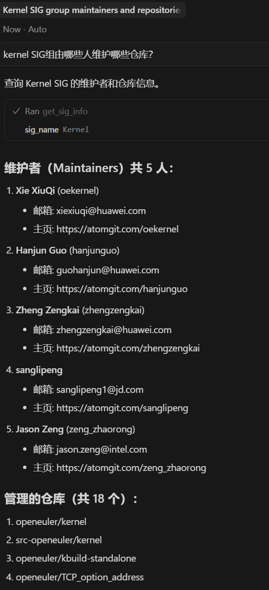
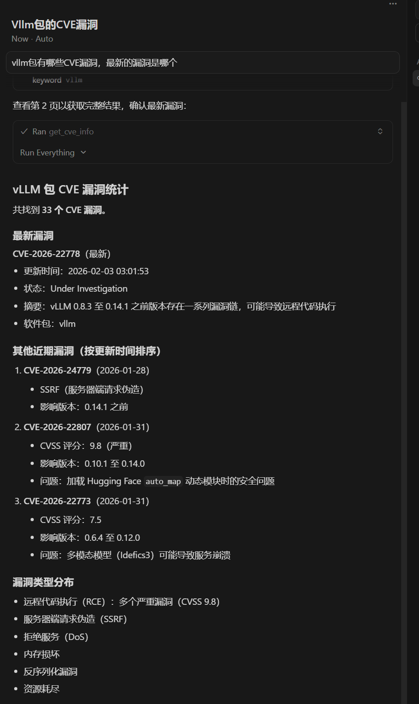
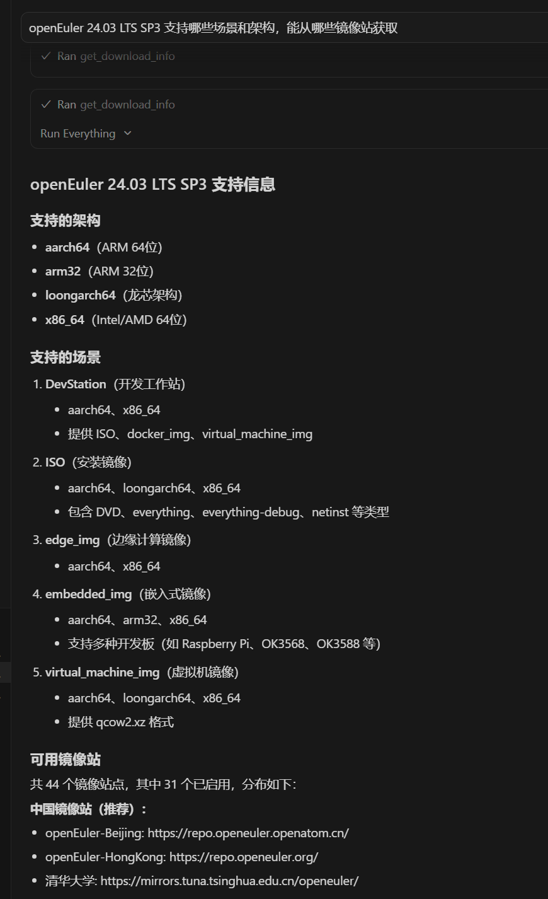
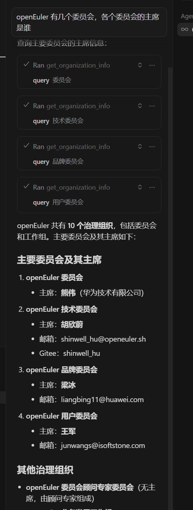

近日开发了一个openEuler mcp server，提供 openEuler 官网相关信息的查询能力，目前还在持续迭代中，欢迎大家使用并提意见。

## 关于 MCP

### 什么是 Model Context Protocol？

想象一下，当你在使用 AI 助手时，它不仅能回答问题，还能实时查询数据库、调用 API、访问文件系统。Model Context Protocol (MCP) 正是为此而生的开放协议，由 Anthropic 推出，旨在打破 AI 与外部世界的壁垒。

传统上，每个 AI 应用都需要为不同的数据源单独开发集成方案，这既耗时又难以维护。MCP 提供了一套统一的标准，让 AI 助手能够以相同的方式连接各种工具和服务。更重要的是，MCP 采用客户端-服务器架构，所有数据访问都在用户本地或受控环境中进行，你完全掌控 AI 能访问什么、不能访问什么，无需担心数据泄露到云端。

### 为什么需要 openEuler Portal MCP Server？

openEuler 社区是一个庞大的开源生态系统，拥有上百个 SIG 组、海量的软件包、技术文档和安全公告。当你想了解"某个 SIG 的维护者是谁"、"某个 CVE 漏洞影响哪些版本"、"如何下载 aarch64 架构的 ISO 镜像"时，往往需要在多个页面间跳转查找。

现在，通过 openEuler Portal MCP Server，你可以直接在 AI 对话中获取这些信息。只需用自然语言提问，AI 助手就能自动调用合适的工具，从 openEuler 官网实时获取准确的数据并呈现给你。无论是查询 SIG 组织陈冠、检索安全漏洞、获取下载地址，还是了解社区成员信息，都变得前所未有的简单高效。

## 功能

提供 4 个工具函数，根据问题自动选择合适的工具函数。

### 工具列表

| 工具名称 | 函数名 | 功能描述 | 主要参数 | 使用场景 |
|---------|--------|---------|---------|---------|
| SIG 信息查询 | `get_sig_info` | 查询 openEuler SIG 的详细信息，支持智能查询 | `sig_name` (必需), `query_type` (可选) | 查询 SIG 维护者、仓库、贡献者；查询仓库/maintainer 所属的 SIG |
| CVE 安全公告查询 | `get_cve_info` | 查询 openEuler CVE 安全公告信息 | `keyword` (必需), `page`, `page_size` | 查询安全漏洞、CVE 详情、软件包安全问题 |
| 下载信息查询 | `get_download_info` | 查询下载信息、镜像站点、版本列表 | `query` (必需), `query_type` (可选) | 下载 ISO 镜像、查询镜像站点、查看可用版本 |
| 组织信息查询 | `get_organization_info` | 查询 openEuler 社区组织架构和成员信息 | `query` (必需) | 查询委员会、工作组、社区成员信息 |

**下一步将持续迭代，并扩大支持范围**，包括：

1. 文档
2. 社区活动
3. 软件包查询
4. ...

### 支持的 AI 客户端

本 MCP Server 兼容支持 MCP 协议的客户端，包括但不限于：

- **Claude Code**：Anthropic 官方应用，原生支持 MCP
- **Cursor**：AI 驱动的代码编辑器，深受开发者喜爱
- **Cline**：VS Code 中的 AI 助手扩展
- **Trae-CN**：国内优秀的 AI 开发工具

只需简单配置，就能让这些工具获得访问 openEuler 社区数据的能力。

## 环境要求

本项目需要以下环境：

- **Node.js**: >= 18.0.0（推荐使用 LTS 版本）
  - 本项目使用 ES Modules，需要 Node.js 18 或更高版本
  - 下载地址：<https://nodejs.org/>
- **npm**: >= 9.0.0（随 Node.js 自动安装）

**检查当前版本：**

```bash
node --version
npm --version
```

## 安装

### 方式 1：使用 npx

npx 会在首次使用时自动从 npm 下载包并运行，无需手动执行安装命令。当 MCP 客户端启动时会自动执行。

**注意：** 首次启动时需要联网下载包，之后会使用缓存。

### 方式 2：全局安装

```bash
npm install -g openeuler-portal-mcp
```

## 配置

### Claude Code (终端 CLI)

编辑配置文件：

- macOS/Linux: `~/.claude.json`
- Windows: `%USERPROFILE%\.claude.json`

**使用 npx：**

```json
{
  "mcpServers": {
    "openeuler-portal": {
      "command": "npx",
      "args": ["-y", "openeuler-portal-mcp"]
    }
  }
}
```

**使用全局安装：**

```json
{
  "mcpServers": {
    "openeuler-portal": {
      "command": "openeuler-portal-mcp"
    }
  }
}
```

### Cursor

在 Cursor 的 MCP 配置中添加：

**使用 npx：**

```json
{
  "mcpServers": {
    "openeuler-portal": {
      "command": "npx",
      "args": ["-y", "openeuler-portal-mcp"]
    }
  }
}
```

**使用全局安装：**

```json
{
  "mcpServers": {
    "openeuler-portal": {
      "command": "openeuler-portal-mcp"
    }
  }
}
```

### Cline (VS Code Extension)

在 VS Code 设置中配置 MCP servers：

**使用 npx：**

```json
{
  "mcpServers": {
    "openeuler-portal": {
      "command": "npx",
      "args": ["-y", "openeuler-portal-mcp"]
    }
  }
}
```

**使用全局安装：**

```json
{
  "mcpServers": {
    "openeuler-portal": {
      "command": "openeuler-portal-mcp"
    }
  }
}
```

### Trae-CN

在 trae 设置中配置 MCP servers：

**使用 npx：**

```json
{
  "mcpServers": {
    "openeuler-portal": {
      "command": "npx",
      "args": ["-y", "openeuler-portal-mcp"]
    }
  }
}
```

**使用全局安装：**

```json
{
  "mcpServers": {
    "openeuler-portal": {
      "command": "openeuler-portal-mcp"
    }
  }
}
```

## 详细功能说明

### 1. SIG 信息查询 (`get_sig_info`)

查询 openEuler 特别兴趣小组（SIG）的详细信息，或查询仓库/maintainer 所属的 SIG 组。

**何时使用：**

- 用户询问某个 SIG 的信息、维护者、仓库等
- 用户提到具体的 SIG 名称（如 Kernel、ai、Compiler）
- 用户想了解某个仓库属于哪些 SIG 组
- 用户想查询某个 maintainer 参与了哪些 SIG 组

**参数：**

- `sig_name` (string, 必需): 查询关键词，可以是 SIG 名称、仓库名或 maintainer 的 Gitee ID
- `query_type` (string, 可选): 查询类型，默认为 "sig"（智能查询）
  - `"sig"`: 智能查询模式，自动按 SIG → 仓库 → maintainer 顺序尝试
  - `"repos"`: 仅查询仓库所属的 SIG 组
  - `"maintainer"`: 仅查询 maintainer 所属的 SIG 组

**特性：**

- 智能查询：自动识别输入类型，无需指定查询模式
- 模糊搜索：支持不同大小写变体（如 ai → AI）
- 多类型支持：可查询 SIG、仓库、maintainer

**返回信息：**

- SIG 基本信息（名称、描述、邮件列表）
- Maintainers 列表和详细信息
- 仓库列表（最多显示 20 个）
- Committers 统计（显示前 10 位活跃贡献者）
- 分支管理信息（显示前 3 个分支组）

**示例问题：**

- "Kernel SIG 的维护者是谁？"
- "ai SIG 管理哪些仓库？"
- "kernel 仓库属于哪些 SIG 组？"
- "gzbang 这个 maintainer 参与了哪些 SIG？"



### 2. CVE 安全公告查询 (`get_cve_info`)

查询 openEuler CVE（Common Vulnerabilities and Exposures）安全公告信息。

**何时使用：**

- 用户询问安全漏洞、CVE 信息
- 用户想了解某个软件包的安全问题
- 用户查询特定 CVE 编号的详情

**参数：**

- `keyword` (string, 必需): 查询关键词，可以是 CVE 编号或软件包名
- `page` (number, 可选): 页码，默认为 1
- `page_size` (number, 可选): 每页显示记录数，默认 20，最大 1000

**返回信息：**

- CVE ID（漏洞编号）
- 摘要（漏洞描述）
- CVSS 评分（漏洞严重程度）
- 状态（如已修复、调查中等）
- 发布时间和更新时间
- 受影响的产品和软件包
- 安全公告编号

**示例问题：**

- "查询 kernel 相关的 CVE"
- "openssl 有哪些安全漏洞？"
- "CVE-2024-1234 的详细信息"



### 3. 下载信息查询 (`get_download_info`)

查询 openEuler 下载信息、镜像仓列表和版本信息。

**何时使用：**

- 用户想下载 openEuler ISO 镜像
- 用户询问某个版本的下载地址
- 用户想查找镜像站点
- 用户想了解有哪些可用版本

**参数：**

- `query` (string, 必需): 查询关键词
- `query_type` (string, 可选): 查询类型，默认为 "auto"
  - `"auto"`: 自动查询，支持版本号和模糊搜索
  - `"mirrors"`: 查询镜像仓列表
  - `"versions"`: 查询所有可用版本

**特性：**

- 智能查询：自动识别版本号或关键词
- 模糊搜索：在多个版本中查找匹配的文件
- 镜像列表：显示全球镜像站点信息
- 版本列表：显示所有可用的 openEuler 版本

**返回信息：**

- ISO 文件名、大小、下载路径
- SHA256 校验码
- 支持的架构（aarch64、x86_64 等）
- 镜像站点 URL、国家、带宽
- 版本号、LTS 状态、支持的架构

**示例问题：**

- "openEuler-24.03-LTS 的下载地址"
- "查询 openEuler 镜像站点"
- "有哪些 openEuler 版本可用？"
- "查找 aarch64 架构的 ISO"



### 4. 组织信息查询 (`get_organization_info`)

查询 openEuler 社区组织架构和成员信息。

**何时使用：**

- 用户询问社区组织结构
- 用户想了解委员会、工作组信息
- 用户查询社区成员和角色

**参数：**

- `query` (string, 必需): 查询关键词

**示例问题：**

- "openEuler 有哪些委员会？"
- "技术委员会的成员有谁？"



> 💡 **提示：** AI助手会根据工具的描述自动选择合适的工具。
