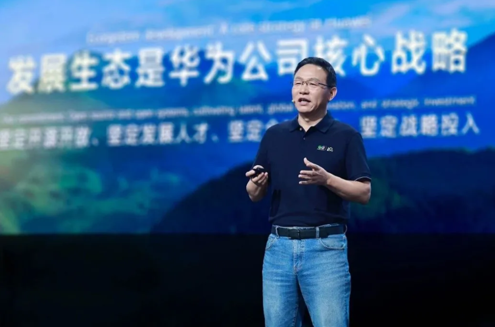
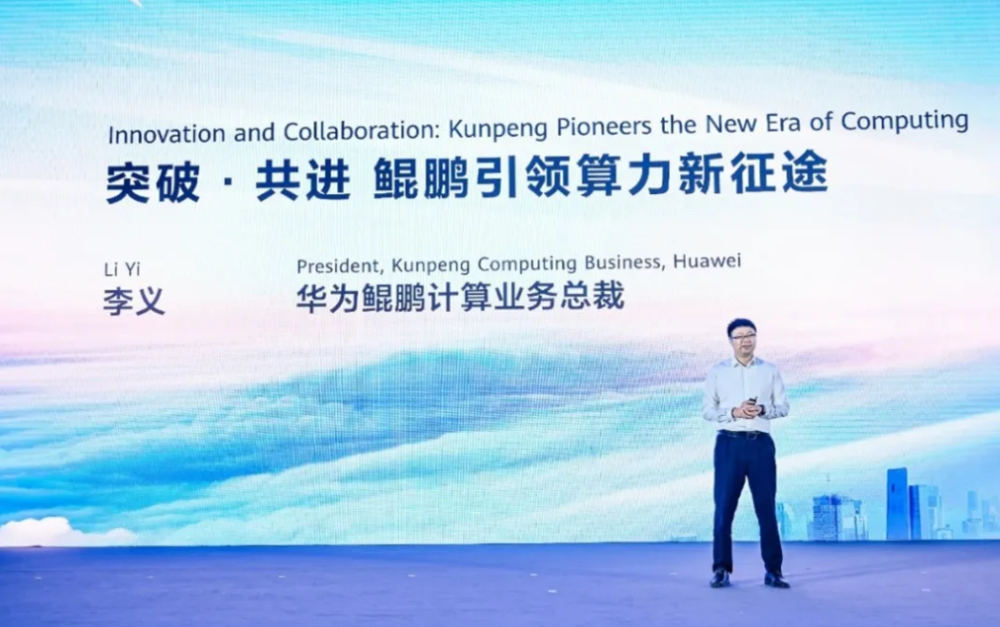
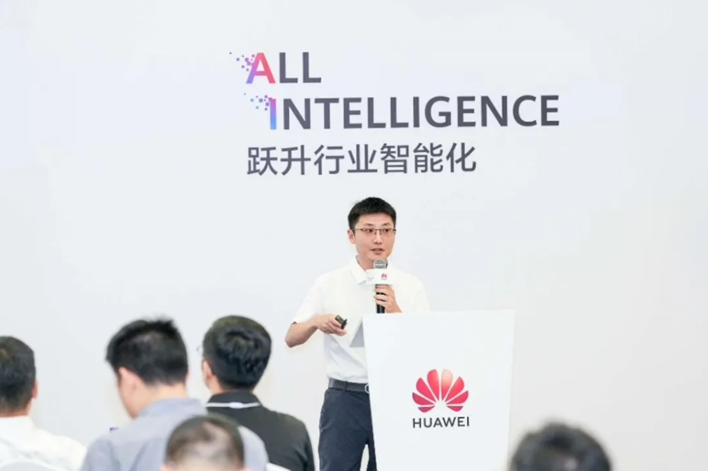
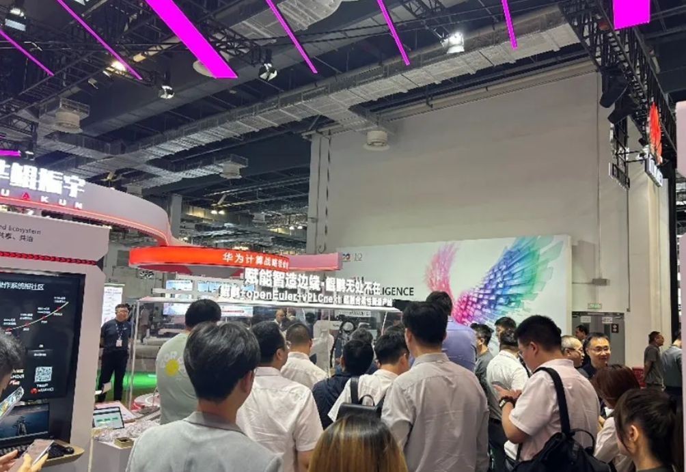

【中国，上海，2025年9月18-20日】华为全联接大会 2025 （HC2025）以 “跃升行业智能化” 为主题，OpenAtom openEuler（简称：“openEuler”或“开源欧拉”）作为开源操作系统领域的关键力量深度参与其中。高层演讲、技术实践、生态成果与合作案例，展现开源操作系统如何打破行业壁垒，从算力基础设施协同到多产业场景适配，openEuler 正联接起软硬件厂商、企业用户与开发者，用开放协作推动产业资源深度整合，为各领域融合发展提供新路径。

### 创新引领，开源开放，共创智能世界生态新选择

华为常务董事汪涛在演讲中表示，openEuler历经六年发展，已赋能万千企业应用，服务全球多个国家和地区，推动构建全球开源新生态，开创了中国开源发展的新范式。同时，openEuler已在下一代操作系统技术的探索中取得突破：灵衢互联总线技术实现了更高效的资源池化与弹性供给，相关核心能力也将贡献至openEuler社区。我们相信，依托全球开发者的力量，openEuler将成为用户首选的数智基础设施操作系统。

华为常务董事汪涛

### 突破·共进 鲲鹏引领算力新征途

华为鲲鹏计算业务总裁李义在演讲中提到，华为将向openEuler社区贡献灵衢使能、异构融合使能代码，助力openEuler构建统一互联总线架构软件新生态。在技术上，openEuler通过设备池化统一管理，资源可按需匹配灵活组合，达成超节点系统高性能和高资源利用率，充分发挥算力优势，驱动通算、智算业务场景效能跃迁。

华为鲲鹏计算业务总裁李义

### 中国南方电网妙算系列高能效服务器技术创新分享

国家“双碳”战略，实现节能降耗与绿色发展，是能源行业的方向目标。南方电网数据中心业务副总经理刘运分享到，中国南方电网通过软硬协同和垂直整合自主研发的一款机架式服务器（南网妙算系列），该服务器基于鲲鹏处理器和openEuler操作系统，集合了CPU精准调频降耗、高效电源降损和智控风扇降温三大核心技术，可通过感知业务负载智能调节整机功耗，在同等算力下整机功耗降低约13-15%，以万台服务器规模估算，数据中心预计一年可节电1500万度电，约为375万户家庭耗电量。鲲鹏联合openEuler软硬协同，充分发挥多核优势，让算力成本直降，让绿色算力落地，是电碳算协同的最优算力底座！

南方电网数据中心业务副总经理刘运

除了专题演讲环节以外，openEuler 在华为全联接大会 2025 现场设立展览展示。openEuler 生态发展迅猛，目前麒麟、麒麟信安、统信等25 家厂商基于openEuler 推出商业发行版，广泛应用于金融、能源、制造等关键行业。在技术上，openEuler 基于灵衢支持超节点，释放大规模异构计算能力，包括池化基础底座，异构融合调度，sysHAX CPU+xPU 算力协同调度，推理吞吐量提高10% ；异构融合内存GMEM 内存倍级超分，推理吞吐提升5% ，助力通算、智算领域实现跨越式效能跃迁。

此外，现场重磅展示 “openEuler & 菲尼克斯 & 泊川 & 拓斯达 & 鲲鹏”超融合柔性智造产线特装，以菲尼克斯电气开放式控制平台vPLCnext 虚拟化控制技术和拓斯达X5 机器人实时运控平台为核心，融合了鲲鹏模组、泊川的基于openEuler 的QsemOS 嵌入式操作系统等多项先进技术，实现了工厂无线化、PLC 集中化与产线柔性化，让生产流程更加灵活高效，满足市场多样化需求。

最后，华为全联接大会2025 虽已落幕，但openEuler 的征程不止步：此次大会让全球直观看到其开源生态的无限潜力，openEuler 依托生态规模的不断壮大与核心技术的持续创新，继续携手全球开发者与合作伙伴，以开源力量驱动产业创新，让技术成果惠及千行百业，共绘数字经济发展的宏伟蓝图。