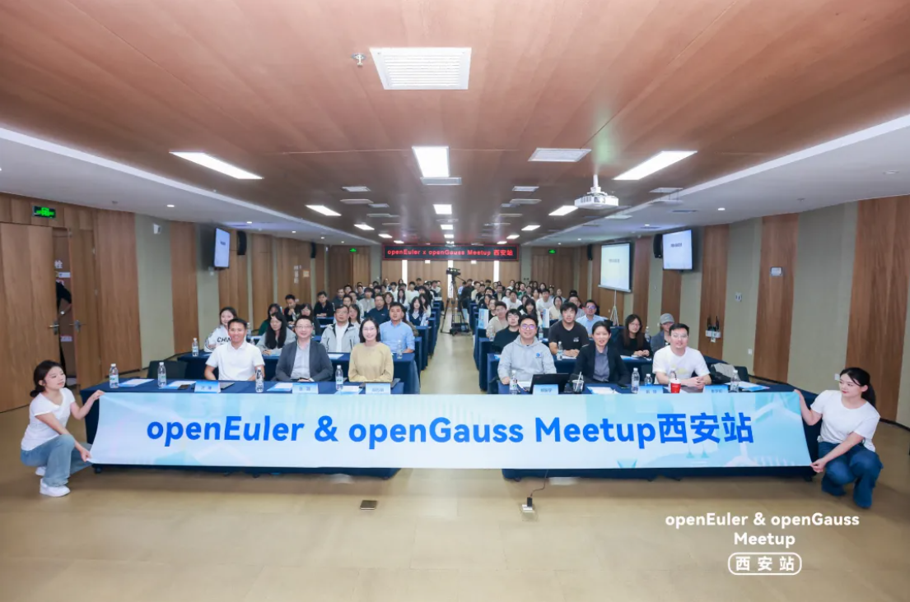
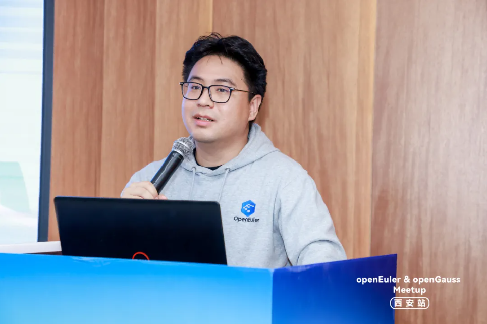
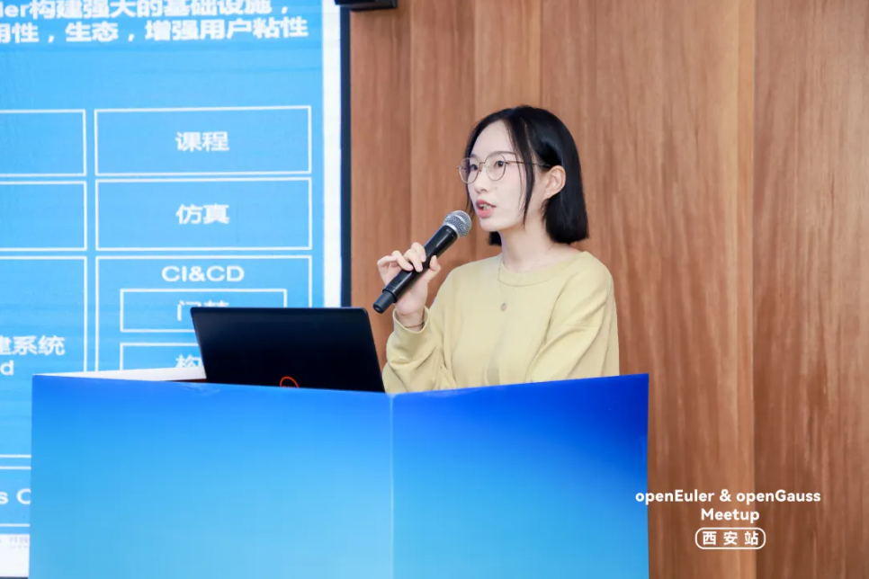
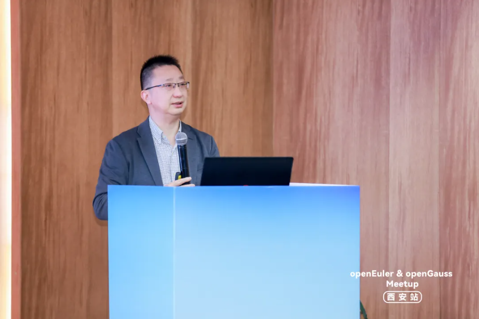
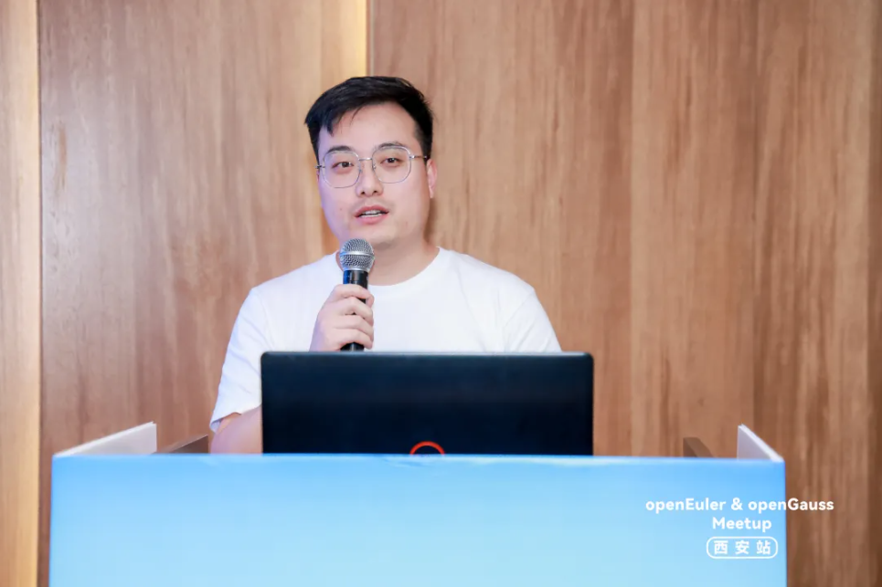
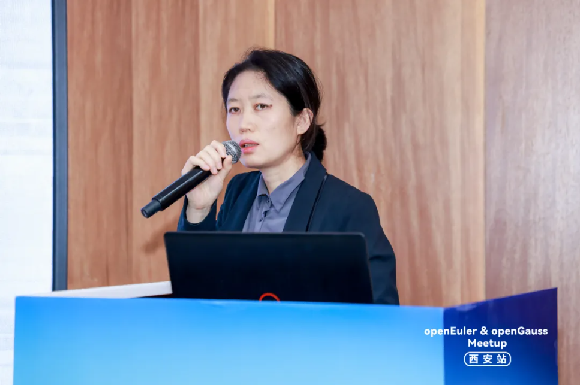
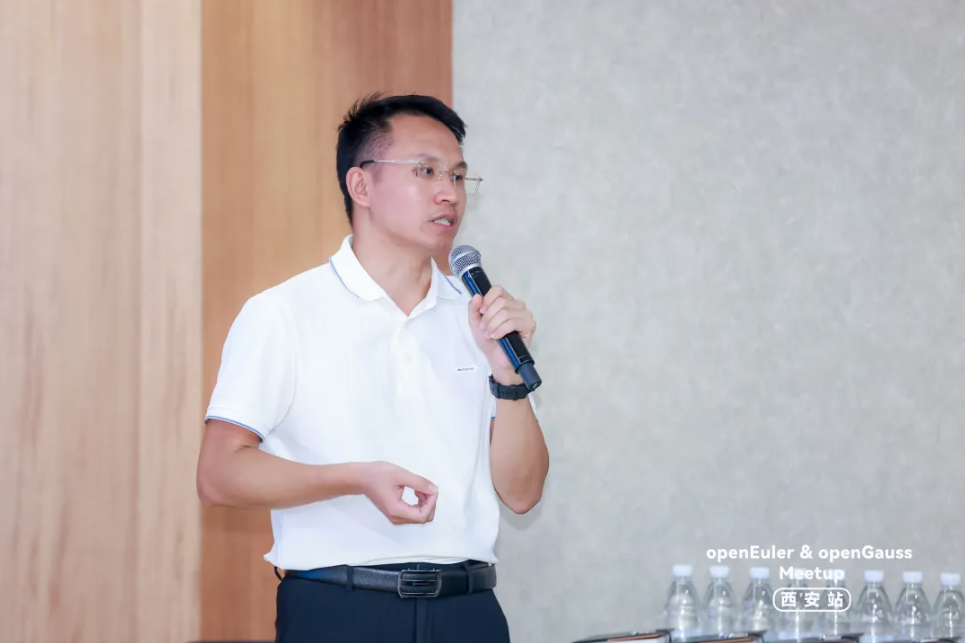

2025年9月26日，由openEuler社区、openGauss社区、西安软件园发展有限公司、陕西鲲鹏生态创新中心、西北工业大学计算机学院联合主办的“openEuler & openGauss Meetup暨openEuler西安用户组2025年度线下交流活动”在西安成功举办。本次活动汇聚了多位开源领域的专家、学者与企业代表，围绕openEuler和openGauss的最新技术进展、生态建设、行业实践等议题展开深度分享与交流。

### openEuler：聚焦AI与嵌入式，多元生态共建推动操作系统智能化演进

活动伊始，openEuler运营组组长郑振宇分享了openEuler社区的生态发展现状与AI全栈开源新进程。社区持续聚焦“全场景、智能化、多样性算力”三大技术方向，推动操作系统在服务器、云、边缘、嵌入式等场景的深度融合。他特别介绍了openEuler在AI原生操作系统方向的探索，包括智能运维、智能问答、AI辅助编程等功能的增强，以及与大模型推理全栈方案的深度融合，进一步提升AI应用的效率与易用性。

郑振宇 openEuler运营组组长
 

openEuler Embedded SIG成员胡万明聚焦openEuler在嵌入式领域的进展，重点介绍了面向具身智能场景的嵌入式操作系统规划。她介绍到，openEuler Embedded提出具身软件栈“Intelligence BooM Robot”，深度融合ROS生态与AI生态，并致力于构建具身智能OS的高实时性、异构加速等技术竞争力，为具身智能应用场景提供坚实的嵌入式底座。

胡万明 openEuler Embedded SIG成员
 

西北工业大学张羽教授分享了基于openEuler在面向多指令集的泛在操作系统新型内核构建方面的最新研究进展。团队开发了一款轻量级Hypervisor，具备低内存占用与高安全性的技术特点，并在无人机集群等实际场景中完成功能验证。此外，张羽教授还介绍了所在团队在泛在操作系统方向的持续探索，涵盖轻量级虚拟机监控器等多个项目成果，致力于为现场计算场景提供安全、专用且智能化的操作系统支持。

张羽 西北工业大学教授
 

openEuler社区Maintainer、OpenHPC社区TSC鲁卫军介绍了BoostKit加速套件在openEuler上的开源计划与成果，其大数据组件OmniRuntime等已开源并贡献给社区，为全场景应用提供软硬协同优化。同时，社区基于openEuler和鲲鹏底座构建OpenHPC 4.x版本，推动高性能计算软件栈整合。此外，在Bioconductor、Bioconda等主流社区的上游软件包也已实现对openEuler与鲲鹏架构的广泛支持，展现出蓬勃的生态活力。

鲁卫军 openEuler社区Maintainer、OpenHPC社区TSC
 

### openGauss：企业级数据库实践与嵌入式创新

在openGauss专题环节，海量数据技术专家姚婷介绍了基于openGauss研发的企业级数据库Vastbase G100，及其在金融、政务、制造等行业的成功案例。她强调，Vastbase在兼容性、高可用、安全性方面的优势，助力多家客户实现数据库平滑迁移与系统效能提升。

姚婷 海量数据技术专家
 

大湾区国创中心工业软件产业发展中心嵌入式数据库市场总监兰锋则聚焦嵌入式数据库的创新实践，推出了国创灵梭嵌入式数据库（IntarkDB）。该产品基于openGauss内核深度优化，支持多模态数据管理，具备高性能、轻量化、智能化、高实时、易协同等特点，精准匹配智能制造装备、具身智能机器人、智能汽车、智能终端等多元工业场景需求，有效破解嵌入式数据库基础软件底座在自主可控、可持续发展及智能化演进中的关键难题，完美适配嵌入式设备资源受限场景下的实时性与安全性要求。其开源版本openGauss-embedded 在Embedded SIG 与 RISC-V SIG 的通力协作下已成功适配RISC-V架构，未来将持续深入合作，为openGauss社区生态注入更强赋能！

兰锋 大湾区国创中心工业软件产业发展中心嵌入式数据库市场总监
 

本次Meetup不仅为西安及周边的开发者提供了与社区核心团队面对面交流的机会，也进一步推动了openEuler与openGauss在西北地区的生态拓展与技术落地。未来，openEuler与openGauss社区将继续携手高校、企业及开发者，共同推动开源操作系统与数据库的创新与产业化应用。

如果您错过了本次线下活动，可点击下方链接回看！

黄大年茶思屋

https://www.chaspark.com/#/live/1189694886000082944