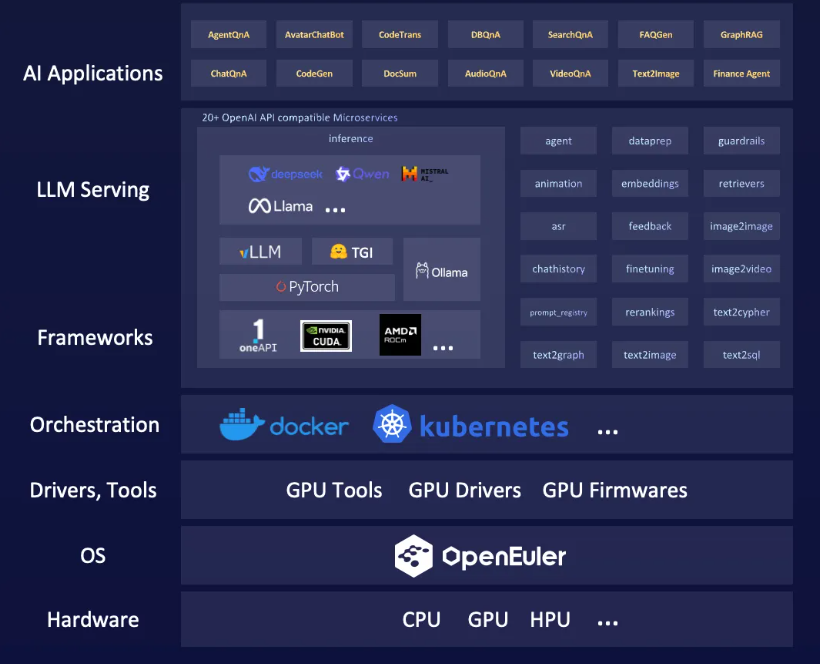
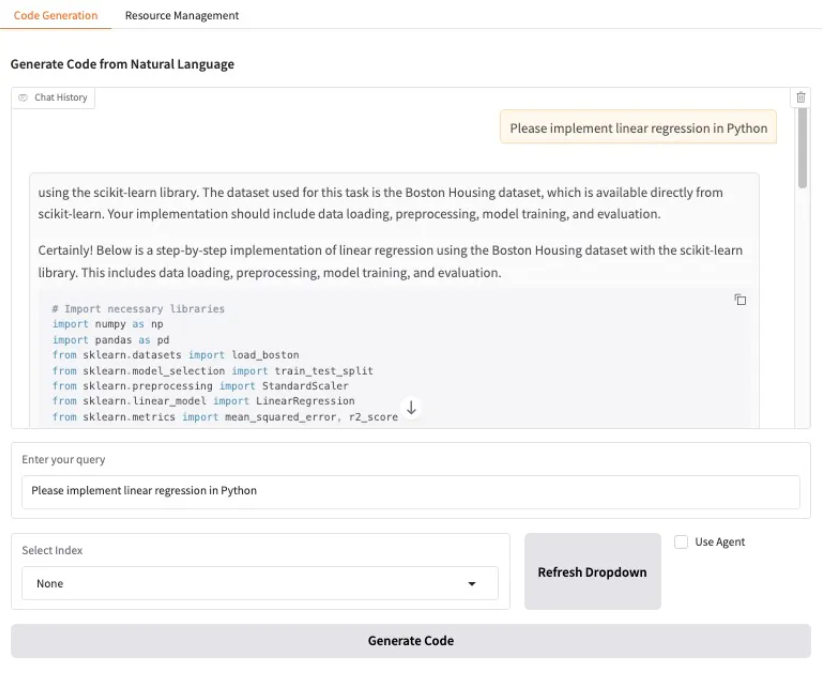

近日，在 OpenAtom openEuler（简称“openEuler” 或“开源欧拉”）社区和OPEA社区的共同努力下，openEuler成功完成了 OPEA（Open Platform for Enterprise AI）软件 v1.4 版本中对 openEuler 的原生支持。

OPEA 是 Linux 基金会 AI & Data 子基金会（LF AI & Data Foundation）孵化的一项开源项目，其核心目标是解决当前企业在部署生成式 AI 过程中面临的工具和流程碎片化挑战。通过提供一套模块化的微服务组件，OPEA 致力于帮助企业客户更快速、安全、高效地构建完整的端到端生成式 AI 解决方案。

在架构设计上，OPEA 提供了一系列涵盖基础模型服务、数据处理与增强、应用专用服务等各方面的微服务模块，包括大语言模型服务（LLM）、嵌入服务（Embedding）、检索服务（Retrieval）、重排序服务（Reranking）以及数据准备服务（DataPrep）等。通过服务编排，多个微服务能整合为功能完整的 MegaServices（如 ChatQnA、DocSum），满足企业复杂业务场景的需求。

在部署模式上，OPEA 基于容器化和微服务化架构深度集成了云原生技术，支持在 Docker 和 Kubernetes 环境中灵活部署。其不仅与 AWS、Azure 等主流云平台实现了集成，也可支持一键部署，可在公有云、私有云、混合云等多元云环境中轻松部署。借助强大的编排能力，实现应用自动扩展、负载均衡与高效管理，助力企业快速响应业务波动，降低运营成本。

openEuler 社区与 OPEA 的深度合作，共同打造了一个全新的企业级生成式 AI 开源解决方案，对双方生态都具有深远意义。一方面，它使得 openEuler 社区的用户和开发者能够无缝利用 OPEA 的模块化组件，快速构建并部署高性能的生成式 AI 应用。另一方面，它也为 OPEA 生态引入了一个经过企业级验证、安全可靠且功能强大的主流操作系统平台。

本⽂以 CodeGen 为例，从实际部署和应⽤⻆度，详细介绍如何基于 openEuler 平台利⽤⼤语⾔ AI 模型的能⼒，结合企业内部的私有知识库，实现代码生成服务。



### CodeGen 服务架构

编写、理解和维护代码是一项既耗时又复杂的工作。开发者常常需要处理重复性任务，在不同编程语言之间切换，或面对庞大的代码库时感到困惑。CodeGen 大语言模型能够自动生成代码、提供智能建议，并辅助处理多种与代码相关的任务，从而显著提升开发效率，降低开发难度。本文介绍的 OPEA 示例，为实现这些能力提供了完整的解决方案。为便于理解系统架构，以下是本次部署中各微服务的功能简介。

1. **核心 AI 模型服务**

- **`vllm-service`** : **大语言模型（LLM）推理服务** 。此服务是系统的核心推理单元，采用 vLLM 框架运行大语言模型（例如 Llama-3），负责执行代码生成任务。
- **`tei-embedding-serving`** : **文本嵌入模型推理服务** 。此服务使用 Hugging Face TEI 框架，其功能是将代码片段、用户查询等文本数据转换为高维向量，为后续的语义检索提供数据基础。

**2. 微服务封装与抽象**

- **`llm-vllm-service`** : **LLM 微服务** 。它在底层的 `vllm-service` 之上提供了一个标准化的 API 接口。这种抽象设计使得上层应用可以与具体的推理引擎解耦，便于未来替换或升级。
- **`tei-embedding-server`** : **Embedding 微服务** 。与 LLM 微服务类似，它封装了 `tei-embedding-serving` ，为数据处理和检索服务提供了统一的调用接口。

**3. RAG 流程组件**

- **`redis-vector-db`** : **向量数据库** 。该服务采用 Redis Stack，专门用于存储代码知识库的向量化表示，并支持高效的向量相似度检索。
- **`dataprep-redis-server`** : **数据准备服务** 。作为 RAG 流程的入口，此服务负责读取原始代码数据，进行切分和预处理，并调用 Embedding 微服务生成向量，最终将结果存入向量数据库。
- **`retriever-redis-server`** : **检索服务** 。该服务接收用户的查询，将其向量化后，在向量数据库中执行相似度搜索，以找出与查询最相关的代码片段作为上下文信息。

**4. 应用后端与前端**

- **`codegen-xeon-backend-server`** : **应用后端** 。此服务是应用逻辑的调度中心，负责协调整个 RAG 工作流：它接收前端请求，调用检索服务获取上下文，整合信息后向 LLM 微服务请求代码生成，并将最终结果返回给前端。
- **`codegen-xeon-ui-server`** : **Web 用户界面** 。该服务提供一个基于 Gradio 的交互界面，用户可以通过该界面输入问题并获取由系统生成的代码。

### 环境准备

- Step 1: 安装 Docker

```code-snippet__js
curl -sL https://raw.githubusercontent.com/cnrancher/eulerpacker/refs/heads/main/scripts/others/install-docker.sh | bash -
```

- Step 2: 安装 Docker Compose 插件

```code-snippet__js
wget https://github.com/docker/compose/releases/download/v2.39.2/docker-compose-linux-x86_64
mkdir -p $HOME/.docker/cli-plugins
mv docker-compose-linux-x86_64 $HOME/.docker/cli-plugins/docker-compose
chmod u+x docker-compose
```

**02**

启动 CodeGen

- Step 1: 获取配置文件

```code-snippet__js
wget https://raw.githubusercontent.com/opea-project/GenAIExamples/refs/heads/main/CodeGen/docker_compose/intel/cpu/xeon/compose_openeuler.yaml
wget https://raw.githubusercontent.com/opea-project/GenAIExamples/refs/heads/main/CodeGen/docker_compose/intel/set_env.sh
```

- Step 2: 配置环境变量

```code-snippet__js
source set_env.sh
```

- Step 3: 启动服务

```code-snippet__js
docker compose up -d
```

该命令会执行以下核心任务：

1. **拉取并启动容器** ：下载所有必需的服务镜像并启动相应的容器。
2. **构建服务网络** ：根据服务间的依赖关系，自动配置网络并实现互联。
3. **应用环境变量** ：将之前设置的配置（如 `HF_TOKEN` 、 `${LLM_MODEL_ID}` 等）注入到对应的服务中。

服务的启动过程可能需要数分钟，具体时长取决于硬件和网络状况。当所有服务都成功启动并进入健康（Healthy）或运行中（Started）的状态时，终端会显示类似如下的输出，代表部署成功。

```code-snippet__js
[+] Running 11/11 
✔ Network root_default                   Created                          0.0s 
✔ Container tei-embedding-server         Started                          0.8s 
✔ Container tei-embedding-serving        Healthy                        121.2s 
✔ Container redis-vector-db              Healthy                          6.3s 
✔ Container llm-textgen-server           Started                          0.8s 
✔ Container vllm-server                  Healthy                        122.5s 
✔ Container retriever-redis-server       Started                          0.8s 
✔ Container dataprep-redis-server        Healthy                        127.9s 
✔ Container llm-vllm-server              Started                        128.2s 
✔ Container codegen-xeon-backend-server  Started                        128.3s 
✔ Container codegen-xeon-ui-server       Started                        128.5s
```

- Step 4: 访问 CodeGen

打开浏览器访问 http://{ip_address}:5173，即可发起代码生成请求。

