9月25日， OpenAtom openEuler（简称"openEuler"或“开源欧拉”）社区与 东方通联合主办的 openEuler 社区云原生开源中间件Meetup武汉站，在武汉职业技术大学圆满落幕。本次活动以开源技术赋能高校教育、校企协同共育实战人才为核心方向，聚焦Qingzhou（轻舟）融合管理开发平台（以下简称“轻舟”）和云翼数据缓存中间件云原生管理平台（以下简称“云翼”）两大开源项目，带领现场师生们了解云原生等前沿技术，领略开源魅力、共享技术实践，现场互动热烈、氛围浓厚，吸引200余名计算机相关专业师生到场参与。

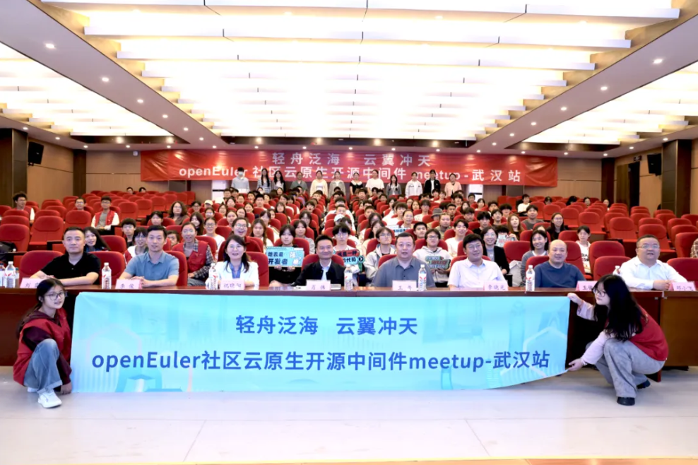

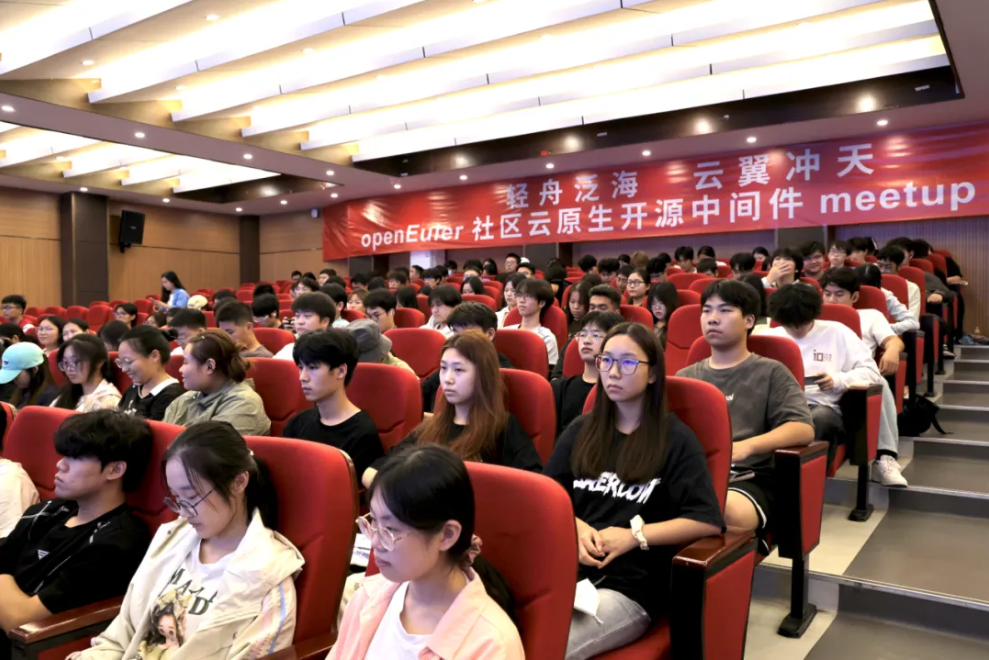

### 锚定开源生态发展 共绘育人蓝图

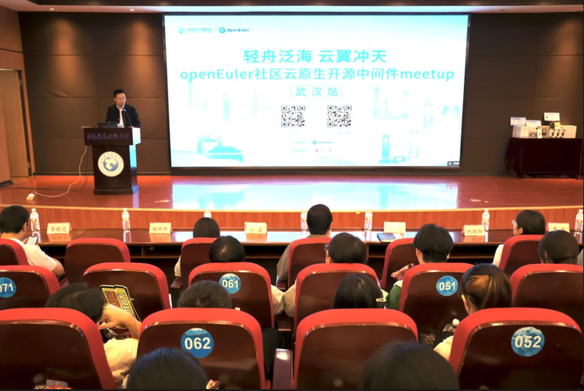

武汉职业技术大学人工智能学院党委书记肖伟致辞。他指出，当前开源生态已成为科技创新的重要引擎，高校作为人才培养的主阵地，亟需与企业开展深度合作，将前沿开源技术融入课程教学与实践环节。武汉职业技术大学始终重视应用型、创新型人才的培养，此次携手openEuler与 东方通社区，不仅能够让学生近距离接触企业级开源项目，更将为学生搭建起面向未来职业发展的技术实践平台。肖伟书记表示，期待未来持续深化校企协同育人机制，共同为推动开源事业发展贡献力量，为国家科技创新提供坚实的人才支撑。

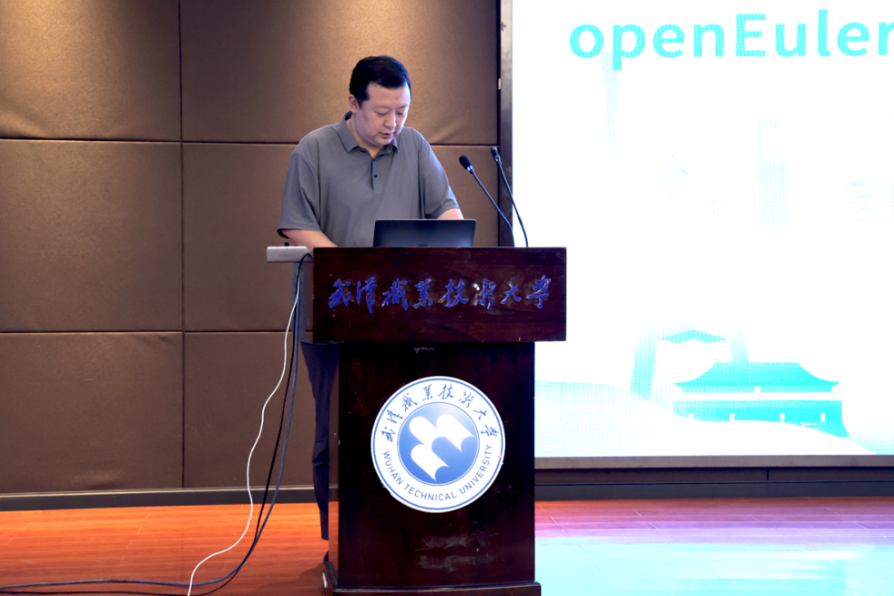

东方通开发部经理王普在致辞分享了开源生态的发展趋势与技术价值。他表示，作为openEuler社区的重要贡献者，东方通致力于以开源发展推动国产基础软件创新，并已成功举办多期校企联合培训，积极培育技术人才。高校人才是开源生态持续发展的核心动力，本次Meetup活动不仅是技术分享的平台，更是链接校企协同育人的桥梁。希望借此机会，让更多学子了解并参与开源项目，共同为开源生态的繁荣注入新生力量。

### “轻舟”“云翼”双擎驱动 推动云原生中间件发展

随着业务敏捷性要求与底层基础设施的不断升级，中间件的云原生化已成为必然选择。openEuler社区与 东方通技术专家在沙龙现场带来重磅分享，聚焦“轻舟”与“云翼”两大开源项目，深入解读技术内核与创新实践，共同探索云原生中间件的未来演进路径。

**轻舟开源项目 极简开发的“效率利器”**

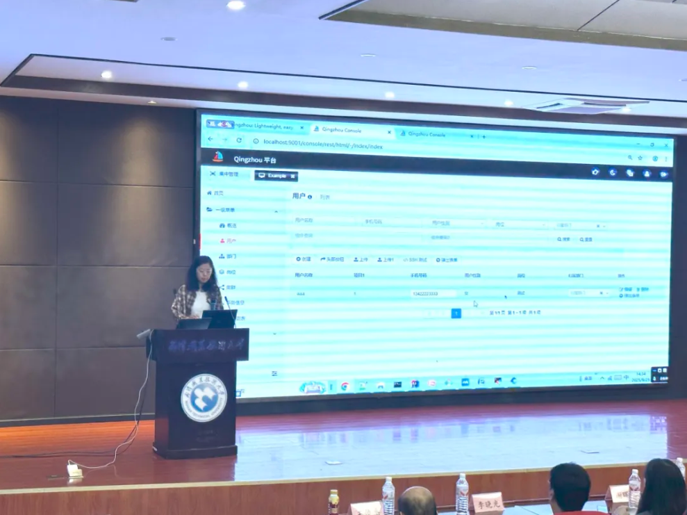

东方通核心技术与轻舟项目Committer程福娟围绕轻舟开源平台展开分享。她指出，传统Web开发存在重复编码多、周期长、集成难等痛点，而轻舟作为轻量级开源平台，通过编写Java Bean，即可自动生成业务模块对应的前端网页、REST接口、JMX接口、国际化等服务，并能开箱即用内置的用户管理、认证授权、监视自动化、文件上传下载、本地和远程集中管理、公共组件等能力。以用户管理模块为例，直接确认字段类型、操作类型、模型接口等，就能自动生成查询、编辑、导出等完整功能，开发效率大幅提升。

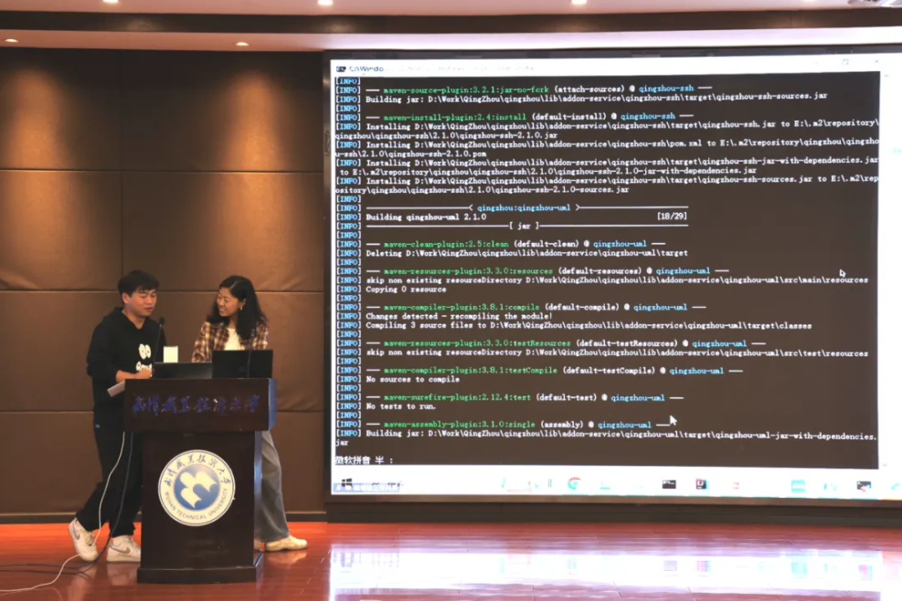

随后，通过现场互动、项目实操，现场师生更直观地感受到了轻舟的便捷性。程福娟现场演示了项目搭建流程，从扫码注册登录、Git下载源码，到基于Java 8+、Maven、IDEA 搭建环境，再到编译运行访问本地服务，全程仅需 5 步即可完成基础开发环境部署。在互动环节，她还针对师生提出的 “轻舟如何适配复杂业务逻辑”等问题逐一解答，并通过实操功能，让在场师生切实体会到轻舟的灵活性与实用性。

**云翼开源项目 云原生环境的完美适配方案**

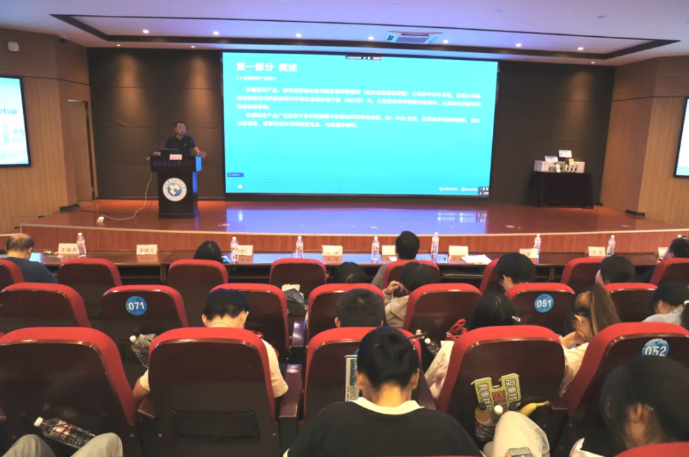

openEuler社区云翼项目Committer李东升，系统讲解了TongRDS分布式数据缓存中间件。他介绍，TongRDS全面兼容Redis，凭借自主创新能力及面向云原生和现代多核硬件设计的全新架构，在性能、可靠性、可扩展性和云原生适应性上具备显著优势。针对缓存应用中的核心痛点，李东升重点解析了缓存穿透、缓存雪崩、缓存击穿三大典型问题的应对方案。同时，他指出，TongRDS具备真正的多核并行能力、高可用保障、片内多主多活等三大技术突破，充分释放硬件算力，实现服务秒级恢复，进一步提升服务稳定性。最后，李东升介绍了基于TongRDS打造的云翼开源项目，结合实际应用场景阐释项目价值，并通过知识问答互动深化学生理解，帮助师生构建起完整、系统的缓存技术知识体系。

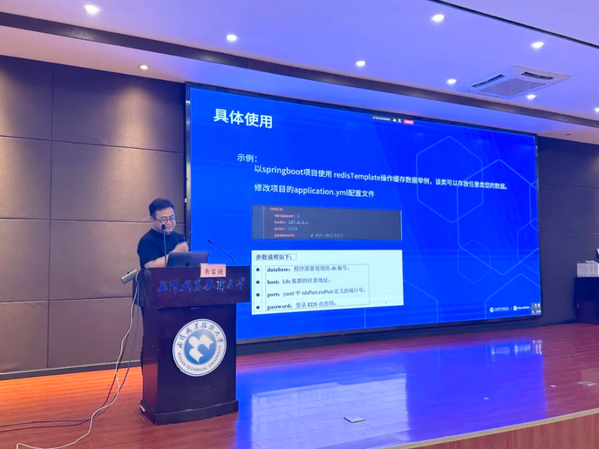

为帮助现场师生深入了解“TongRDS”与“云翼项目”，TongRDS云原生版技术经理岳富强分享了TongRDS分布式缓存中间件和TongRDS-Proxy（云翼）的工作原理和使用，详细介绍了 TongRDS 分布式缓存中间件的核心特性、TongRDS-Proxy的工作原理与实际使用方法，同时讲解了TongRDS-Proxy 解决云环境节点漂移、提供统一数据访问接口的核心功能，K8S 的八大核心组件，云翼数据缓存中间件云原生管理平台的四部分构成，以及 Proxy 在集群伸缩中对内代理节点、对外提供缓存服务且通过全异步处理请求优化性能的关键作用。

### 开源实习：增强实践演练 扩大社区影响

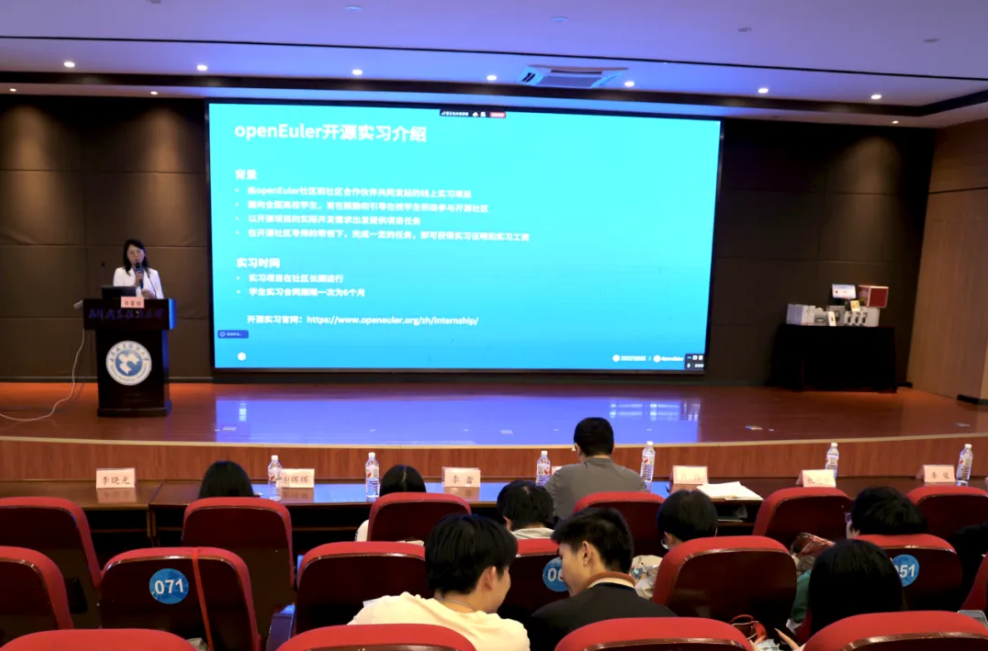

东方通生态发展经理祝晓阳介绍了东方通在openEuler社区的开源实习计划。该实习计划由openEuler社区与东方通联合发起，面向全国高校学生开放，以轻舟、云翼两大开源项目为核心，提供线上为期6个月实习机会，时间管理灵活，导师全程指导，学生可通过线上方式参与开发，积累积分兑换实习证明及奖金，根据积分进阶机制，表现突出者最高可得8000 元实习工资及证明。该计划不仅助力学生积累企业级项目经验，更为其未来职业发展构建扎实的技术基础。

- 轻舟项目地址：https://gitee.com/openeuler/qingzhou

- 云翼项目地址：https://gitee.com/openeuler/yunyi

想要加入实习项目的小伙伴可通过以下方式联系：

- 轻舟项目联系方式：wangpl@tongtech.com

- 云翼项目联系方式：wuyd@tongtech.com

### 校企协同 共筑开源新生态

本次 Meetup 不仅带来前沿技术分享，更成功搭建起校企协同育人的桥梁。活动现场气氛热烈，学生们热情高涨，不少同学表示，能近距离接触企业级开源项目，收获远超预期；还有同学直言，希望尽快将专家讲解的技术知识转化为实践，真正应用到开发中。会后，同学们更是第一时间扫码关注 “轻舟”“云翼” 项目的 Gitee 仓库，围绕实习任务的申请条件、开发方向展开热烈讨论。武汉职业技术大学人工智能学院副院长邓小飞表示，期待未来能将最新开源技术融入课堂教学，让学生在校期间就能接触企业真实技术场景，积累实战经验。

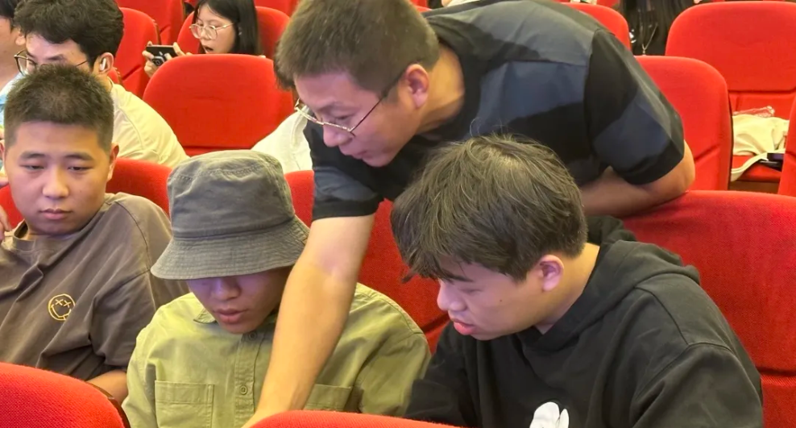

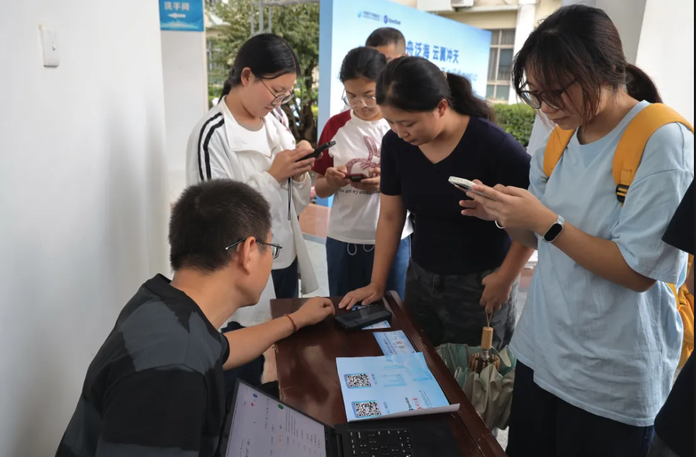

此次 Meetup 的成功举办，通过校企合作桥梁，既为学生提供了宝贵的实践机会，也为企业储备具备实战能力的技术人才创造了条件。未来，随着更多高校学生加入“开源阵营”，开源人才培养的新路径将持续拓宽，年轻开发者能在参与实际项目的过程中快速成长，实现从“学习技术”到“贡献技术” 的跨越，为开源生态发展注入源源不断的蓬勃活力。