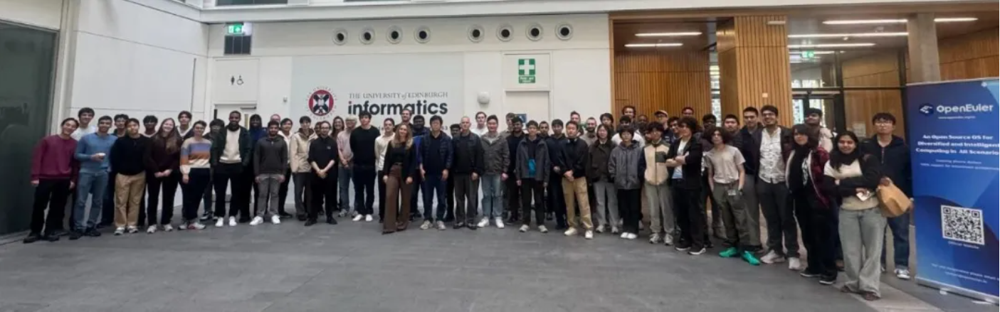
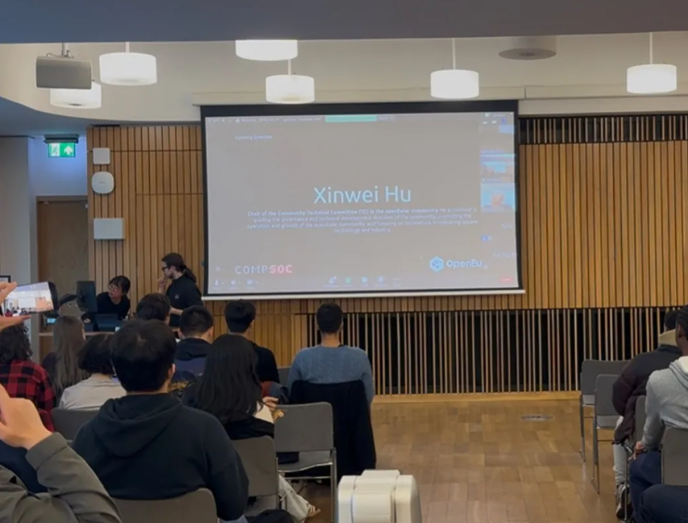
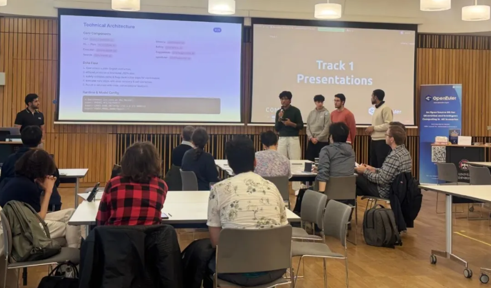
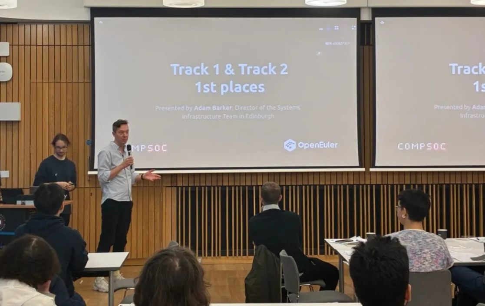
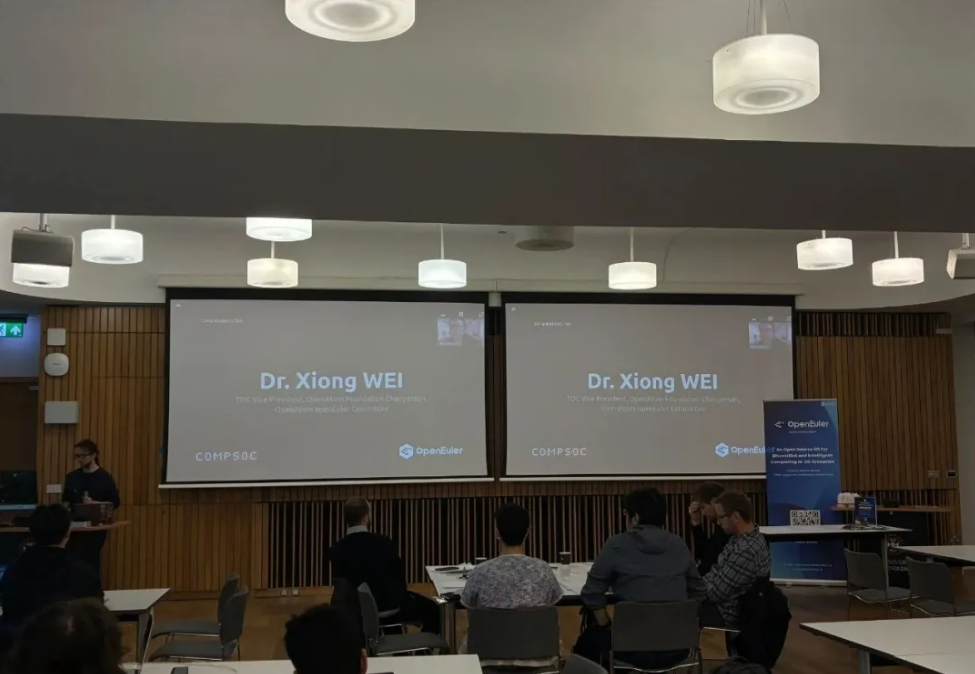
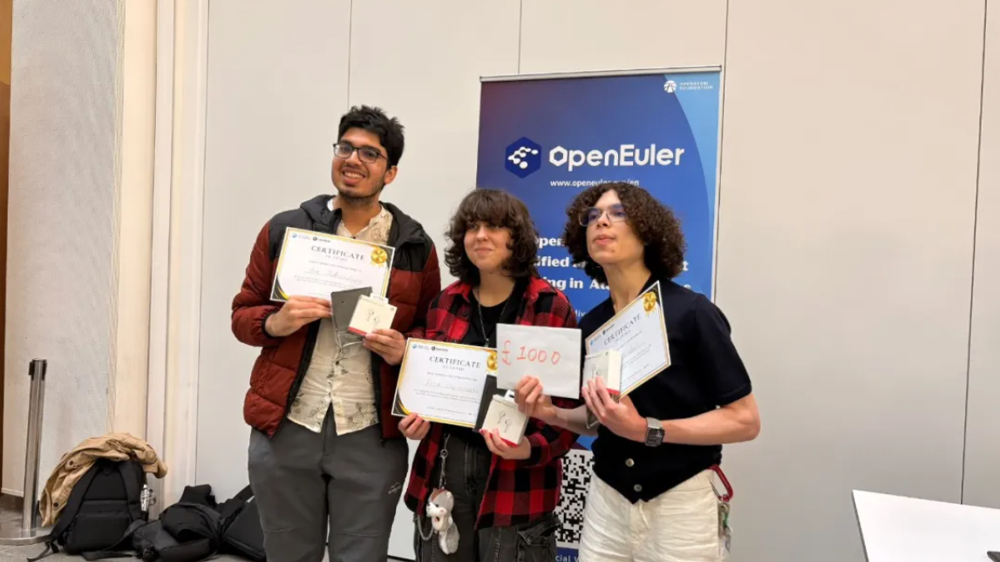
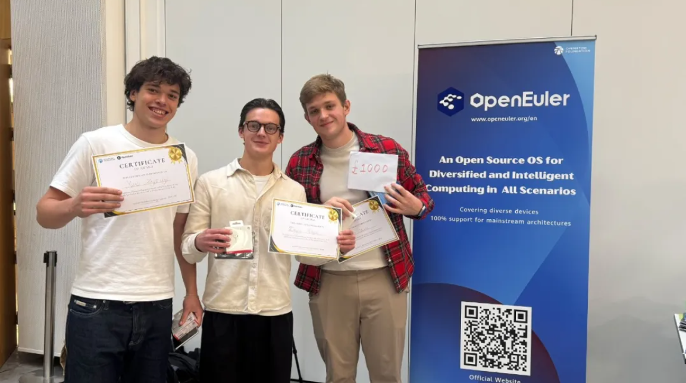

2025年9月29日至10月3日，OpenAtom openEuler （简称“openEuler” 或“开源欧拉”）社区和华为爱丁堡研究所携手爱丁堡大学，举办了欧洲首场以 openEuler 为主题的黑客松。本次黑客松共集结80余名选手，共计20支队伍参与，围绕操作系统智能化这个主题进行系统创新，活动的成功举办，体现了 openEuler 与海外高校合作的最新进展，是 openEuler 国际化进程中一个新的里程碑。

### 开幕典礼与注册

9月29日，20支参与黑客松的队伍在爱丁堡大学成功集结。爱丁堡大学的 CompSoc 社团主席作为本次活动的主持人，在开幕式上为大家介绍了本次活动的整体流程。

openEuler 技术委员会主席胡欣蔚在开幕上致辞：

“非常荣幸能够出席由 openEuler 社区与爱丁堡大学共同举办的黑客马拉松开幕式。openEuler 一直以来都积极推动与国内外高校的合作与交流，而此次活动也是我们在欧洲举办的首场黑客马拉松，具有特别的意义。希望通过这一平台，同学们能够尽情展示才华、激发创新思维，并收获宝贵的经验。预祝所有参与黑客松的队伍取得优异成绩！”

### 成果展示与闭幕

10月3日，由openEuler社区、爱丁堡大学和华为公司六名专家组成的评审团对20支参赛队伍所展示的项目，进行了全面而深入的点评与指导。

参赛选手与评委们展开了积极而富有成效的交流与答辩。在评审之后，共计有6支队伍脱颖而出。

爱丁堡大学布尔研究所系统与分布式调度实验室首席技术专家Adam Barker ，在闭幕式上揭晓了获奖名单，并向获奖同学们致以热烈的祝贺。

开放原子开源基金会TOC副主席、openEuler委员会主席熊伟向这6支获奖队伍表示祝贺并致辞：

“在本次比赛中，我们深切感受到了同学们的极大热情与创造力。未来，openEuler 将继续围绕操作系统与人工智能推动技术融合，不断拓展开源生态的可能性。我们期待 openEuler 在欧洲能够持续焕发光彩，也希望各位同学与开发者们能够在本次赛事之后，继续积极参与并为 openEuler 开源项目贡献力量！”

本次活动将为获得一等奖的队伍提供丰富的实习岗位面试机会，为同学们未来的科研与职业发展创造更广阔的平台。

### 一等奖获奖队伍项目展示

#### 题目1

- 要求：  创建一个 AI 驱动的终端助手，能够理解自然语言命令，并在 openEuler 系统上与用户的文件系统进行交互和管理。
- 获奖队伍：  HUIS
- 项目展示：  该团队实现的 Samantha 智能助手在终端里无缝集成了一个智能体，借助大模型能力为用户提供服务器优化建议。

#### 题目2

- 要求：  将开源 openEuler 操作系统转变为一个智能平台，能够理解、预测并优化在其上运行的复杂 AI 工作负载。
- 获奖队伍： OVERCooked
- 项目展示：  该团队开发了一个工作负载特征分类工具，该工具允许操作系统感知工作负载类型并进行自适应，并且具有帮助理解重要指标的无缝UI，很好的提升了用户体验。

### 总结

未来，openEuler 将持续与欧洲的开源组织、高校及开发者展开技术交流与合作，共同推动生态的繁荣与拓展，进一步提升 openEuler 的国际影响力。