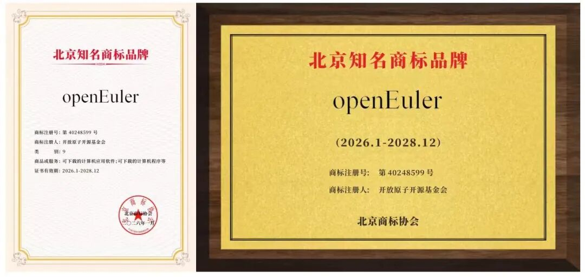
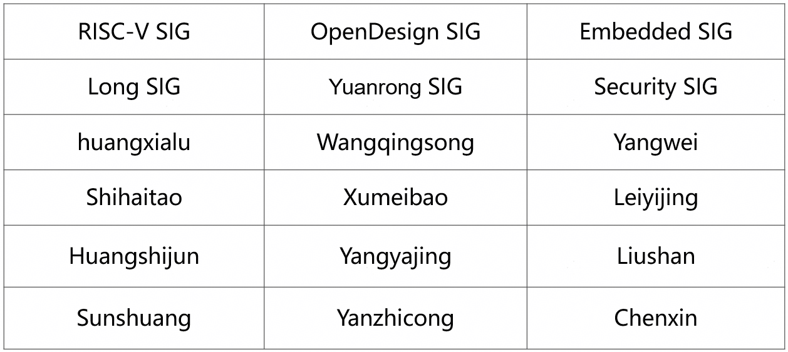

## 概述

2026年1-2月，OpenAtom openEuler（简称“openEuler”或“开源欧拉”）社区围绕生态建设、技术演进、品牌发展与安全治理等方面推进相关工作，社区各项运营与技术活动持续开展。

在技术方面，社区围绕操作系统核心能力建设和多架构支持推进相关工作。RISC-V 版本能力持续完善，服务器关键特性得到补充与优化。openYuanrong 分布式计算引擎发布 0.7.0 版本，支持基于 Serverless 架构构建 AI、大数据与微服务等分布式应用，并提供多语言函数编程接口及分布式调度能力。社区完成与 OpenSSF OSV 生态的端到端对接，支持安全公告数据标准化输出，提升漏洞数据的共享与复用能力。openEuler Embedded 完成对异构混合部署的支持，其小型化设备端云协同方案完成穿刺。此外，社区官网发布了openEuler Portal MCP Server，实现用户直接在AI对话提问，即可从官网获取实时准确的数据。

在生态与社区发展方面，社区规模继续扩大，开发者与成员单位持续参与社区协作。社区发布2025 年度报告，对过去一年的发展情况进行系统梳理和总结。openEuler品牌影响力持续提升，获评“北京知名商标品牌” 并入选《北京重点商标保护名录》。此外，社区联合成员单位发布首批实习岗位，为学生和开发者提供参与开源项目实践的机会。

（本月报阅读时长约10分钟）

## 社区规模

截至2026年2月28日，openEuler 社区用户累计超过631万，超过2.6万名开发者在社区持续贡献，累计产生 261K个PRs、136.4K条Issues、4594.4K条Comment。目前，加入openEuler社区的单位成员2138家。

社区贡献看板（截至2026/02/28）

## 社区事件

### ➣openEuler 2025社区年报发布

2025年是 openEuler 发展第二个五年的第一年。回望这一年的发展，在2100多家成员单位和24000多名开发者的共同努力下，已经成长为全球范围内体量和技术创新都处于领先行列的开源社区，基本实现 openEuler 社区在创立之初“立根铸魂”的目标和愿景。面向下一个五年，openEuler 社区将在技术上积极拥抱超节点、AI，产业上持续推动全球化，实现跨越式发展。

原文阅读：
[智跃无界，开源致远 | OpenAtom openEuler社区2025年度报告](https://mp.weixin.qq.com/s/YJAX0ESnEeg5GDba6Moqew)

### ➣openEuler 获评2025年度“北京知名商标品牌”

1月16日，首届北京商标品牌盛典在京举行，会上正式揭晓2025年度“北京知名商标品牌”评选结果，并发布第二批《北京重点商标保护名录》。开放原子开源基金会旗下开源欧拉（openEuler）凭借深厚的技术积淀、广泛的生态影响力及完善的知识产权保护体系，成功获评“北京知名商标品牌”并入选《北京重点商标保护名录》。

原文阅读：
[openEuler获评2025年度 “北京知名商标品牌”并入选《北京重点商标保护名录》](https://mp.weixin.qq.com/s/NcMRvJ_uH7nEQEhH5XGVaA)

### ➣openEuler社区首批实习岗位发布

开源开放是驱动技术创新和产业繁荣的核心力量，也是产业发展的关键支撑。目前 openEuler 社区联合各成员单位开放实习岗位，为社区成员提供贴近实际产业环境的实践机会。

原文阅读：
[实习招募 | openEuler社区首批实习岗位发布，速来投递！](https://mp.weixin.qq.com/s/uvt8iV2Nm39SJZ84fgDByA)

## 技术进展

### ➣openEuler 24.03 LTS SP3 正式发布 

RISC-V 版本中国科学院软件研究所联合中兴通讯、阿里巴巴达摩院、算能、进迭时空、超睿科技等产业伙伴，推动社区发布 openEuler 24.03 LTS SP3 RISC-V 版本， 这是首个支持 RVA23 标准的 Linux LTS 版本，并实现了面向 RISC-V Server Platform 规范能力的初步支持。

本次更新提供 RVA20/RVA23 双镜像，完成 SpacemiT K3 芯片支持，并适配 DevStation 开发者工作站。工具链方面完成 GCC 14.3.1、Binutils 2.42、LLVM 20 等全栈升级，用户态软件包适配覆盖 Ceph 等数十个组件。内核层面同步落地 RVCK 同源体系，统一 ACPI、AIA、IOMMU、RAS 等服务器关键特性，提升硬件兼容性与系统稳定性。 

当前版本作为 preview 发布，面向开发者征集测试反馈，后续将正式移入 LTS 发布目录并在生命周期内持续维护更新。

### ➣openYuanrong 分布式计算引擎 0.7.0 发布

openYuanrong 分布式计算引擎发布0.7.0，支持以一套 Serverless 架构支持AI、大数据、微服务等各类分布式应用。它提供多语言函数编程接口，以单机编程体验简化分布式应用开发；提供分布式动态调度和数据共享等能力，实现分布式应用的高性能运行和集群的高效资源利用。

原文阅读：
[把集群变“单机”（上）——openYuanrong核心技术理念解析](https://mp.weixin.qq.com/s/OmJGzpWQpaQi82U8kbHIYA)

### ➣openEuler × OpenSSF OSV 协作成果发布

openEuler 社区安全委员会宣布一项阶段性进展：在软件供应链安全方向，我们与 OpenSSF Open Source Vulnerabilities（简称“OSV”） 生态完成了端到端对接。作为较早完成 OSV 生态对接的 Linux 发行版之一，openEuler 在发行版对接 OSV 的探索中走在前沿，也让 openEuler 的安全公告能够以更标准、更易复用的方式进入主流开源安全工具链，为社区用户与生态伙伴提供更加一致、可落地的漏洞数据与检测能力。

原文阅读：
[openEuler × OpenSSF OSV 协作成果分享](https://mp.weixin.qq.com/s/g34AIMXBwuRf9qWCxI-pcw)

### ➣openEuler Embedded 小型化设备端云协同方案完成穿刺     

 openEuler Embedded联合启诺，基于海鸥派 PICO 的小型化嵌入式设备，成功打通基于火山引擎 RTC 的低成本宠物机器人技术穿刺，完成 IB-Robot 中间件在极简端侧硬件+云端大脑+端侧执行器联动的交互式具身能力验证。

### ➣openEuler Embedded 完成对异构混合部署的支持      

近期，openEuler Embedded 的混合关键性部署框架（MICA）完成对异构部署模式的支持，全面打通并激活南向平台丰富的异构算力。以海鸥派为例，该特性支持在ARM64 CPU侧运行openEuler Embedded系统，同时在RISCV MCU侧部署 LiteOS，成功实现异构 OS 间的全生命周期管理和高效跨核通信，为具身智能等场景提供了兼顾强算力、高实时、富生态的底座。

### ➣官网发布openEuler Portal MCP Server    

 openEuler 社区承载了海量的各类信息，当用户需要获取各类数据时往往需要在多个页面间跳转查找，同时 AI 工具也在潜移默化地改变开发者的使用习惯。为此，官网提供了 openEuler Portal MCP Server，用户直接在 AI 对话提问，即可从 openEuler 官网获取实时准确的数据。目前支持 SIG 信息、CVE 安全公告、软件包、下载、文档内容等关键场景查询检索并在迭代更新中。

相关链接：<https://www.openeuler.openatom.cn/zh/blog/openEuler-portal-mcp/index.html>

## 容器镜像更新

截至2月28日，社区公有容器镜像总量达316个。1–2 月期间，基于 openEuler 24.03-LTS-SP3 基础镜像已完成 33 个上层应用镜像的升级，2个应用镜像的新增。具体分类如下：

### ➣升级镜像（33个）：

### ➣新增镜像（2个）：

bisheng-jdk:21.0.5

claude-code:2.1.20

容器镜像可通过 Docker Hub 拉取使用，仓库地址：<https://hub.docker.com/u/openeuler>

## 软硬件兼容性测评

截至2026年2月28日，openEuler 软硬件兼容性测评总计2538个，2026年1-2月新增85个，其中北向（ISV）新增61个，南向（IHV）新增21个，OSV新增3个。

- 兼容性列表：
https://www.openeuler.org/zh/compatibility/OSV

- 技术测评列表:
https://www.openeuler.org/zh/approve/

## 安全公告

2026年1 -2月，社区共发布安全公告486个，修复漏洞392个（其中 Critical 5个，High 134个，其它253个）。

### ▐ 重点漏洞提醒

如下漏洞评估影响较大，请重点关注。

**CVE-2025-15467 （CVSS评分：9.8分）**

**问题摘要：** 解析带有恶意构造的 AEAD 参数的 CMS AuthEnvelopedData 消息时，可能会触发栈缓冲区溢出。

**影响摘要：** 栈缓冲区溢出可能导致程序崩溃，引发拒绝服务（DoS），甚至可能造成远程代码执行。

**影响范围：**

- openEuler-20.03-LTS-SP4

- openEuler-22.03-LTS-SP4

- openEuler-24.03-LTS

- openEuler-24.03-LTS-SP1

- openEuler-24.03-LTS-SP2

- openEuler-24.03-LTS-SP3

公告链接：<https://www.openeuler.openatom.cn/zh/security/security-bulletins/detail/?id=openEuler-SA-2026-1411>

**CVE-2026-0884 （CVSS评分：9.8分）**

JavaScript 引擎组件中存在释放后重用漏洞。该漏洞影响版本低于 147 的 Firefox、版本低于 140.7 的 Firefox ESR、版本低于 147 的 Thunderbird 以及版本低于 140.7 的 Thunderbird。

**影响范围：**

- openEuler-20.03-LTS-SP4

- openEuler-22.03-LTS-SP3

- openEuler-22.03-LTS-SP4

- openEuler-24.03-LTS

- openEuler-24.03-LTS-SP1

- openEuler-24.03-LTS-SP2

- openEuler-24.03-LTS-SP3

公告链接：<https://www.openeuler.openatom.cn/zh/security/security-bulletins/detail/?id=openEuler-SA-2026-1285>

### ▐ 漏洞防护

openEuler社区针对在维版本例行修复漏洞，发布安全补丁。建议用户关注openEuler官网安全公告，及时安装漏洞补丁进行防护。

openEuler 安全公告：<https://www.openeuler.org/zh/security/security-bulletins/>

## 致谢

openEuler社区的发展离不开每一位参与者的共同努力。每一次代码提交、每一次技术讨论、每一次经验分享，都在不断推动社区向前发展，也共同汇聚成社区持续成长的动力。由于社区实践与成果持续涌现，月报在整理过程中难免有所遗漏。如有尚未收录的重要进展或贡献，欢迎与我们联系补充，让更多努力被记录与传递。在此，向为本期月报提供资料支持的各 SIG 组以及广大开发者朋友们致以诚挚的感谢与敬意：

*以上排名顺序不分先后

若您希望在月报中补充相关工作内容，或对月报内容提出意见和建议，欢迎联系：
contact@openeuler.io

