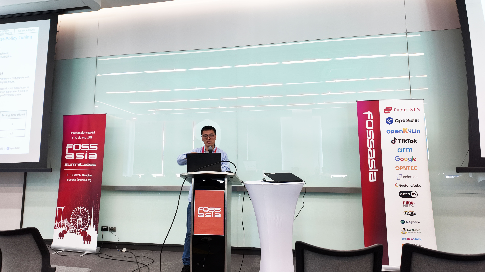
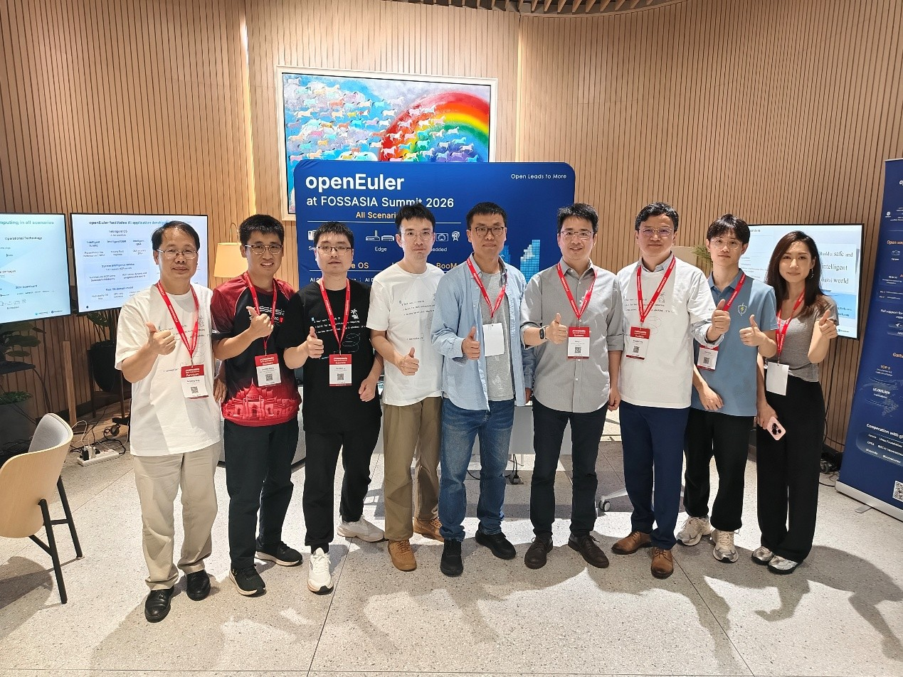

2026年3月8日至10日，国际开源盛会 FOSSASIA Summit 2026 在泰国曼谷隆重举行。作为亚洲最具影响力的开源技术大会之一，FOSSASIA Summit 汇聚了来自全球的开源开发者、技术专家及产业伙伴，共同探讨开源技术的发展趋势与创新实践。

OpenAtom openEuler（简称“openEuler”或“开源欧拉”）作为白金赞助商，携手中科院软件所与东方通共同参会，与来自全球的 IT 企业、软件开发者展开深入交流，分享 openEuler 在 AI 时代操作系统创新方面的最新成果。

## 精彩回顾

### 01 Keynote演讲：openEuler推动AI时代操作系统创新

3月9日，openEuler Kernel SIG Maintainer 郭寒军发表题为 “openEuler-based Open Source Stack: Powering the AI Era Forward”的主题演讲。郭寒军表示，随着算力形态的不断演进，操作系统正面临新的技术挑战与机遇。openEuler 紧跟 AI 时代的发展趋势，发布了面向超节点架构的操作系统版本，持续释放极致的通算与智算能力。

在演讲中，他重点介绍了 openEuler 在 AI for OS、OS for AI 以及 AI 全栈能力方面的创新实践，通过系统层能力与 AI 技术的深度融合，加速企业 AI 应用落地，为开发者构建更加高效、便捷的 AI 开发环境。

此外，郭寒军还介绍了全球首个支持超节点（SuperPoD）的操作系统版本 openEuler 24.03 LTS SP3。该版本通过 UnifiedBus（UB）技术突破单机资源边界，实现异构资源的高效融合，使应用性能提升 30%–50%。这一创新成果获得了现场开发者的广泛关注与积极反馈。

### 02 AI Session演讲：探索AI全栈与超节点操作系统

3月10日，在 AI 专题论坛上，郭寒军再次带来主题为 “openEuler AI Exploration: AI Technical Innovation & SuperPoD OS”的演讲。他介绍，随着 AI 技术的快速发展，openEuler 推出了开源 AI 全栈解决方案 Intelligence BooM，为开发者提供开箱即用的 AI 开发体验，帮助企业更加高效地构建 AI 应用。

同时，openEuler 持续提升异构算力融合能力，通过算力切分与混部调度，大幅提升 XPU/NPU 的资源利用率。超节点操作系统还实现了 CPU 与 NPU 的协同计算以及内存融合能力，进一步提升 AI 计算效率。

### 03 openEuler展区：展示AI与开源生态创新成果

大会期间，openEuler 展区成为现场备受关注的技术展示区域之一。展区重点展示了 openEuler 在 AI 技术、操作系统能力、开发工具以及开源生态建设方面的最新进展，并联合中科院软件所及东方通生态伙伴展示了多项基于 openEuler 的创新合作案例，吸引了众多开发者与企业代表驻足交流。

此外，展区还特别设置了开发者工作站 DevStation体验区。通过 AI 智能开发场景展示，吸引了来自全球的开发者现场体验与互动交流。现场工作人员还为参与互动的开发者准备了精美礼品，进一步拉近了与开发者之间的距离，营造出活跃的开源交流氛围。

## 总结展望

此次亮相 FOSSASIA Summit 2026，openEuler 携手生态伙伴全面展示了在 AI 时代操作系统创新方面的最新成果，也进一步促进了与全球开源社区之间的技术交流与合作。

未来，openEuler 将持续坚持开放协作与技术创新，与全球开发者和产业伙伴共同构建繁荣的开源生态，为数字基础设施发展提供更加高效、可靠的开源操作系统解决方案。