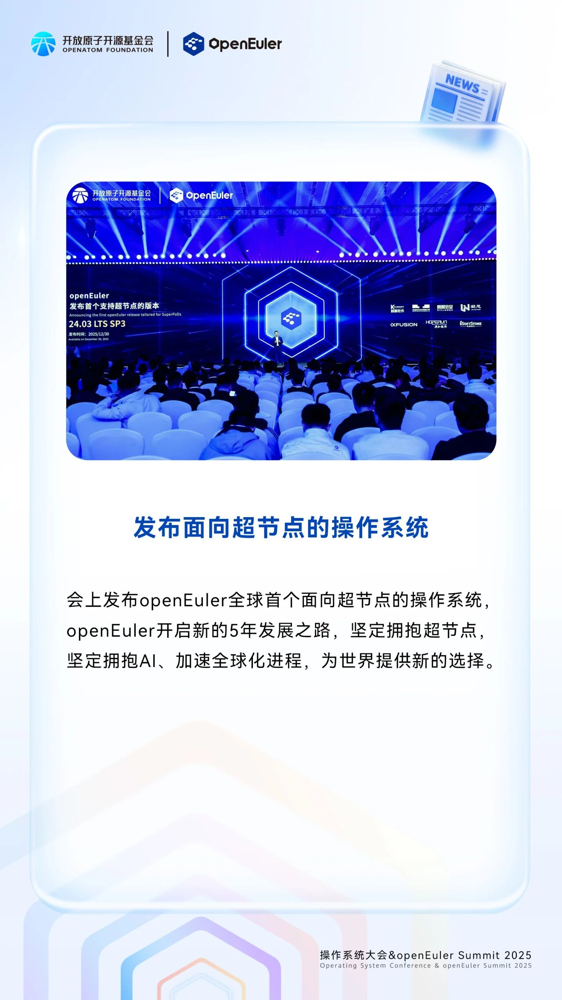
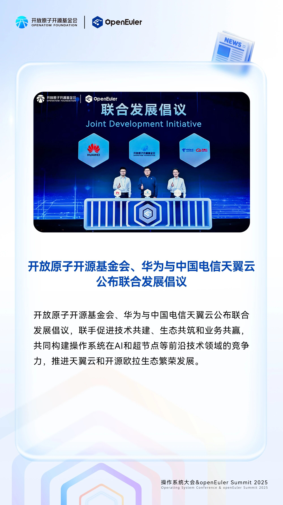
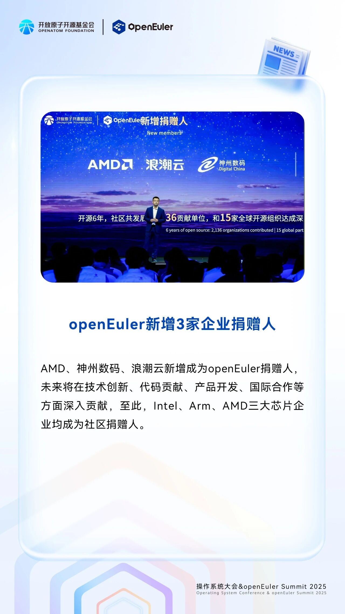
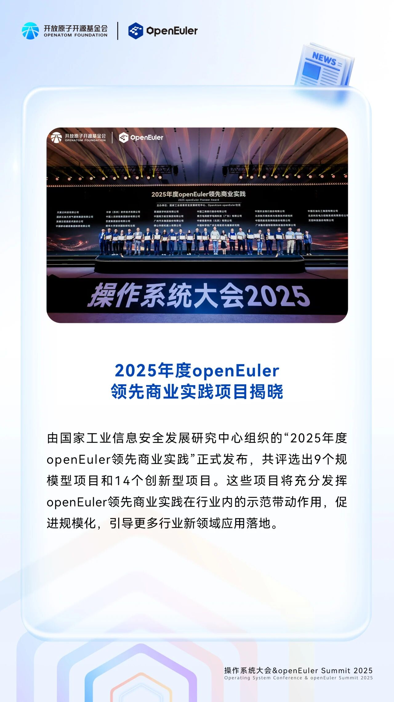
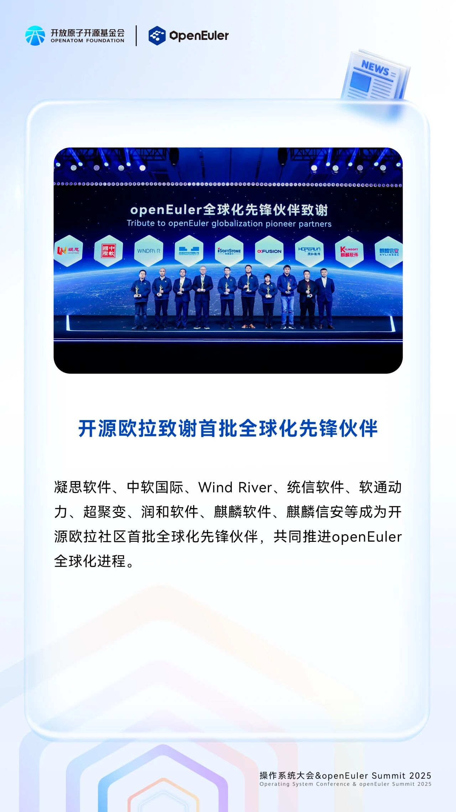

以“智跃无界，开源致远”为主题的操作系统大会2025（以下简称“大会”）在北京中关村国际创新中心成功举办。本次大会上，开放原子开源欧拉（OpenAtom openEuler，简称“开源欧拉”或“openEuler”）发布面向超节点的操作系统；开放原子开源基金会、华为与中国电信天翼云公布联合发展倡议；AMD、神州数码、浪潮云、3家企业成为openEuler新增捐赠人；23个2025年度openEuler领先商业实践项目揭晓；开源欧拉致谢首批全球化先锋伙伴。

