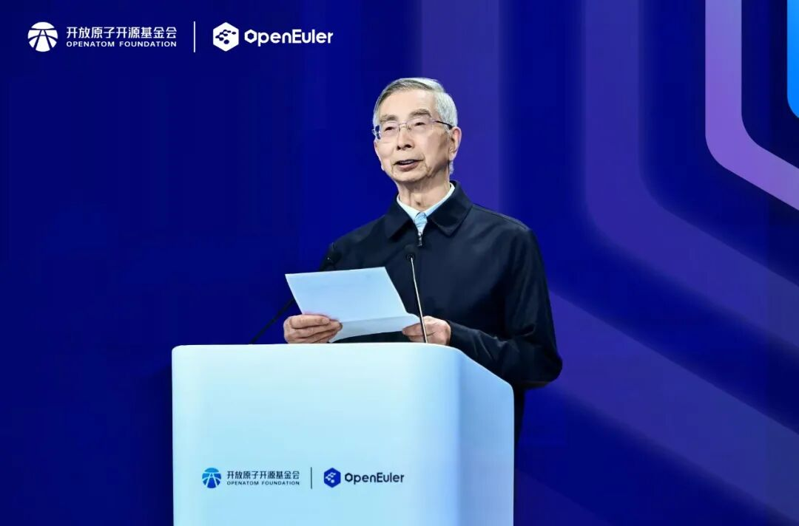
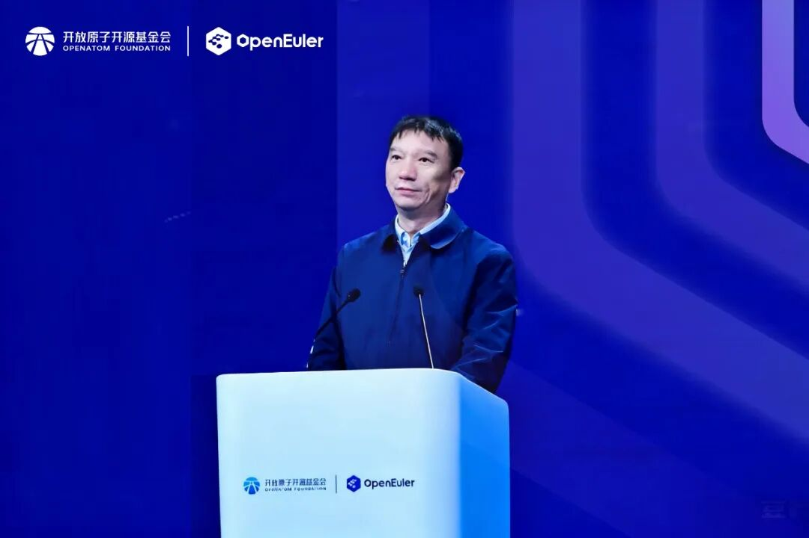
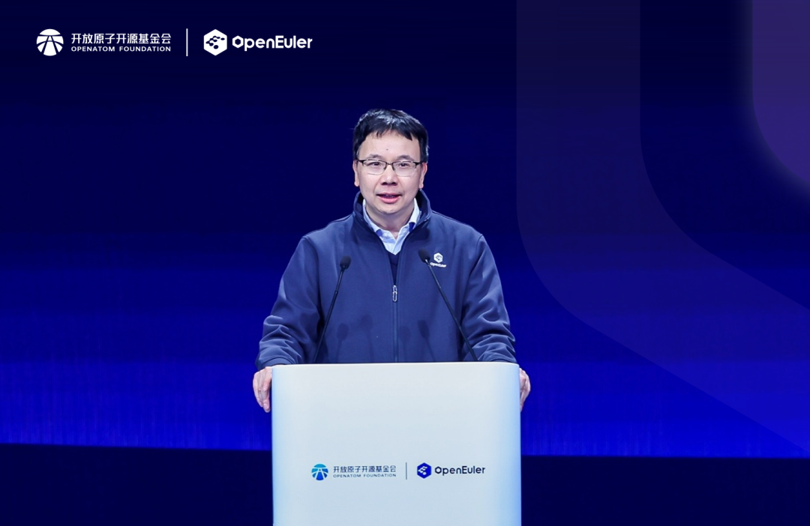
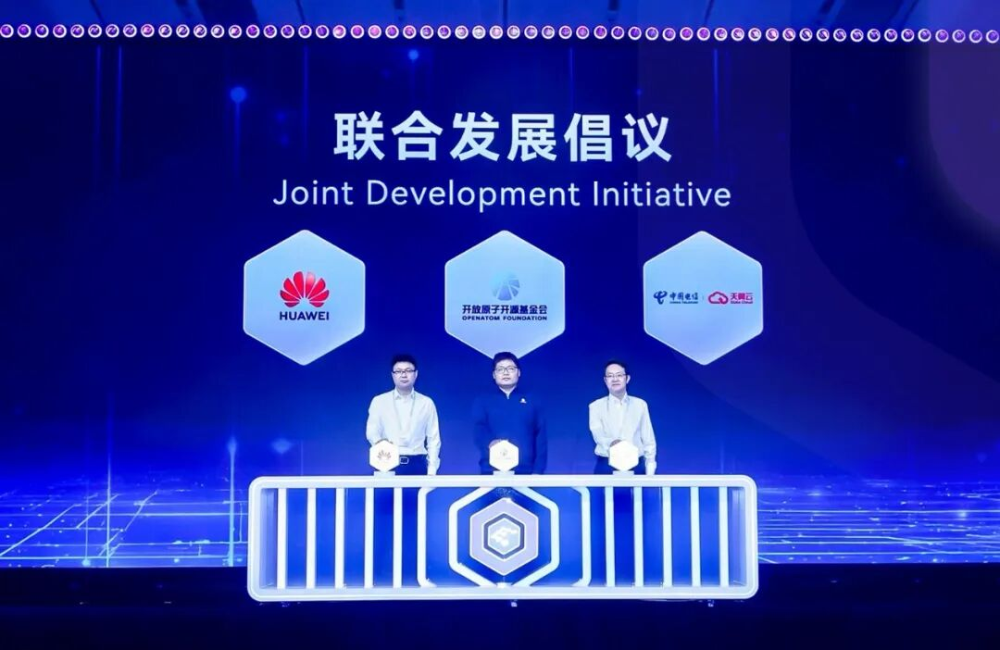
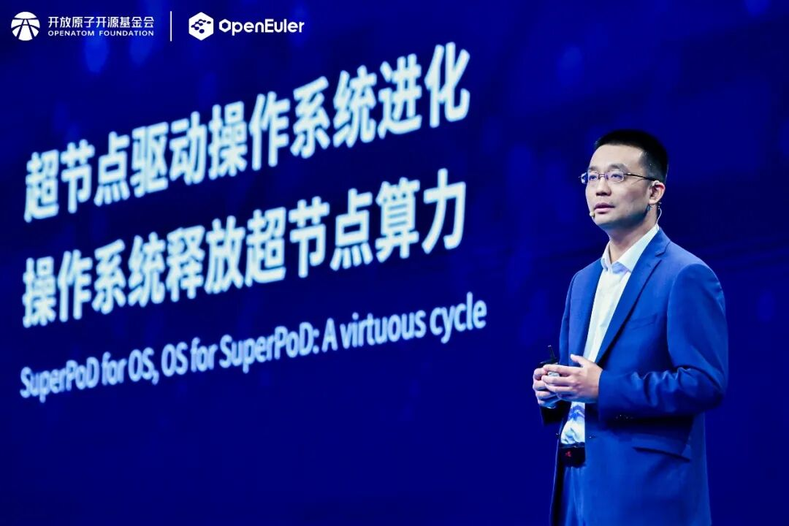
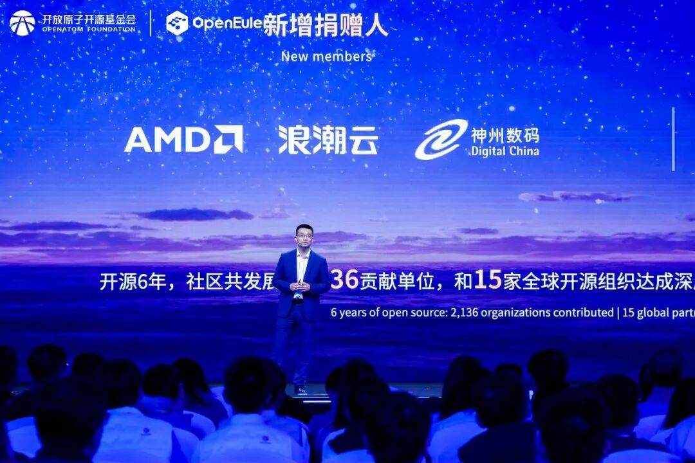
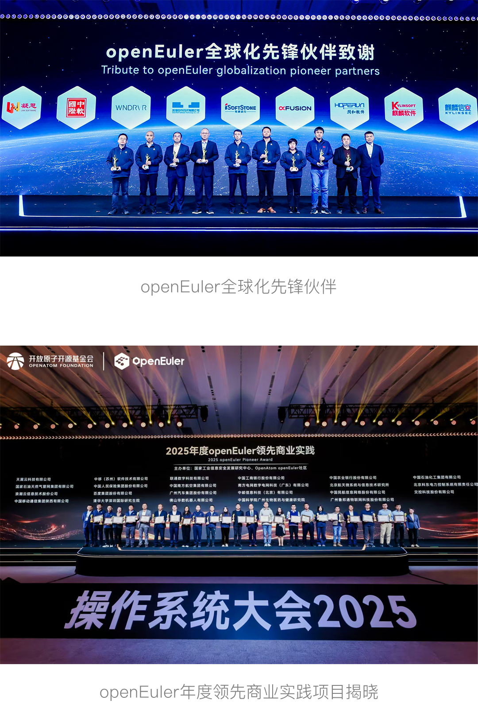

以“智跃无界，开源致远”为主题的操作系统大会2025（以下简称“大会”）在北京中关村国际创新中心成功举办。大会由开放原子开源欧拉（OpenAtom openEuler，简称“开源欧拉”或“openEuler”）社区，协同数十家产业伙伴共同举办，旨在汇聚全球产业界力量，打造极具创新力的操作系统，加速全球基础软件开源生态发展。

开源六年以来，在开放原子开源基金会的运营孵化下，开源欧拉社区蓬勃发展，成员单位超2100家，全球贡献者突破 2.3万人，用户超过550万。openEuler系操作系统累计装机量预计2025年底将超过1600万套，已经成为中国行业数智化首选操作系统，份额持续保持领先，在互联网、通信、政务、金融、公共事业和能源等行业已实现规模化应用。

面向未来，开源欧拉社区正式开启新的5年发展之路，将于2025年底正式上线面向超节点的操作系统，引领AI时代，加速全球化。

中国工程院院士倪光南在致辞中强调，基础软件是战略性产业，必须加强自主创新；是生态型产业，必须共创共建共享；是长周期产业，必须长期持续投入。过去5年，在产业各界的共同努力下，开源欧拉已经成为全球最活跃的开源操作系统技术社区之一，持续引领操作系统产业生态繁荣壮大。未来，超节点已经成为算力基础设施建设和部署的主流形态。智能时代的操作系统将衔接智能时代的硬件和应用，成为释放算力潜能的核心基石，助力千行万业智能化。

中国工程院院士 倪光南发表致辞

开放原子开源基金会理事长程晓明在致辞中强调，开源的核心是协作，生态的未来在共生。开源欧拉的每一点进步，离不开硬件伙伴的深度适配，离不开软件应用厂商的场景验证，更离不开全球开发者的智慧贡献。相信在各方携手努力下，开源欧拉将以技术创新打破边界，让数字智能赋能万物， 以协作共生凝聚力量，推动开源生态行稳致远。

开放原子开源基金会理事长 程晓明发表致辞

华为公司董事、ICT BG CEO杨超斌在致辞中表示，AI技术正以前所未有的速度改变各行各业，传统服务器集群无法有效满足算力不断增长的诉求。华为已经开放灵衢互联协议2.0，支持产业界伙伴打造基于灵衢的超节点，还将向开源欧拉社区贡献支持超节点的操作系统插件代码，提供“内存统一编址”、“异构算力低时延通信”和“全局资源池化”等关键能力。华为将与社区协同，推动与Linux Foundation AI&Data、PyTorch等AI领域全球性开源组织深度合作，深化AI运行时、向量数据库、云化部署等技术专题落地。同时，华为将协同社区数十家OSV、ISV伙伴，面向海外客户提供openEuler整体解决方案，积极推动开源欧拉全球化进程。

华为公司董事、ICT BG CEO 杨超斌发表致辞

## 发布面向超节点的操作系统，引领AI时代

会上，开放原子开源基金会、华为与中国电信天翼云公布联合发展倡议，联手促进技术共建、生态共筑和业务共赢，共同构建操作系统在AI和超节点等前沿技术领域的竞争力，推进天翼云和开源欧拉生态繁荣发展。

大会现场公布联合发展倡议

开放原子开源欧拉委员会主席熊伟发布openEuler全球首个面向超节点的操作系统（openEuler 24.03 LTS SP3），并在主题演讲中提到，openEuler开启新的5年发展之路，坚定拥抱超节点，坚定拥抱AI，加速全球化进程，为世界提供新的选择。

开放原子开源欧拉委员会主席 熊伟发表主题演讲

当前，算力基础设施向 “超节点” 形态演进已成为业界普遍共识。面向超节点的操作系统，应该具备三个关键特征，包括：全局资源抽象，内存统一编址，设备池化管理；异构资源融合，大带宽低时延通信，实现平等互联；全局资源视图，兼容性接口，原生接口等，以此充分释放超节点算力潜能，加速基于超节点的应用创新。

## 持续增强AI能力，加速行业数智化

面向数据中心场景，开源欧拉社区提供Intelligence BooM全栈开源AI解决方案，支持50+模型微调，通过异构协同推理效率提升10%～30%，具备面向AgenticAI智能体生态快速适配能力，该方案已经在宝德、华鲲振宇等伙伴商用。

面向新型工业自动化领域，openEuler持续演化嵌入式能力，孵化了MICA混合关键性部署、UniProton实时内核、嵌入式虚拟化等核心技术，实现微秒级响应时间。该方案已经在中国南方电网、菲尼克斯等多家国内外知名企业商业落地，有力地推动了OT领域IT化转型。

## 共建产业生态，加速全球化

今年， AMD、神州数码、浪潮云新增成为开源欧拉社区捐赠人。至此，Intel、Arm、 AMD三大芯片企业均成为社区捐赠人。

大会现场宣布社区新增捐赠人

凝思软件、中软国际、Wind River、统信软件、软通动力、超聚变、润和软件、麒麟软件、麒麟信安等成为开源欧拉社区首批全球化先锋伙伴，大家将携手推进openEuler全球化进程。

在全球开源组织协作层面，开源欧拉社区近期与Zephyr嵌入式技术基金会、Linux Foundation AI&Data基金会达成深度技术合作。目前，开源欧拉社区累计与15家全球开源组织在AI、云、大数据、HPC、嵌入式等领域建立紧密合作关系。

开源欧拉的成长得益于每一位伙伴和开发者的信任。大会现场揭晓了“2025年度openEuler领先商业实践”，共计23个openEuler年度领先商业实践项目，包括9个规模型项目与14个创新型项目。

