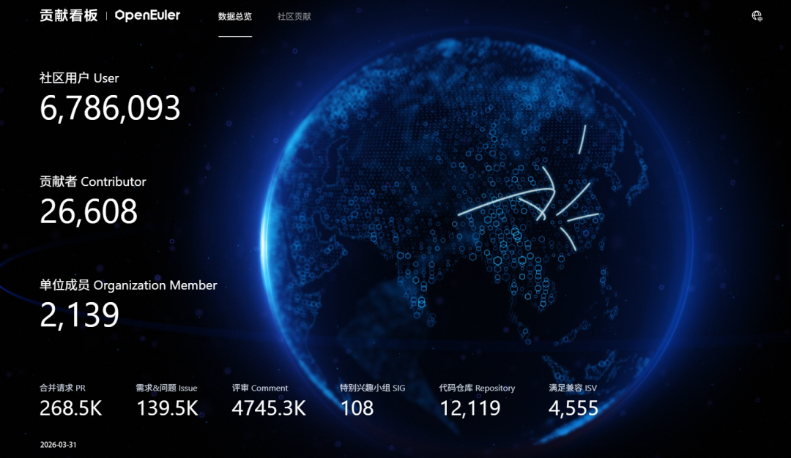
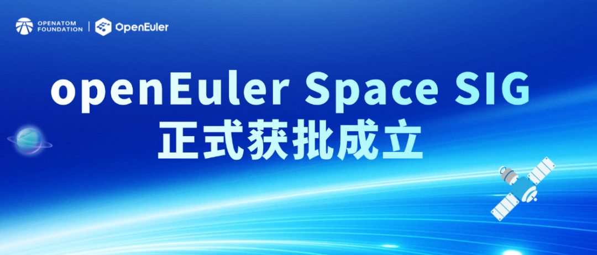
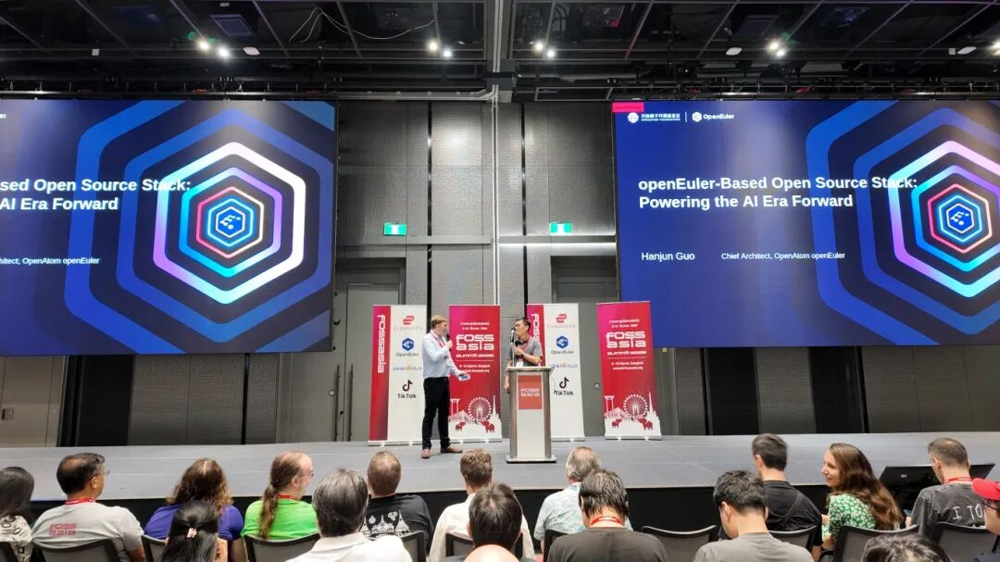
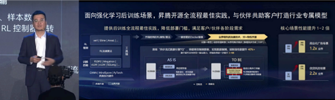
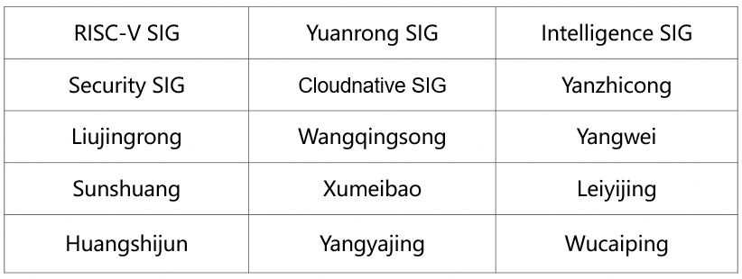

## 概述

2026年3月，OpenAtom openEuler（简称 “openEuler” 或 “开源欧拉”）社区在稳步发展的基础上，持续推进技术演进与生态建设协同发力。社区规模与活跃度保持增长，截至3月底，用户、开发者及单位成员数量进一步提升，社区贡献持续积累。在技术方面，围绕AI时代操作系统的发展需求，社区在RISC-V长期维护版本、智能运维Agent能力、日志分析引擎及云原生沙箱引擎等方向取得阶段性进展，持续夯实基础软件能力底座。在社区运营与生态拓展方面，通过成立Space SIG拓展空间智能应用场景，参与FOSSASIA Summit 2026深化国际开源交流，并开展了社区满意度调研，持续优化用户体验。另外，openEuler Developer Day 2026已正式官宣将于4 月 25 日在长沙举办，进一步凝聚开发者共识。整体来看，openEuler社区正围绕“技术创新+生态共建”双轮驱动，持续夯实开源操作系统生态基础，推动社区向高质量发展迈进。

（本月报阅读时长约10分钟）

## 社区规模

截至2026年3月31日，openEuler 社区用户累计超过678万。超过2.6万名开发者在社区持续贡献。社区累计产生268.5K个PRs、139.4K条Issues、4745.3K条Comment。目前，加入openEuler社区的单位成员2139家。

社区贡献看板（截至2026/03/31）

## 社区事件

### ➣openEuler Space SIG正式获批成立：为空间智能构建统一开源基础设施

3月4日，openEuler社区迎来重要里程碑：由北京航天微系统与信息技术研究所牵头，联合成都菁蓉联创科技有限公司、北京邮电大学、华郅（北京）技术有限公司共同发起的 openEuler Space SIG（特别兴趣小组）正式获批成立。该 SIG 是 openEuler 社区首个面向卫星星座、深空探测、无人机及电动垂直起降飞行器（eVTOL）等空间智能场景的开源研究组织，旨在构建一个开放、统一、智能的空间计算生态系统，为下一代空间应用打造坚实的开源软件底座。

此次 Space SIG 的成立，经过了社区技术委员会专家的严格技术评审和答辩，并获得全票通过，充分体现了社区对该方向战略重要性的高度认可。

原文阅读：
[openEuler Space SIG正式获批成立：为空间智能构建统一开源基础设施](https://mp.weixin.qq.com/s/K1zh5eDUD1rYSBBR-Zb36g)

### ➣openEuler携生态伙伴亮相 FOSSASIA Summit 2026

2026年3月8日至10日，国际开源盛会 FOSSASIA Summit 2026 在泰国曼谷隆重举行。作为亚洲最具影响力的开源技术大会之一，FOSSASIA Summit 汇聚了来自全球的开源开发者、技术专家及产业伙伴，共同探讨开源技术的发展趋势与创新实践。

openEuler 作为白金赞助商，携手中科院软件所与东方通共同参会，与来自全球的 IT 企业、软件开发者展开深入交流，分享 openEuler 在 AI 时代操作系统创新方面的最新成果。

原文阅读：
[共探AI与开源未来：openEuler携生态伙伴亮相 FOSSASIA Summit 2026](https://mp.weixin.qq.com/s/KIHgxgGokxm4NGCnm_OoXQ)

### ➣openEuler亮相 KCD Beijing + vLLM 2026 活动

在云原生技术与 AI 基础设施深度融合的当下，大模型推理的效率优化、硬件适配与分布式调度，成为行业落地的核心课题。在3月21日的 KCD Beijing + vLLM 2026 活动中，openEuler在开发者展区内聚焦AI最新核心能力交流，开发者对openEuler提供更强的DevStation智能开发桌面、社区开发助手Agent等交流反响热烈。

### ➣openEuler Developer Day 2026 定档 4月25日·长沙

在AI、算力与多样性架构全面加速的时代，操作系统正在从底层支撑跃升为技术创新的核心引擎与生态基石属于openEuler开发者的年度大事件，如约而至——openEuler Developer Day 2026（ODD 2026）定档 4月25日·长沙。

面向AI时代的操作系统带来哪些创新？openEuler未来LTS及创新版本的技术需求、特性规划与版本节奏将会形成什么技术共识？openEuler Developer Day 2026正式开启全面征集，助力大会搭建高质量的技术交流平台，碰撞思维火花。

原文阅读：
[我参与我做主|openEuler Developer Day 2026 定档4月25日·长沙，Call for开启，等你登场！](https://mp.weixin.qq.com/s/G0qx4WhdYBPY6SXLd6X4Hg)

### ➣开展 openEuler 社区满意度调查

3月20日，为持续提升开发者/用户的使用体验，推出了社区满意度调查推文，邀请开发者/用户参与本次满意度调查，并从中选取具有建设性的意见或建议给予奖品感谢。

原文阅读：
[有奖调研 | 您的声音很重要！openEuler社区满意度调查诚邀您参与](https://mp.weixin.qq.com/s/5C5Yohaw4Zo1yBdzSa8Wlw)

## 技术进展

### ➣openEuler 24.03 LTS SP3 RISC-V 版本进入长期维护阶段

经历充分的社区验证与稳定性加固后，openEuler 24.03 LTS SP3 RISC-V 版本已正式移入 LTS 发布目录，进入长期维护阶段。作为首个支持 RVA23 标准的长周期维护版本，该版本实现了面向 RISC-V Server Platform 规范的初步支持，并将在生命周期内持续通过 update 跟随上游演进。

内核与硬件生态方面，基于 RVCK 持续完善服务器能力，并完成 SpacemiT K3 平台支持，推动 RVA23 软硬件体系进一步落地。

后续将在 LTS 生命周期内持续推进 RVA23 架构能力、内核基础设施与开发生态体系建设，进一步提升 RISC-V 服务器软件栈的稳定性与可用性。

### ➣轻量级知识库 MCP 上线：为“已知问题分析 Agent”打造本地化智能记忆

在企业级运维中，一个令人无奈的现实是：大量故障并非首次发生。无论是配置错误、版本兼容问题，还是硬件异常，许多“新”告警背后，往往藏着早已被解决过的“老问题”。然而，这些宝贵的经验通常散落在工单系统、内部 Wiki、PDF 手册或工程师的个人笔记中，难以在关键时刻被快速召回。

为此，openEuler团队将于 2026 年 3 月正式推出已知问题分析 Agent —— 一款专注于故障复用与加速诊断的智能体。该 Agent 能自动解析用户输入的故障现象或整篇日志，识别潜在根因，并主动查询历史已知问题库，匹配相似案例，从而生成包含“典型表现、解决方案、验证步骤”的结构化分析报告，大幅缩短平均修复时间。

原文链接：
[轻量级知识库 MCP 上线：为“已知问题分析 Agent”打造本地化智能记忆](https://mp.weixin.qq.com/s/EHobQm6w_PXiDuedUgSO-g)

### ➣日志异常检测MCP正式上线：为“已知问题分析Agent”构建高性能日志分析核心引擎

在企业级运维场景中，系统日志普遍存在类型繁多、体量庞大、维度复杂的问题，单文件容量轻松突破GB级。 传统单一算法处理效率低下，即便依托大模型，也常受限于上下文窗口不足、注意力分散等瓶颈，导致异常识别准确率低、分析成本居高不下。

为此，openEuler团队计划于2026年3月正式发布已知问题分析Agent——聚焦故障复用、智能诊断、问题快速定位，助力企业运维效率升级。 而支撑其核心能力的关键组件——日志异常检测MCP，已于3月13日正式上线。

原文链接：
[日志异常检测MCP正式上线：为“已知问题分析Agent”构建高性能日志分析核心引擎](https://mp.weixin.qq.com/s/3zXFGHHuLSurJ7DYdT5t8w)

### ➣CloudNative SIG 组推出了 Conch（海螺）

随着 OpenClaw 等AI Agent项目快速发展，直接在宿主机或者在虚拟机上裸机部署智能体的问题日益凸显。开发者赋予了 AI Agent 深度调用系统资源（如文件系统操作、外设驱动管理）的特权，使其能够像真实员工一样处理复杂业务。但也带来如下一些问题：

- 破坏主机环境：在遇到提示词注入、模型幻觉、复杂正则表达式、符号连接处理不当的情况下，极易破坏宿主环境，导致环境不可逆损坏。

- 故障无法修复：Agent 在执行任务时极易造成环境“污染”（如配置篡改或库文件损坏），缺乏一种能在环境崩溃时瞬间回滚至上一个可用状态的机制。

- 部署效率低下：采用裸机部署或者虚拟机部署效率都需要分钟级，即使容器化部署也面临并发启动性能非线性劣化问题，需要一种支持大规模Agent毫秒级拉起任务沙箱的机制同时保障隔离和部署效率。

针对上述痛点，openEuler社区CloudNative SIG 组推出了 Conch（海螺） —— 一个集成了强隔离、可扩展、毫秒级启动的下一代沙箱引擎，为 AI 智能体提供可靠的执行基座。给调皮的“小龙虾”装上“海螺壳”，能够放心让它干活。

原文链接：
[openEuler Conch沙箱引擎：如何用毫秒级速度给“闯祸”的小龙虾套上“海螺”壳](https://mp.weixin.qq.com/s/cpSrWvow71tzlNr6rziOCg)

### ➣Witty Assistant重磅来袭，“已知问题分析Agent”一键搞定运维难题

 OpenEuler 24.03-LTS-SP3版本正式推出Witty Assistant，更重磅打造“已知问题分析Agent”，以AI赋能运维，让“老问题”不再重复消耗精力，让故障诊断效率实现质的飞跃，解锁openEuler智能运维新体验 。

作为openEuler-24.03-LTS-SP3版本Witty Assistant的核心组件，“已知问题分析Agent”是一款专注于故障复用与加速诊断的智能体，依托轻量级知识库MCP服务和日志异常检测MCP引擎，打破传统运维中“经验分散、排查低效”的痛点，为运维人员提供全流程自动化的问题分析能力。

简单来说，它就像一个“运维经验大师”——能自动记住所有已解决的系统问题，当你遇到新故障时，它会快速匹配历史案例，一键生成完整的分析报告和解决方案，无需手动翻查、无需重复试错，让故障修复时间大幅缩短。

原文链接：
[Witty Assistant重磅来袭，“已知问题分析Agent”一键搞定运维难题](https://mp.weixin.qq.com/s/RpwGVDXbD1uEbzIKruw2EQ)

### ➣突破样本传输瓶颈：openYuanrong 作为TransferQueue KV 后端加速 veRL 强化学习

3 月 20 日，在 2026 年华为伙伴大会上，华为昇腾计算总裁张迪煊在介绍强化学习时，重点提到异步流式数据引擎 TransferQueue，并介绍了其基于 openYuanrong 在超节点上的实现：数据传输效率进一步提升 3～4 倍，RL 端到端性能提升 40%。这也说明，openYuanrong 正在成为强化学习高效样本流转的重要底座。

目前，openYuanrong 已在openEuler社区开源。本文将详细展开 openYuanrong 如何作为 TransferQueue 的 KV 后端，依托面向昇腾平台的分布式异构对象多级缓存能力，加速 veRL 的样本传输链路。

原文链接：
[突破样本传输瓶颈：openYuanrong 作为TransferQueue KV 后端加速 veRL 强化学习](https://mp.weixin.qq.com/s/ZUdKwm2JbXOOKaAUswjb5A)

## 容器镜像更新

统计周期：2026年3月1日-3月31日 

数据来源：<https://gitcode.com/openeuler/openeuler-docker-images>

2026年3月期间，基于openEuler 24.03-LTS-SP3基础镜像已完成35个上层应用镜像的升级。具体分类如下：

容器镜像可通过 Docker Hub 拉取使用，仓库地址：<hub.docker.com/u/openeuler>

## 软硬件兼容性测评

截至2026年3月31日，通过openEuler 软硬件兼容性测评的产品达2603款，2026年3月新增62款，其中北向（ISV）新增49款，南向（IHV）新增11款，OSV新增2款。

- 兼容性列表：
<https://www.openeuler.org/zh/compatibility/OSV>

- 技术测评列表:
<https://www.openeuler.org/zh/approve/>

## 安全公告

2026年3月，社区共发布安全公告274个，修复漏洞65个（其中 Critical 7个，High 17个，其它41个）。

### ▐ 重点漏洞提醒

如下漏洞评估影响较大，请重点关注。

**CVE-2026-4698 （CVSS评分：9.8分）**

简述：JavaScript引擎中的JIT编译错误：JIT组件。此漏洞影响Firefox < 149、Firefox ESR < 115.34、Firefox ESR < 140.9、Thunderbird < 149、Thunderbird < 140.9版本。

**影响范围：**

- openEuler-20.03-LTS-SP4

- openEuler-22.03-LTS-SP4

- openEuler-24.03-LTS

- openEuler-24.03-LTS-SP1

- openEuler-24.03-LTS-SP2

- openEuler-24.03-LTS-SP3

链接：<https://www.openeuler.org/zh/security/cve/detail/?cveId=CVE-2026-4698&packageName=thunderbird>

**CVE-2026-2049 （CVSS评分：9.8分）**

简述：GEGL 提供了基础设施，可以在大于内存的缓冲区上实现基于需求的缓存式无损图像编辑。通过 babl，它支持输入输出时使用多种颜色模型和像素存储格式。

**影响范围：**

- openEuler-20.03-LTS-SP4

- openEuler-22.03-LTS-SP3

- openEuler-24.03-LTS

- openEuler-24.03-LTS-SP1

- openEuler-24.03-LTS-SP2

- openEuler-24.03-LTS-SP3

链接：<https://www.openeuler.org/zh/security/cve/detail/?cveId=CVE-2026-2049&packageName=gegl04>

### ▐ 漏洞防护

openEuler社区针对在维版本例行修复漏洞，发布安全补丁。建议用户关注openEuler官网安全公告，及时安装漏洞补丁进行防护。

openEuler 安全公告：<https://www.openeuler.org/zh/security/security-bulletins/>

## 致谢

openEuler社区的发展离不开每一位参与者的共同努力。每一次代码提交、每一次技术讨论、每一次经验分享，都在不断推动社区向前发展，也共同汇聚成社区持续成长的动力。由于社区实践与成果持续涌现，月报在整理过程中难免有所遗漏。如有尚未收录的重要进展或贡献，欢迎与我们联系补充，让更多努力被记录与传递。在此，向为本期月报提供资料支持的各 SIG 组以及广大开发者朋友们致以诚挚的感谢与敬意：

*以上排名顺序不分先后

若您希望在月报中补充相关工作内容，或对月报内容提出意见和建议，欢迎联系：
contact@openeuler.io

