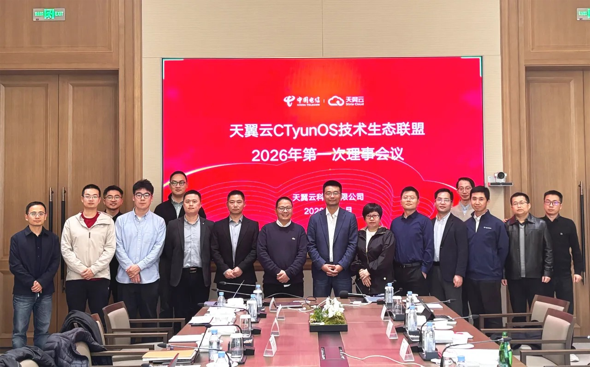

近日，CTyunOS技术生态联盟召开2026年首次理事会，同期天翼云CTyunOS团队奔赴OpenAtom openEuler（简称 “openEuler” 或 “开源欧拉”）社区开展AI专题技术研讨。双线联动、同频发力，一边定方向明目标，一边深技术研细节，CTyunOS技术生态联盟正式开启2026年「AI+安全」核心布局！

本次理事会由天翼云科技有限公司组织、openEuler社区协办，12家联盟理事会成员单位代表齐聚一堂。当前，CTyunOS已在中国电信集团现网核心业务实现规模化覆盖，具备了强劲的规模化验证和业务承载能力，这为联盟全年聚焦「AI+安全」奠定了坚实基础。

会议由中国电信天翼云首席专家蒋彪、开放原子开源欧拉社区委员会主席熊伟共同开场，复盘了2026年第一季度生态发展成果，与会理事单位还围绕技术标准共建、重点行业拓展、联合市场活动等关键议题达成多项共识，为联盟全年的协同发展与技术突破定下总基调。而同期openEuler社区的AI专题研讨会，更聚焦底层技术能力升级，与理事会形成战略与技术相互支撑的协同机制，让「AI+安全」的布局既有顶层设计，又有技术落地。

自2025年12月联盟成立以来，CTyunOS生态建设一路高歌猛进，短短数月便交出亮眼成绩单：

- **生态规模行业领先：** CTyunOS生态适配规模已突破百万，并已实现对中国电信集团内部现网核心业务的全域覆盖。

- **行业拓展多点开花：** 携手联盟伙伴在金融、政务、企业级安全等重点行业，打磨成熟联合产品解决方案，市场渠道共拓成效显著。

- **产学研融合提速：** 与多所高校牵手，在云计算、量子计算等前沿领域开展深度合作，为技术探索储备人才、筑牢根基。

站在超百万生态适配规模的新起点，CTyunOS技术生态联盟也明确了2026年的核心战略——将CTyunOS打造为智能时代的「AI+安全」融合型操作系统底座！围绕这一目标，联盟将集中发力四大方向：

- 推进共性技术标准建设，筑牢行业发展基础；

- 探索前沿技术场景，同步做好人才培育；

- 推动重点行业标杆案例规模化部署，以实践验价值；

- 共建区域产业高地，凝聚产业协同力量。

生态向前走，技术是核心。天翼云CTyunOS也同步锚定三大技术攻坚领域，持续打磨硬核能力：聚焦AI推理底座，为大模型稳定运行、高效调用提供支撑；攻坚Agent基础设施，提升智能体开发、部署与管控效率；发力操作系统智能化，增强系统对复杂AI业务场景的适配能力。通过这一系列动作，CTyunOS将加速向智能化、平台化、一体化的AIOS演进，为联盟「AI+安全」生态建设和操作系统能力升级筑牢技术底座。

当下Agentic AI时代来临，异构资源统一管理、智能体原生支持、安全沙箱隔离等算力与安全新挑战接踵而至，本次理事会也成为行业智慧碰撞的平台。openEuler社区专家杜开田、陆志浩详解社区AI多领域技术布局，为CTyunOS AI技术融合提供底层支撑；安恒信息专家阎东剖析智能体时代新型安全风险，提出针对性防护策略，完善联盟安全技术体系。

在生态圆桌讨论环节，与会理事代表围绕OpenClaw等开源项目展开热烈探讨，进一步明确了产业链协同、加速开放生态布局的方向。产业链上下游伙伴更是各展所长、协同发力：海光、飞腾、沐曦等芯片伙伴从底层算力调度与硬件安全加固入手，筑牢算力底座与硬件安全根基；奇安信、润和软件等ISV伙伴聚焦软件供应链安全、纵深防护体系建设，完善软件全链路安全防护；电子标准院专家则强调标准引领的重要性，提出制定异构算力管理标准与智能体安全基线，让技术落地更规范、更可行。

此次CTyunOS技术生态联盟理事会的召开，叠加openEuler社区AI专题研讨的开展，标志着联盟2026年「AI+安全」工作全面启动。CTyunOS技术生态联盟将凝聚芯片、软件、科研机构等全产业链力量，以技术为根、生态为翼，深化技术攻坚与生态协同，持续推动操作系统生态的繁荣与安全发展，为智能时代的操作系统发展注入新动能！
